# Пояснительная записка к курсовому проекту

## Титульный лист

**Дисциплина:** «Системы инженерного анализа»  
**Тема:** Параметрическое приложение для расчёта течения воды в канале с шахматным массивом квадратных препятствий  
**Вариант:** №3  
**Студент:** ____________________  
**Группа:** ____________________  
**Преподаватель:** ____________________  
**Год:** 2026

## Задание на курсовой проект

Разработать приложение, которое средствами SALOME, OpenFOAM и ParaView строит и рассчитывает канал варианта №3. Пользователь должен иметь возможность изменять все размеры расчётной схемы `L`, `H`, `a`, `P`, `S`, `Y`, `R` и скорость воды на входе `Uin`. Геометрия, сетка, OpenFOAM case, расчётные журналы и изображения должны формироваться воспроизводимо и сохраняться отдельно для каждого запуска.

## Аннотация

В проекте реализован полный параметрический CFD-конвейер: проверка исходных данных, построение геометрии и однослойной сетки в SALOME 9.16, экспорт UNV, импорт и проверка сетки в OpenFOAM Foundation 13, последовательный расчёт несжимаемого изотермического течения воды и автоматическая постобработка в ParaView 6.1. Базовая модель использует RAS `kOmegaSST`. Стационарный SIMPLE-расчёт применён как диагностическая инициализация; из-за сохраняющегося периодического вихревого следа отчётный участок продолжен алгоритмом PIMPLE.

Параметричность подтверждена тремя полными расчётами: стандартным, расчётом с увеличенной входной скоростью и расчётом с изменённой геометрией. Во всех трёх случаях расширенный `checkMesh` выдал `Mesh OK`, решатель завершился строкой `End`, а относительный дисбаланс расходов оказался менее 1% (нулевым в точности печати OpenFOAM). Для управления расчётным конвейером создано локальное браузерное приложение без сторонних npm-зависимостей.

## Содержание

1. Обзор и анализ научно-технической литературы  
2. Ручной расчёт  
3. Разработка приложения  
4. Тестирование и сравнение результатов  
Заключение  
Список литературы  
Приложение А — листинг и структура проекта

## Введение

Течение через последовательность плохообтекаемых тел характерно для теплообменников, решёток, фильтров и смесительных устройств. Квадратные препятствия вызывают торможение потока перед передней гранью, отрыв на острых кромках, ускорение в сужениях и образование вихревого следа. Поэтому задача одновременно проверяет навыки геометрической параметризации, сеточной подготовки, постановки граничных условий, выбора численной модели и анализа достоверности результата.

Цель проекта — получить не единичный расчётный случай, а воспроизводимую инженерную систему. Один `settings.json` должен однозначно определять геометрию, сетку, физические параметры, поля OpenFOAM и отображение в браузере. Численные выводы ниже основаны на сохранённых `summary.json`, журналах решателей, HDF/UNV и полях трёх фактически выполненных расчётов.

## Описание технического задания

Расчётная область — прямоугольный канал с семью квадратными препятствиями, расположенными в два шахматных ряда. Рабочая среда — вода при приблизительно 20 °C с постоянной плотностью и вязкостью. Расчёт является несжимаемым и изотермическим. Геометрия создаётся только в SALOME; `blockMesh` для фактической CFD-сетки не используется. Технологическая толщина псевдодвумерной модели фиксирована и равна 1 мм.

Приложение должно:

- валидировать восемь пользовательских параметров до запуска внешних программ;
- показывать динамическую схему и числа Рейнольдса;
- создавать изолированный каталог запуска;
- запускать SALOME, OpenFOAM и ParaView без MPI;
- показывать этап и журнал, не блокируя браузер;
- сохранять HDF, UNV, case, logs, PNG и итоговый JSON;
- не перезаписывать предыдущие успешные результаты.

# 1 Обзор и анализ научно-технической литературы

## 1.1 Математическая модель

Для несжимаемой жидкости используется условие неразрывности

\[
\nabla\cdot\mathbf{U}=0,
\]

где `U` — вектор скорости, м/с. Уравнение количества движения в принятой RANS-постановке можно записать в виде [6]

\[
\frac{\partial\mathbf{U}}{\partial t}+\nabla\cdot(\mathbf{U}\mathbf{U})=-\nabla p+\nabla\cdot\left[(\nu+\nu_t)\nabla\mathbf{U}\right],
\]

где `p` — кинематическое давление, м²/с²; `ν` — кинематическая молекулярная вязкость, м²/с; `νt` — турбулентная кинематическая вязкость, м²/с. В OpenFOAM для несжимаемой модели давление хранится в кинематических единицах. Перевод перепада в паскали выполнен по формуле

\[
\Delta p_{Pa}=\rho\left(\overline p_{in}-\overline p_{out}\right),
\]

где `ρ=998.2 кг/м³`, а черта обозначает осреднение по площади граничного участка (patch).

## 1.2 Число Рейнольдса

Число Рейнольдса выражает отношение инерционных и вязких эффектов:

\[
Re=\frac{UL_c}{\nu}.
\]

В проекте одновременно выводятся два значения:

\[
Re_a=\frac{U_{in}a}{\nu},\qquad Re_H=\frac{U_{in}H}{\nu}.
\]

`Re_a` характеризует обтекание квадратного тела, а `Re_H` — масштаб всего канала. Правило перехода к турбулентности для полностью развитого круглого трубопровода здесь не применяется механически: острые кромки семи препятствий формируют отрыв и нестационарный след независимо от такого упрощённого критерия.

## 1.3 Модель k-ω SST

Модель `kOmegaSST` решает транспортные уравнения для турбулентной кинетической энергии `k` и удельной скорости диссипации `ω`. Она сочетает преимущества `k-ω` в пристенной области с поведением `k-ε` вдали от стенок и пригодна как инженерная RANS/URANS-модель для течений с неблагоприятным градиентом давления и отрывом. Официальная документация OpenFOAM 13 определяет реализацию как применимую к несжимаемым и сжимаемым течениям и указывает использование пристенных функций для `ω` [1]; исходная двухпараметрическая модель описана в работе Ментера [5].

Входные значения не скопированы из другого примера. Они вычисляются из текущих `Uin`, `H` и `ν`:

\[
I=0.16Re_H^{-1/8},\qquad l=0.07H,
\]

\[
k=1.5(U_{in}I)^2,\qquad \omega=\frac{\sqrt{k}}{C_\mu^{1/4}l},\quad C_\mu=0.09.
\]

Для базового расчёта получены `I=0.06084554`, `l=0.00161 м`, `k=5.5532696·10⁻⁵ м²/с²`, `ω=8.4506065 с⁻¹`.

## 1.4 Сеточные и численные средства

SALOME SMESH поддерживает вычисление сетки, создание групп и экспорт UNV; формат UNV в документации указан как I-DEAS 10 [3]. Использованный `NETGEN_1D2D` создаёт одномерные элементы на границах и двумерные элементы на поверхности [4].

В `fvSolution` задаются решатели дискретизированных уравнений и параметры алгоритмов SIMPLE/PIMPLE. Различие между модульным решателем `incompressibleFluid` и линейными решателями полей описано в официальном руководстве [2].

# 2 Ручной расчёт

## 2.1 Геометрия варианта №3

Стандартные параметры приведены в таблице 1.

**Таблица 1 — Исходные параметры варианта №3**

| Параметр | Значение | Смысл |
|---|---:|---|
| `L` | 326 мм | длина канала |
| `H` | 23 мм | высота канала |
| `a` | 12 мм | сторона квадратного препятствия |
| `P` | 60 мм | шаг центров одного ряда |
| `S` | 30 мм | горизонтальный сдвиг рядов |
| `Y` | 8 мм | расстояние центра от соответствующей стенки |
| `R` | 60 мм | расстояние последнего верхнего центра от outlet |
| `Uin` | 0.1 м/с | входная скорость базового расчёта |

Начало координат находится в нижнем левом углу. Верхний уровень `H-Y=15 мм`, нижний `Y=8 мм`. Координаты семи центров приведены в таблице 2.

**Таблица 2 — Координаты центров квадратных препятствий**

| Препятствие | x, мм | y, мм |
|---|---:|---:|
| upper1 | 86 | 15 |
| upper2 | 146 | 15 |
| upper3 | 206 | 15 |
| upper4 | 266 | 15 |
| lower1 | 116 | 8 |
| lower2 | 176 | 8 |
| lower3 | 236 | 8 |

## 2.2 Параметризация геометрии

Координаты не хранятся как независимые константы:

\[
x_{upper,i}=L-R-(4-i)P,\quad i=1..4,
\]

\[
x_{lower,i}=x_{upper,i}+S,\quad i=1..3.
\]

До SALOME валидатор проверяет конечность и положительность чисел, `S≥a`, `P-S≥a`, `P≥a`, зазоры до верхней и нижней стенок, положение каждого квадрата внутри `0<x<L` и попарные пересечения. Это предотвращает передачу геометрически невозможных параметров во внешние программы. Отображение стандартных параметров и расчётной схемы в приложении показано на рисунке 1.

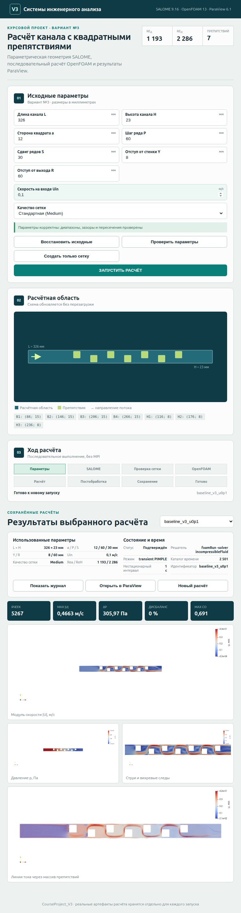

**Рисунок 1 — Стандартные параметры варианта №3 и динамическая схема канала.**

## 2.3 Создание модели в SALOME

Скрипт `salome/generate_mesh.py` читает `settings.json`, создаёт прямоугольную грань канала, строит семь квадратных граней и вычитает их из расчётной области (fluid domain). Полученная плоская область экструдируется по `Z` на 1 мм. Технологическая толщина нужна только для представления двумерной задачи в трёхмерном формате OpenFOAM.

Границы классифицируются по координатам, а не по нестабильным индексам `Face_N`: `inlet` — `x=0`; `outlet` — `x=L`; `walls` — `y=0` и `y=H`; `obstacles` — 28 боковых поверхностей квадратов; `frontAndBack` — `z=0` и `z=1 мм`.

Проверенный HDF находится в `salome/final/CourseProject_V3.hdf`, экспорт — в `salome/final/Mesh.unv`. Геометрия, построенная сетка и именованные группы показаны соответственно на рисунках 2–4.

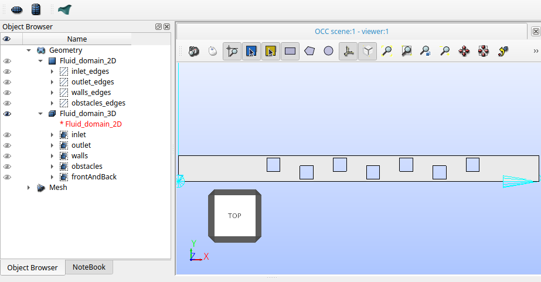  
**Рисунок 2 — Геометрия канала варианта №3 с семью квадратными препятствиями в SALOME.**

  
**Рисунок 3 — Однослойная quad-dominant сетка расчётной области в модуле SMESH.**

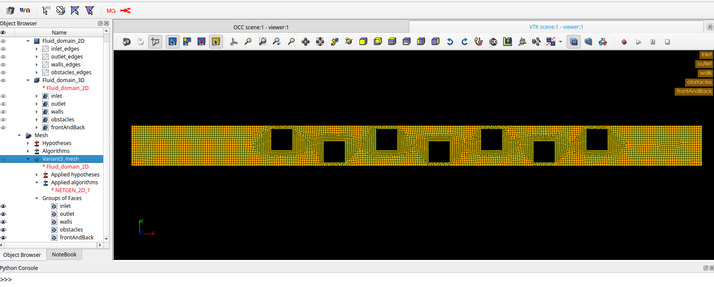  
**Рисунок 4 — Именованные группы границ inlet, outlet, walls, obstacles и frontAndBack.**

## 2.4 Генерация сетки

На плоской грани применён `NETGEN_1D2D`; включён quad-dominant режим, максимальный размер 1.25 мм, минимальный 0.6 мм, локальный размер на рёбрах препятствий 0.75 мм. Затем двумерные элементы экструдированы одним слоем. Чисто треугольные пробные сетки были отвергнуты, потому что расширенный `checkMesh` выявлял 3–4 призмы с малым determinant. Проверенные характеристики принятой сетки приведены в таблице 3, а её вид после импорта в OpenFOAM — на рисунке 5.

**Таблица 3 — Характеристики базовой расчётной сетки**

| Показатель базовой сетки | Значение |
|---|---:|
| nodes / OpenFOAM points | 11364 |
| ячейки | 5267 |
| hexahedra | 5101 |
| prisms | 166 |
| max aspect ratio | 2.5618444 |
| max non-orthogonality | 41.596905° |
| average non-orthogonality | 4.8437362° |
| max skewness | 2.5947718 |
| minimum cell determinant | 0.027537398 |
| результат | `Mesh OK` |

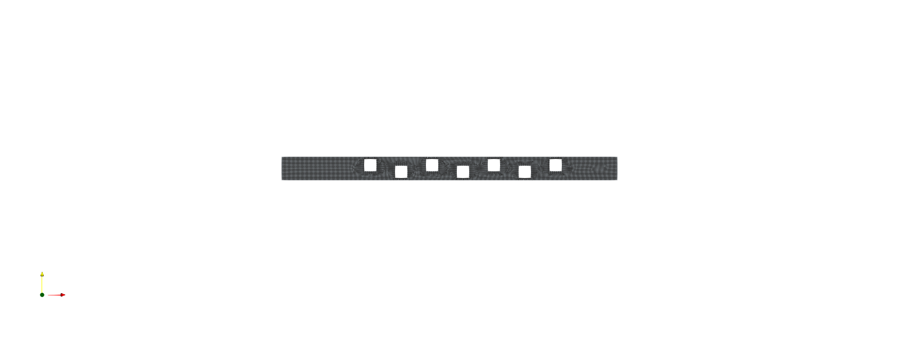

**Рисунок 5 — Принятая quad-dominant сетка после импорта в OpenFOAM.**

## 2.5 Импорт сетки в OpenFOAM

```bash
CPV3_SETTINGS=/media/sf_OpenFOAM_Labs/CourseProject_V3/settings.json \
CPV3_OUTPUT_DIR=/tmp/CourseProject_V3/mesh \
/home/pavel/openfoam-lab/tools/SALOME-9.16.0/run_salome.sh -t \
/media/sf_OpenFOAM_Labs/CourseProject_V3/salome/generate_mesh.py
```

Команда строит HDF и экспортирует UNV.

```bash
ideasUnvToFoam /tmp/CourseProject_V3/mesh/Mesh.unv
transformPoints 'scale=(0.001 0.001 0.001)'
python3 scripts/set_patch_types.py constant/polyMesh/boundary
checkMesh -allGeometry -allTopology
```

Последовательно выполняются импорт групп, перевод миллиметров в метры, назначение типов граничных участков (patches) по именам и расширенная проверка. Итог базового расчёта: `Mesh OK`.

## 2.6 Физические свойства воды

В `constant/physicalProperties` задана ньютоновская жидкость с `ν=1.006·10⁻⁶ м²/с`. Для перевода кинематического давления принята постоянная `ρ=998.2 кг/м³`. Температурное уравнение не решается.

## 2.7 Числа Рейнольдса для базового расчёта

При `Uin=0.1 м/с`, `a=0.012 м`, `H=0.023 м`:

\[
Re_a=1192.8429,\qquad Re_H=2286.2823.
\]

## 2.8 Выбор решателя и модели турбулентности

Фактическая команда:

```bash
foamRun -solver incompressibleFluid
```

Модуль подходит для однофазной несжимаемой изотермической жидкости. В `constant/momentumTransport` задано `simulationType RAS`, `model kOmegaSST`. Выбор обусловлен отрывом на острых гранях, вихревыми следами, сильными градиентами скорости и наличием стенок.

## 2.9 Граничные условия

Фактические граничные условия базового расчёта приведены в таблице 4.

**Таблица 4 — Граничные условия базового расчёта**

| Граница | Поле | Тип | Значение базового расчёта | Физический смысл |
|---|---|---|---|---|
| inlet | `U` | `fixedValue` | `(0.1 0 0)` м/с | равномерный приток |
| outlet | `U` | `zeroGradient` | `∂U/∂n=0` | свободный выход |
| walls, obstacles | `U` | `noSlip` | `U=0` | прилипание |
| frontAndBack | `U` | `empty` | — | отсутствие изменения по Z |
| inlet | `p` | `zeroGradient` | `∂p/∂n=0` | давление определяется решением |
| outlet | `p` | `fixedValue` | `0 м²/с²` | опорное давление |
| walls, obstacles | `p` | `zeroGradient` | `∂p/∂n=0` | непроницаемая стенка |
| frontAndBack | `p` | `empty` | — | квазидвумерная постановка |
| inlet | `k` | `fixedValue` | `5.5532696·10⁻⁵ м²/с²` | турбулентная энергия |
| walls, obstacles | `k` | `kqRWallFunction` | wall function | пристенное условие |
| inlet | `omega` | `fixedValue` | `8.4506065 с⁻¹` | удельная диссипация |
| walls, obstacles | `omega` | `omegaWallFunction` | wall function | пристенная модель |
| outlet | `k`, `omega` | `zeroGradient` | `∂/∂n=0` | свободный выход турбулентных величин |
| inlet, outlet | `nut` | `calculated` | начальное `0` | вычисляется моделью |
| walls, obstacles | `nut` | `nutkWallFunction` | wall function | турбулентная вязкость у стенки |
| frontAndBack | `k`, `omega`, `nut` | `empty` | — | одна ячейка по Z |

На outlet для `k` и `omega` задан `zeroGradient`. `fixedValue` фиксирует значение, `zeroGradient` — нулевую нормальную производную, а `empty` удаляет производные по Z из двумерной постановки.

## 2.10 Структура и настройка расчётного случая OpenFOAM

- `0/U`, `0/p`, `0/k`, `0/omega`, `0/nut` — начальные и граничные условия;
- `constant/physicalProperties` — `ν`;
- `constant/momentumTransport` — RAS `kOmegaSST`;
- `constant/polyMesh` — импортированная сетка;
- `system/controlDict` — время, запись и решатель;
- `system/fvSchemes` — дискретизация;
- `system/fvSolution` — линейные решатели и SIMPLE/PIMPLE.

Steady-конфигурация использует `steadyState`, SIMPLE, `nNonOrthogonalCorrectors 1`, ограниченные конвективные схемы и релаксацию. Transient-конфигурация использует Euler, PIMPLE с одним outer и двумя pressure correctors, адаптивный шаг, `maxCo=0.7`, `maxDeltaT=0.002 с`.

## 2.11 Запуск базового расчёта

Стационарный диагностический расчёт достиг метки 2500 и завершился, но начальные невязки продолжали колебаться приблизительно на уровнях `U=2–3·10⁻³`, `p=4–5·10⁻³`, `k≈3·10⁻³`, `omega≈1.3·10⁻³`. Поэтому результат не объявлялся стационарно сошедшимся. Тот же расчётный случай продолжен по схеме transient PIMPLE на одну физическую секунду — от каталога времени 2500 до 2501. На последнем шаге получены `maxCo=0.6914771`, шаг `5.9680162·10⁻⁴ с`, локальная ошибка неразрывности `1.7465988·10⁻¹¹` и накопленная ошибка `-4.2313741·10⁻¹¹`; журнал заканчивается строкой `End`.

Постобработка последнего времени:

```bash
foamPostProcess -latestTime -func 'patchFlowRate(name=inlet,patch=inlet)'
foamPostProcess -latestTime -func 'patchFlowRate(name=outlet,patch=outlet)'
foamPostProcess -latestTime -func 'patchAverage(name=pInlet,patch=inlet,field=p)'
foamPostProcess -latestTime -func 'patchAverage(name=pOutlet,patch=outlet,field=p)'
foamPostProcess -latestTime -func 'cellMaxMag(U)'
foamPostProcess -latestTime -func 'cellMinMag(U)'
foamPostProcess -latestTime -func 'cellMax(p)'
foamPostProcess -latestTime -func 'cellMin(p)'
```

## 2.12 Анализ результатов базового расчёта

Интегральные и экстремальные значения базового расчёта сведены в таблицу 5.

**Таблица 5 — Результаты базового расчёта**

| Величина | Проверенное значение |
|---|---:|
| `Qin` по модулю | `2.3·10⁻⁶ м³/с` |
| `Qout` по модулю | `2.3·10⁻⁶ м³/с` |
| дисбаланс | `0%` в точности вывода |
| areaAverage `p` на inlet | `0.30652243 м²/с²` |
| areaAverage `p` на outlet | `0 м²/с²` |
| перепад давления | `305.970689626 Па` |
| max `\|U\|` по ячейкам | `0.46627613 м/с` |
| min `\|U\|` по ячейкам | `0.001867985 м/с` |
| min/max `p` по ячейкам | `-0.13827958 / 0.31614916 м²/с²` |

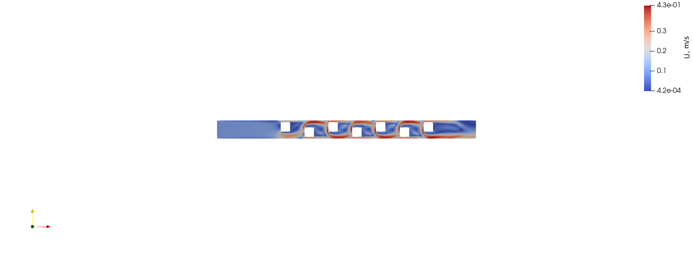

**Рисунок 6 — Модуль скорости воды `|U|` в базовом расчёте в каталоге времени 2501 (после 1 с нестационарного продолжения).**

На рисунке 6 видны ускоренные струи в узких проходах и области малой скорости за квадратами. Максимум по ячейкам примерно в 4.66 раза выше входной скорости.

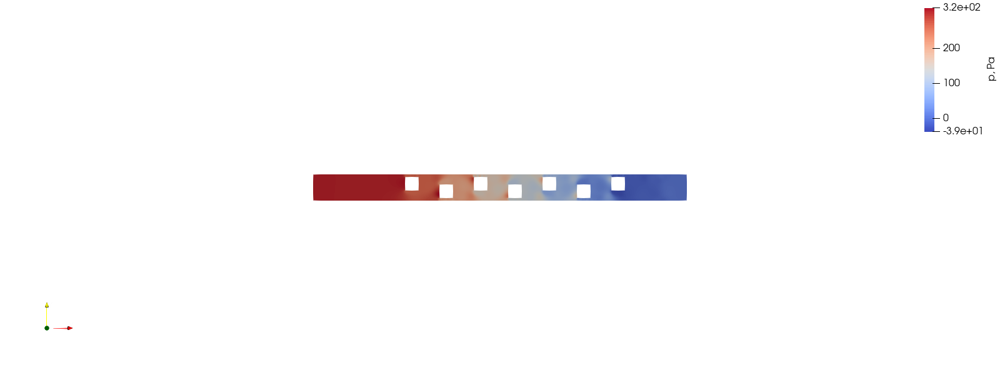

**Рисунок 7 — Давление после пересчёта кинематического `p` в Па.**

На рисунке 7 видно, что среднее давление уменьшается от входа к выходу. Локальные максимумы возникают перед обращёнными к потоку гранями, а области отрицательного давления относительно опорного значения на `outlet` — в ускоренных струях и следах.

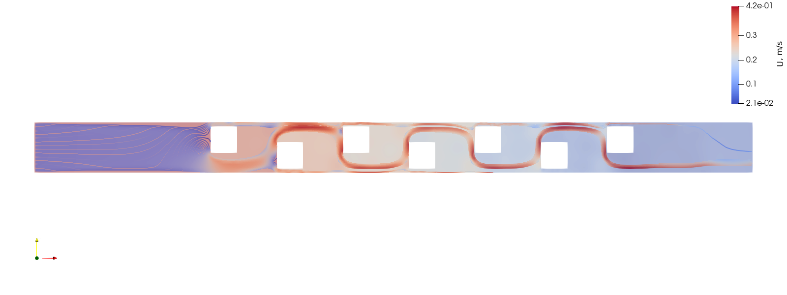

**Рисунок 8 — Линии тока и поле скорости через шахматный массив.**

Рисунок 8 показывает прохождение линий тока через шахматный массив и отклонение потока препятствиями.

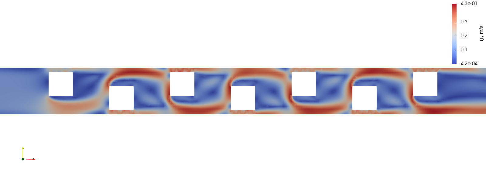

**Рисунок 9 — Увеличенное поле скорости около квадратных препятствий.**

На рисунке 9 детально показаны ускорение в сужениях и зоны пониженной скорости за квадратами.

# 3 Разработка приложения

## 3.1 Архитектура

1. `settings.json` — единый набор параметров.
2. `scripts/geometry.py` — валидация и производные значения.
3. `salome/generate_mesh.py` — HDF/UNV.
4. `openfoam/template` и `parameterize_case.py` — case.
5. `run_pipeline.py` — последовательное управление расчётным конвейером в `/tmp`.
6. `render_results.py` — поля и PNG.
7. `app/server.js` — безопасный локальный API.
8. `app/public` — браузерный интерфейс.
9. `runs/<id>` — история результатов.

## 3.2 Веб-интерфейс

Главная форма представляет собой рабочий экран инженерного расчёта. Она содержит русские подписи и единицы измерения для восьми параметров `L`, `H`, `a`, `P`, `S`, `Y`, `R`, `Uin`, а также предустановку качества сетки `Coarse/Medium/Fine`. После проверки исходных данных без перезагрузки обновляются SVG-схема, координаты семи препятствий, `Re_a` и `Re_H`. Пользователь может восстановить исходные значения, отдельно проверить параметры, создать только сетку или запустить полный расчёт.

Интерфейс не принимает произвольные команды и пути. Кнопка полного запуска имеет явную подпись «Запустить расчёт», а во время активного задания действия повторного запуска блокируются. Изменённая геометрия C, введённая в этой форме, показана на рисунке 10.

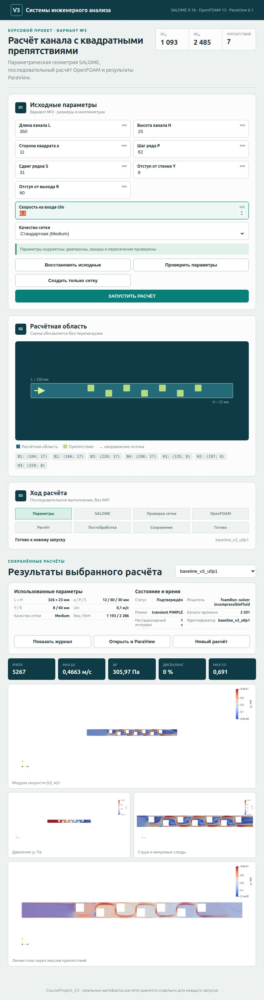

**Рисунок 10 — Параметрическая схема для изменённой геометрии C.**

## 3.3 Проверка исходных данных

Одинаковые ограничения реализованы в серверной части и Python. Проверка `S=5 мм` при `a=12 мм` вернула «S должно быть не меньше a» и заблокировала запуск. Пустое `L` отклоняется сообщением «L: заполните поле», нечисловое значение — сообщением «L: требуется конечное число». Также проверяются допустимые диапазоны, зазоры до стенок, выход препятствий за границы и попарные пересечения. Для C интерфейс и Python независимо вычислили центры `(104,17)`, `(166,17)`, `(228,17)`, `(290,17)`, `(135,8)`, `(197,8)`, `(259,8)` мм.

## 3.4 settings.json и автоматизация

JSON разделён на `geometryMm`, `flow`, `mesh`. После успешной проверки сервер сохраняет именно значения текущей формы в `runs/<id>/settings.json`. Геометрические параметры читает `geometry.py`, затем тот же файл получает SALOME-скрипт. `parameterize_case.py` переносит `Uin`, `k`, `omega`, вязкость и настройки модели в новый OpenFOAM case. Поэтому связь имеет проверяемый вид: поле формы → сохранённый JSON → геометрия/HDF/UNV или словарь OpenFOAM → расчёт → `summary.json`, содержащий использованные входные данные.

Серверная часть передаёт SALOME только проверенные пути через переменные окружения. Скрипт запуска активирует OpenFOAM с `ParaView_TYPE=none`, чтобы исключить ненужное обнаружение системного ParaView, и последовательно выполняет импорт, масштабирование, обработку типов граничных участков, `checkMesh`, запуск решателя и постобработку. MPI не используется.

## 3.5 Серверная часть, состояние и журналирование

Серверная часть написана на встроенном HTTP API Node.js без установки пакетов. Числовые значения проверяются до запуска задания, идентификаторы каталогов разрешаются только внутри `runs`, процессы получают массив аргументов. `status.json` отражает реальные стадии: подготовку задания, SALOME, проверку сетки, подготовку case, решатель, постобработку, сохранение и завершение. Браузер опрашивает API раз в 2 секунды; фиктивная процентная готовность не используется.

Во время активного задания интерфейс блокирует кнопки запуска, а сервер независимо отклоняет конфликтующий запрос кодом 409 и сообщает, какой расчёт уже выполняется. Ошибка дочернего процесса переводит задание в `failed`, выводится пользователю и снова разблокирует форму. Для выбранного завершённого запуска доступна кнопка показа и скрытия реального `pipeline.log`. Реальный запуск только генерации сетки создал HDF/UNV и завершился сообщением `Mesh OK` без решателя. Отображение активного полного задания показано на рисунке 11.

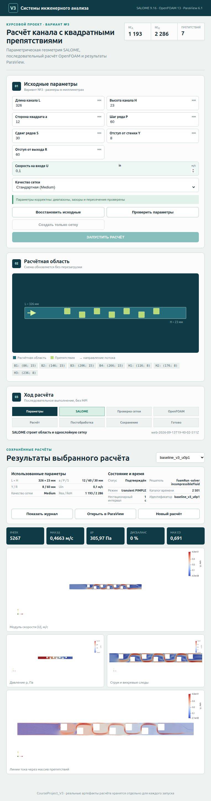

**Рисунок 11 — Неблокирующее отображение стадии SALOME при полном запуске из веб-приложения.**

## 3.6 Интеграция с ParaView

`render_results.py` читает `internalMesh` и поля `U`, `p`, `k`, `omega`, `nut`, выбирает последний каталог времени, вычисляет `p_Pa=p·rho`, строит пять видов и сохраняет `paraview_summary.json`. Экстремумы по ячейкам OpenFOAM и интерполированные диапазоны по точкам ParaView учитываются раздельно.

После завершения интерфейс показывает входные параметры конкретного запуска, статус, решатель, режим, последний каталог времени, длительность нестационарного участка, число ячеек, `max|U|`, `Δp`, дисбаланс расходов и `maxCo`. Доступны журнал, безопасное открытие сохранённого case в ParaView и начало нового расчёта. Результат теста B с `Uin=0.15 м/с` показан на рисунке 12.

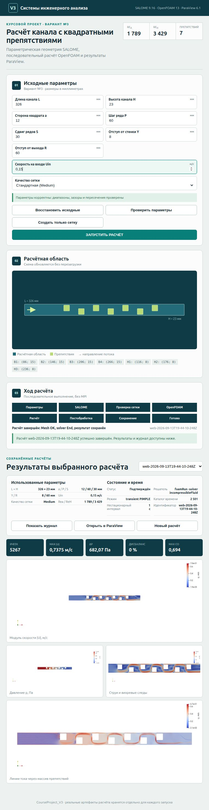

**Рисунок 12 — Завершённый тест B: `Uin=0.15 м/с`, 5267 ячеек, `max|U|=0.7375 м/с`, `Δp=682.07 Па`.**

# 4 Тестирование и сравнение результатов

## 4.1 Матрица тестирования

Сравнение трёх выполненных расчётов приведено в таблице 6 и на рисунке 13.

**Таблица 6 — Матрица проверочных расчётов**

| Расчёт | Отличие | Число ячеек | `Re_a` | `Re_H` | `Qout`, м³/с | max `\|U\|` по ячейкам, м/с | `Δp`, Па | max Co | результат |
|---|---|---:|---:|---:|---:|---:|---:|---:|---|
| A `baseline_v3_u0p1` | стандарт, `Uin=0.1` | 5267 | 1192.843 | 2286.282 | `2.30·10⁻⁶` | 0.466276 | 305.971 | 0.691477 | Mesh OK, End |
| B `speed_v3_u0p15` | та же геометрия, `Uin=0.15` | 5267 | 1789.264 | 3429.423 | `3.45·10⁻⁶` | 0.737507 | 682.066 | 0.694407 | Mesh OK, End |
| C `geometry_v3_changed` | `L=350`, `H=25`, `a=11`, `P=62`, `S=31` мм | 6518 | 1093.439 | 2485.089 | `2.50·10⁻⁶` | 0.399901 | 180.959 | 0.699670 | Mesh OK, End |

Во всех трёх расчётах `Qin=Qout` по модулю в точности сохранённого вывода; критерий менее 1% выполнен.

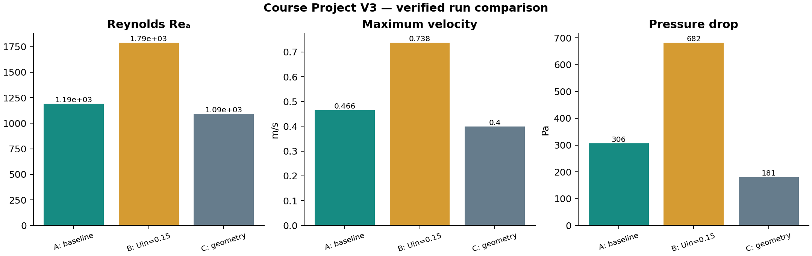

**Рисунок 13 — Сравнение `Re_a`, максимальной скорости и перепада давления.**

## 4.2 Изменение скорости

При увеличении `Uin` в 1.5 раза расход, `Re_a` и `Re_H` выросли в 1.5 раза. Максимальная скорость по ячейкам выросла в 1.5817 раза, перепад давления — в 2.2292 раза. Последний коэффициент близок к `1.5²=2.25`, характерному для инерционных потерь, но вывод относится только к двум рассчитанным точкам.

## 4.3 Изменение геометрии

В C высота увеличена до 25 мм, сторона уменьшена до 11 мм, шаг — 62 мм, сдвиг — 31 мм, длина — 350 мм. При той же скорости расход стал `2.5·10⁻⁶ м³/с`; максимум скорости снизился до `0.39990055 м/с`, перепад — до `180.9586 Па`, или 59.14% значения базового расчёта. Это согласуется с менее стеснённым проходом. Поскольку менялись несколько размеров, вклад каждого отдельно не идентифицируется.

## 4.4 Сквозная приёмка пользовательского интерфейса

После доработки приложения выполнена отдельная сквозная приёмка через пользовательскую форму. Её результаты приведены в таблице 7. Новые запуски получили уникальные каталоги; ранее валидированные `baseline_v3_u0p1`, `speed_v3_u0p15` и `geometry_v3_changed` не перезаписывались.

**Таблица 7 — Результаты сквозных приёмочных тестов**

| Тест | Действие через интерфейс | Проверенный результат |
|---|---|---|
| A | исходные значения, полный запуск `web-2026-09-13T19-40-02-511Z` | входы совпали с baseline; 5267 ячеек; `Mesh OK`; solver `End`; `summary.status=VERIFIED` |
| B | `Uin=0.15 м/с`, полный запуск `web-2026-09-13T19-44-10-248Z` | `0/U=(0.15 0 0)`, пересчитаны `k` и `omega`; `Re_a=1789.264`, `max\|U\|=0.737507 м/с`, `Δp=682.066 Па`; `VERIFIED` |
| C | геометрия `350×25 мм`, `a=11`, `P=62`, `S=31 мм`, запуск только сетки `mesh-2026-09-13T19-48-11-319Z` | значения записаны в run; HDF/UNV созданы; 6518 ячеек; `Mesh OK`; решатель не запускался |
| D | `S=5 мм`, пустое и нечисловое `L` | каждое значение отклонено до SALOME/OpenFOAM; запуск недоступен |
| E | контролируемый ненулевой выход дочернего процесса | показана русская ошибка с кодом 1; форма разблокирована; следующий запуск получил новый ID |

Для теста A новый расчёт дал `max|U|=0.466279 м/с` и `Δp=306.046 Па`. Отличие перепада от сохранённого отчётного baseline составляет около 0.025% и не меняет инженерного вывода; исходный валидированный baseline сохранён как контрольный результат. Попытка второго запуска во время теста B отдельно отклонена сервером кодом 409.

## 4.5 Ограничения достоверности

- формальное исследование сеточной независимости не выполнялось;
- результаты являются URANS-снимками после одной секунды нестационарного продолжения, а не статистикой по множеству периодов;
- RAS `kOmegaSST` и пристенные функции — инженерное приближение;
- экспериментальный или DNS/LES-эталон отсутствует;
- отрицательное локальное `p` отсчитывается от нулевого опорного значения на `outlet` и не означает отрицательного абсолютного давления.

# Заключение

Создан законченный параметрический проект варианта №3. Геометрия вычисляется из восьми пользовательских параметров; невозможные комбинации отсекаются до SALOME. Фактическая однослойная сетка строится в SALOME, экспортируется в UNV, масштабируется и проверяется OpenFOAM. Принятая базовая сетка содержит 5267 ячеек и проходит расширенный `checkMesh`.

Базовый расчёт воды выполнен решателем `incompressibleFluid` с моделью `kOmegaSST`; нестационарное продолжение обосновано периодическим следом. Получены `Re_a=1192.843`, `Re_H=2286.282`, `max|U|=0.466276 м/с`, `Δp=305.971 Па`, расход `2.3·10⁻⁶ м³/с`. Расчёты B и C подтвердили параметричность: новая скорость дала новый физический результат при неизменной геометрии, а новая геометрия привела к созданию новых HDF/UNV и сетки из 6518 ячеек. Все исходные данные и доказательства сохранены в проекте.

# Список литературы

1. OpenFOAM Foundation. *OpenFOAM 13 Source Code Guide: kOmegaSST*. <https://cpp.openfoam.org/v13/classFoam_1_1kOmegaSST.html>.
2. CFD Direct. *OpenFOAM User Guide: Solution and algorithm control*. <https://doc.cfd.direct/openfoam/user-guide-v14/fvsolution>.
3. SALOME Platform. *Mesh 9.16.0 documentation: Importing and exporting meshes*. <https://docs.salome-platform.org/latest/gui/SMESH/importing_exporting_meshes.html>.
4. SALOME Platform. *NETGENPLUGIN User's Guide: NETGEN_1D2D Algorithm*. <https://docs.salome-platform.org/latest/gui/NETGENPLUGIN/netgenpluginpy_doc/classNETGENPluginBuilder_1_1NETGEN__1D2D__Algorithm.html>.
5. Menter F. R. Two-equation eddy-viscosity turbulence models for engineering applications // AIAA Journal. 1994. Vol. 32, No. 8. P. 1598–1605.
6. Ferziger J. H., Perić M., Street R. L. *Computational Methods for Fluid Dynamics*. 4th ed. Springer, 2020.

# Приложение А — листинг и структура проекта

Основные файлы: `settings.json`, `scripts/geometry.py`, `salome/generate_mesh.py`, `scripts/set_patch_types.py`, `scripts/parameterize_case.py`, `scripts/run_pipeline.py`, `scripts/build_summary.py`, `postprocessing/render_results.py`, `app/server.js`, `app/public/*`, `validation/compare_runs.py`. Полные листинги входят в электронный проект и не дублируются здесь, чтобы не расходиться с исполняемой версией.
