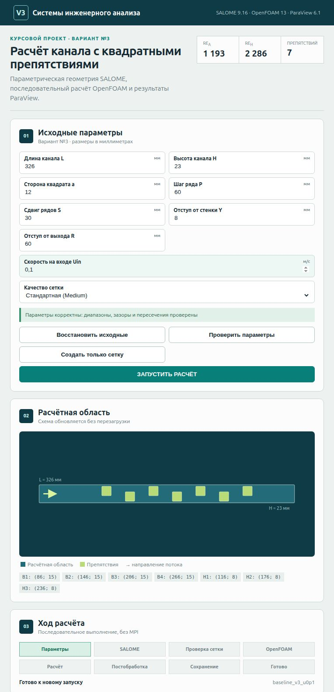
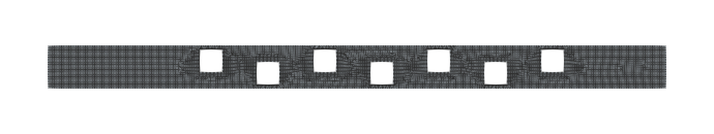
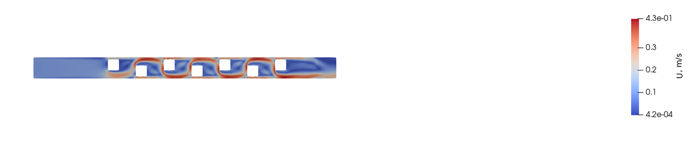
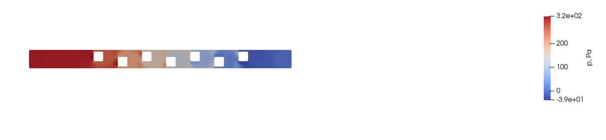
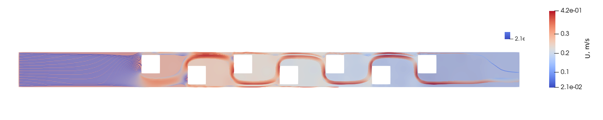
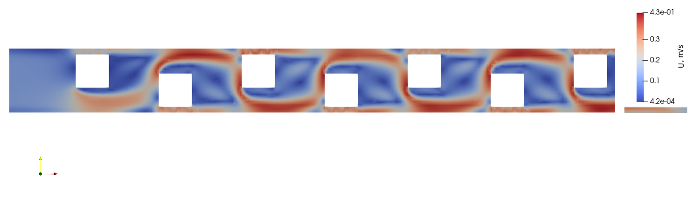
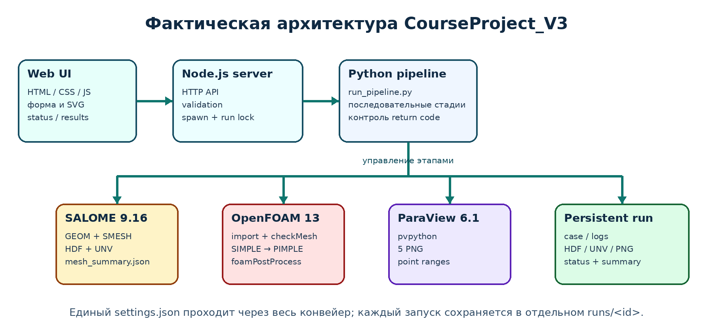
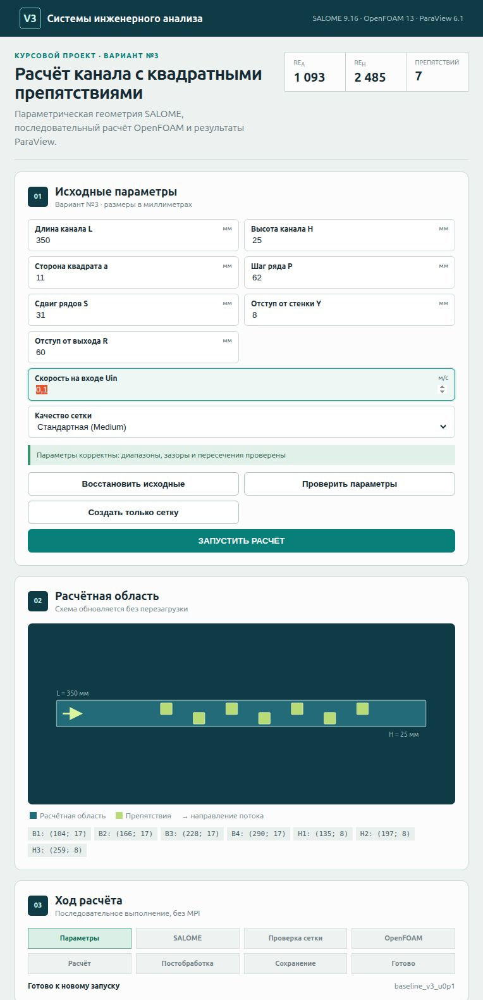
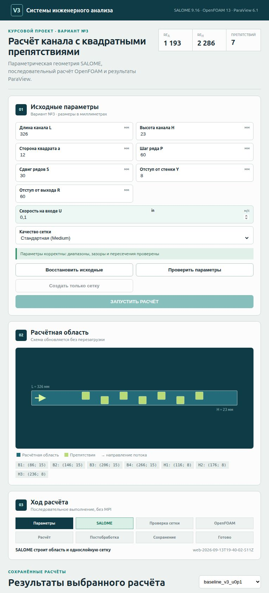
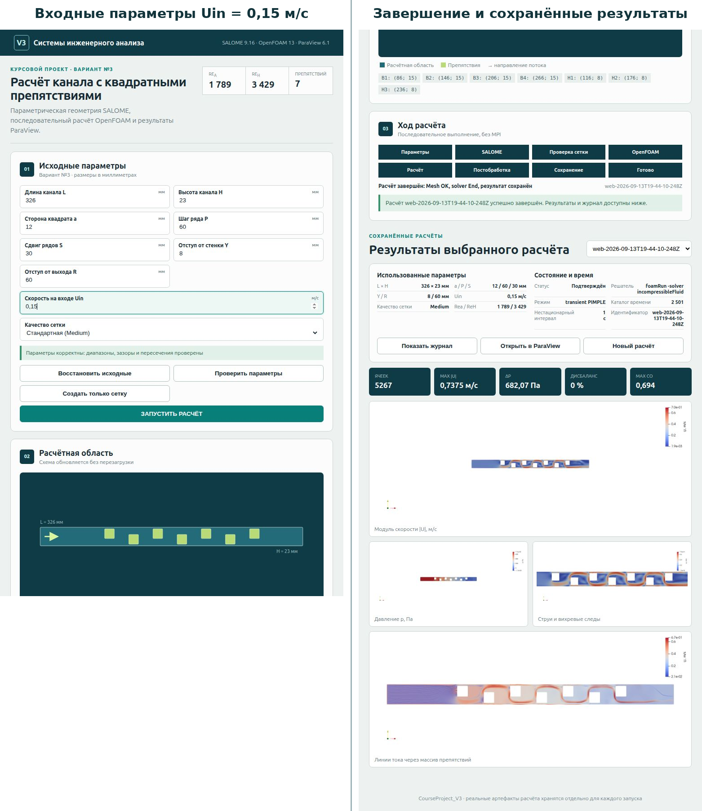

Failed to create stream fd: Operation not permitted
Failed to create stream fd: Operation not permitted
Failed to create stream fd: Operation not permitted
# Пояснительная записка к курсовому проекту

## Титульный лист

**Министерство науки и высшего образования Российской Федерации**  
**Федеральное государственное автономное образовательное учреждение высшего образования**  
**«Московский политехнический университет»**  
**Кафедра «Смарт-технологии»**

**КУРСОВОЙ ПРОЕКТ**  
по дисциплине «Системы инженерного анализа»  
по направлению 09.03.01 «Информатика и вычислительная техника»  
образовательная программа «Интеграция и программирование в САПР»

**Тема:** Параметрическое приложение для расчёта течения воды в канале с шахматным массивом квадратных препятствий  
**Вариант:** №3

**Выполнил:** студент группы 231-324 Шиванко Павел Дмитриевич  
**Преподаватель:** Лаврененко Илья Станиславович

Москва, 2026

## Задание на курсовой проект

**Тема проекта:** разработка приложения для расчёта течения воды через канал заданной формы средствами OpenFOAM.

**Исходные данные:** вариант №3; прямоугольный канал с семью квадратными препятствиями, расположенными в два шахматных ряда; рабочая среда — вода. Геометрия задаётся размерами `L`, `H`, `a`, `P`, `S`, `Y`, `R`, а режим течения — скоростью на входе `Uin`.

**Требуемый практический результат:** локальное приложение, которое позволяет изменить исходные размеры и скорость, проверить геометрическую допустимость, построить геометрию и сетку в SALOME, подготовить и выполнить расчёт OpenFOAM, сформировать результаты ParaView и сохранить доказательные артефакты каждого запуска.

В составе работы необходимо:

1. сформировать параметрическую геометрию и граничные группы;
2. получить пригодную для OpenFOAM сетку и проверить её качество;
3. задать физическую модель, свойства воды, начальные и граничные условия;
4. выполнить эталонный расчёт и проанализировать поля скорости и давления;
5. разработать пользовательский интерфейс и серверную оркестрацию;
6. подтвердить изменение результата при изменении `Uin` и геометрии;
7. обеспечить обработку ошибочного ввода и отказов внешних процессов.

## Аннотация

Курсовой проект посвящён разработке локального параметрического приложения для расчёта течения воды в канале варианта №3 с семью квадратными препятствиями. Реализованы проверка исходных данных, построение геометрии и однослойной сетки средствами SALOME 9.16, экспорт UNV, импорт и расширенная проверка сетки в OpenFOAM Foundation 13, последовательный расчёт несжимаемого изотермического течения и автоматическая постобработка средствами ParaView 6.1. Базовая модель использует RAS `kOmegaSST`. Стационарный SIMPLE-этап применяется как диагностическая инициализация, после которой расчёт продолжается нестационарным алгоритмом PIMPLE.

Параметричность подтверждена тремя полными расчётами: стандартным, расчётом с увеличенной входной скоростью и расчётом с изменённой геометрией. Во всех трёх случаях расширенный `checkMesh` выдал `Mesh OK`, решатель завершился строкой `End`, а относительный дисбаланс расходов оказался менее 1%. Управление реализовано браузерным интерфейсом и сервером Node.js без сторонних npm-зависимостей; последовательный Python-конвейер сохраняет HDF, UNV, OpenFOAM case, журналы, JSON и изображения отдельно для каждого запуска.

## Содержание

Введение  
Описание технического задания  
1 Обзор и анализ научно-технической литературы  
2 Расчётная постановка и ручной расчёт  
3 Разработка приложения  
4 Тестирование и анализ результатов  
Заключение  
Список использованных источников  
Приложение А — основной код приложения  
Приложение Б — автоматизация SALOME  
Приложение В — автоматизация OpenFOAM  
Приложение Г — постобработка и структура артефактов

## Список сокращений

**CAE** — Computer-Aided Engineering, инженерный анализ с применением вычислительных средств.  
**CFD** — Computational Fluid Dynamics, вычислительная гидродинамика.  
**FVM** — Finite Volume Method, метод конечных объёмов.  
**RANS** — Reynolds-Averaged Navier–Stokes, осреднённые по Рейнольдсу уравнения Навье–Стокса.  
**URANS** — нестационарная форма RANS.  
**SIMPLE** — алгоритм связи скорости и давления для стационарной постановки.  
**PIMPLE** — сочетание подходов PISO и SIMPLE для нестационарного расчёта.  
**HDF** — формат файла исследования SALOME.  
**UNV** — универсальный формат обмена сетками I-DEAS.  
**API** — программный интерфейс приложения.

## Введение

CAE-системы позволяют исследовать инженерный объект до изготовления физического прототипа, однако качество результата зависит не только от решателя. Необходимо согласовать геометрию, сетку, свойства среды, граничные условия, численные схемы и критерии контроля. В CFD этот подготовительный этап часто содержит много ручных операций и становится источником трудно обнаруживаемых различий между расчётами.

Течение через последовательность плохообтекаемых тел характерно для решёток, фильтров, смесительных устройств и внутренних трактов. Квадратные препятствия вызывают торможение перед фронтальной гранью, отрыв на острых кромках, ускорение в сужениях и образование вихревого следа. Задача варианта №3 поэтому объединяет геометрическую параметризацию, сеточную подготовку, постановку граничных условий, выбор численной модели и анализ достоверности результата.

**Цель проекта** — разработать и проверить приложение, которое по единому набору параметров автоматически формирует геометрию, расчётную сетку, OpenFOAM case и результаты течения воды в канале варианта №3.

Для достижения цели решены задачи анализа предметной области, параметризации схемы, построения HDF/UNV в SALOME, подготовки OpenFOAM case, выполнения базового расчёта, автоматизации постобработки, разработки интерфейса, обработки ошибок и сравнения трёх наборов параметров.

**Объект исследования** — течение воды через прямоугольный канал с шахматным массивом квадратных препятствий. **Предмет исследования** — методы параметрической подготовки и автоматизированного выполнения CFD-расчёта средствами SALOME, OpenFOAM и ParaView. **Практическая значимость** состоит в том, что единый `settings.json` однозначно определяет геометрию, сетку, физические параметры и поля, а каждый запуск сохраняется независимо и может быть проверен по журналам и изображениям.

## Описание технического задания

Расчётная область — прямоугольный канал с семью квадратными препятствиями, расположенными в два шахматных ряда. Рабочая среда — вода при приблизительно 20 °C с постоянной плотностью и вязкостью. Расчёт является несжимаемым и изотермическим. Геометрия создаётся только в SALOME; `blockMesh` для фактической CFD-сетки не используется. Технологическая толщина псевдодвумерной модели фиксирована и равна 1 мм.

Приложение должно:

- валидировать восемь пользовательских параметров до запуска внешних программ;
- показывать динамическую схему и числа Рейнольдса;
- создавать изолированный каталог запуска;
- запускать SALOME, OpenFOAM и ParaView без MPI;
- показывать этап и журнал, не блокируя браузер;
- сохранять HDF, UNV, case, logs, PNG и итоговый JSON;
- не перезаписывать предыдущие успешные результаты.

Сопоставление требований с реализацией приведено в таблице 1. Доказательствами служат не плановые описания, а исполняемый код и сохранённые артефакты.

**Таблица 1 — Соответствие исходного задания фактической реализации**

| Требование | Реализация | Доказательство |
|---|---|---|
| Вода и геометрия варианта №3 | семь параметрически размещённых квадратов в прямоугольном канале | `settings.json`, `geometry.py`, HDF/UNV |
| Изменение размеров и скорости | поля `L,H,a,P,S,Y,R,Uin`, предустановка сетки | `app/public/index.html`, `server.js` |
| SALOME | Python API GEOM/SMESH, HDF, UNV | `salome/generate_mesh.py` |
| OpenFOAM | импорт UNV, `checkMesh`, `incompressibleFluid`, SIMPLE/PIMPLE | cases и logs в `runs/` |
| ParaView | `pvpython`, пять воспроизводимых видов и JSON диапазонов | `postprocessing/render_results.py` |
| Автоматизация | Node.js API и последовательный Python-runner | `app/server.js`, `run_pipeline.py` |
| Подтверждение параметричности | расчёты A, B, C и интерфейсные тесты | `validation/run_comparison.json`, acceptance screenshots |

Фактический программный стек сведён в таблице 2. В нём разделены интерактивная часть, оркестрация и специализированные CAE-инструменты; ни один компонент не приписан проекту только по первоначальному плану.

**Таблица 2 — Фактический программный стек проекта**

| Уровень | Технология | Роль в проекте |
|---|---|---|
| Пользовательский интерфейс | HTML, CSS, браузерный JavaScript | форма параметров, SVG-схема, стадии, журнал и результаты |
| Локальный сервер | Node.js, встроенные `http`, `fs`, `path`, `child_process` | API, повторная валидация, запуск одного задания и выдача артефактов |
| Оркестрация | Python 3, стандартная библиотека | последовательное выполнение pipeline и контроль кодов возврата |
| Геометрия и сетка | SALOME 9.16, GEOM/SMESH, NETGEN 1D–2D | параметрическая область, группы, HDF, UNV и однослойная сетка |
| CFD | OpenFOAM Foundation 13 | импорт сетки, `checkMesh`, SIMPLE/PIMPLE и postProcess |
| Визуализация | ParaView 6.1, `pvpython` | воспроизводимые изображения полей и диапазоны point data |
| Данные запуска | JSON, HDF, UNV, OpenFOAM case, logs, PNG | трассировка входа, процесса и результата каждого run |

# 1 Обзор и анализ научно-технической литературы

## 1.1 CFD в составе инженерного анализа

Вычислительная гидродинамика рассматривает движение жидкости на основе законов сохранения массы, импульса и, при необходимости, энергии. В инженерной работе CFD связывает три уровня: физическую модель, дискретное представление области и программную реализацию алгоритма решения. Ошибка на любом уровне влияет на итог: корректный решатель не компенсирует неверные размеры, плохую сетку или физически несогласованные граничные условия.

Для задач внутренних течений вычислительная модель позволяет получить не только интегральный расход, но и пространственные поля. В канале с препятствиями это особенно важно: одинаковый расход может сопровождаться различными локальными максимумами скорости, перепадом давления и структурой вихревого следа. Поэтому в данном проекте результат характеризуется одновременно `Q`, `max|U|`, `Δp`, числом Куранта, балансом потока и изображениями полей.

Классический рабочий процесс CFD включает создание геометрии, построение сетки, задание начальных и граничных условий, выбор численных схем, расчёт и постобработку [1, 15–17]. Основная практическая проблема серии параметрических расчётов заключается в повторении этих операций. Если геометрия изменяется вручную, а словари редактируются отдельно, возрастает риск рассогласования. Автоматизация должна обеспечивать не только запуск команды, но и трассируемую передачу одного набора параметров через все этапы.

## 1.2 Метод конечных объёмов

OpenFOAM использует метод конечных объёмов. Расчётная область разбивается на неперекрывающиеся контрольные объёмы, а дифференциальные уравнения интегрируются по каждому объёму. Потоки массы и импульса вычисляются через грани, общие для соседних ячеек. Такая консервативная постановка удобна для гидродинамики: поток, покидающий одну ячейку, входит в соседнюю с противоположным знаком [1, 15, 16].

После интегрирования объёмные и поверхностные члены заменяются алгебраическими выражениями. Значения хранятся преимущественно в центрах ячеек, поэтому величины на гранях требуют интерполяции. Выбор схем в `fvSchemes` определяет компромисс между точностью и устойчивостью. Для конвективного члена скорости в проекте применена ограниченная схема `linearUpwind grad(U)`, а лапласианы вычисляются схемой `Gauss linear corrected`. Поправка `corrected` учитывает ненормальность граней, что важно для неидеально ортогональной сетки около квадратов [3].

Дискретные уравнения скорости и давления связаны условием неразрывности. В стационарной части используется SIMPLE, в нестационарной — PIMPLE. Эти алгоритмы выполняют последовательные коррекции давления и скорости так, чтобы итоговый поток удовлетворял балансу массы. Линейные системы решаются отдельно: для давления применён GAMG, для `U`, `k` и `omega` — `smoothSolver`.

## 1.3 Математическая модель

Для несжимаемой жидкости используется условие неразрывности

\[
\nabla\cdot\mathbf{U}=0,
\]

где `U` — вектор скорости, м/с. Уравнение количества движения в принятой RANS-постановке можно записать в виде [15, 16]

\[
\frac{\partial\mathbf{U}}{\partial t}+\nabla\cdot(\mathbf{U}\mathbf{U})=-\nabla p+\nabla\cdot\left[(\nu+\nu_t)\nabla\mathbf{U}\right],
\]

где `p` — кинематическое давление, м²/с²; `ν` — кинематическая молекулярная вязкость, м²/с; `νt` — турбулентная кинематическая вязкость, м²/с. В OpenFOAM для несжимаемой модели давление хранится в кинематических единицах. Перевод перепада в паскали выполнен по формуле

\[
\Delta p_{Pa}=\rho\left(\overline p_{in}-\overline p_{out}\right),
\]

где `ρ=998.2 кг/м³`, а черта обозначает осреднение по площади граничного участка (patch).

Для базовой модели плотность не входит непосредственно в уравнение движения в форме OpenFOAM, поскольку давление нормировано на плотность. Это допустимо при постоянной плотности и отсутствии тепловой задачи. Значение `rho` сохраняется в конфигурации и используется в постобработке, чтобы представить инженерный перепад давления в паскалях.

## 1.4 Число Рейнольдса и характер течения

Число Рейнольдса выражает отношение инерционных и вязких эффектов:

\[
Re=\frac{UL_c}{\nu}.
\]

Выбор характеристической длины зависит от анализируемого явления. В проекте одновременно выводятся два значения:

\[
Re_a=\frac{U_{in}a}{\nu},\qquad Re_H=\frac{U_{in}H}{\nu}.
\]

`Re_a` характеризует локальный масштаб обтекания квадрата, а `Re_H` — весь проход канала. Для baseline они равны соответственно 1192.84 и 2286.28. Правило перехода к турбулентности для полностью развитой круглой трубы здесь не применяется механически: канал не круглый, течение не является полностью развитым, а острые кромки семи тел создают отрыв и нестационарный след. Числа Рейнольдса используются как сопоставимые безразмерные характеристики расчётов, а не как единственный критерий выбора модели.

Вихреобразование за плохообтекаемыми телами связано с разделением пограничного слоя и попеременным формированием структур в следе. Обобщённая динамика вихревых следов подробно обсуждается в обзоре Уильямсона [18]. Для настоящей работы это означает, что остаточные периодические колебания стационарного алгоритма не следует автоматически трактовать как численную аварию: они могут указывать на физически нестационарный режим.

## 1.5 Осреднение RANS и модель k-ω SST

При RANS мгновенная скорость представляется суммой средней и пульсационной составляющих. Осреднение нелинейного конвективного члена создаёт напряжения Рейнольдса, для замыкания которых используется гипотеза вихревой вязкости. Такой подход не разрешает каждую турбулентную структуру, но позволяет получить инженерную оценку среднего воздействия при существенно меньших затратах, чем DNS или LES.

Модель `kOmegaSST` решает транспортные уравнения для турбулентной кинетической энергии `k` и удельной скорости диссипации `ω`. Она сочетает преимущества `k-ω` в пристенной области с поведением `k-ε` вдали от стенок и ограничивает турбулентное касательное напряжение. Исходная SST-модель описана Ментером [14], а реализация OpenFOAM 13 подтверждается справочником исходного кода [5]. Дополнительным справочным источником для коэффициентов и граничных условий служит Turbulence Modeling Resource NASA [13].

Выбор `kOmegaSST` в проекте обусловлен не только значением Re, но и геометрией: острые кромки, сильные градиенты давления, семь зон отрыва и большое число твёрдых поверхностей. При этом результат остаётся URANS-оценкой. Формальное исследование чувствительности к модели турбулентности и разрешению пристенного слоя в объём проекта не входило, поэтому выводы ограничены сравнением внутри одной согласованной модели.

Входные значения не скопированы из другого примера. Они вычисляются из текущих `Uin`, `H` и `ν`:

\[
I=0.16Re_H^{-1/8},\qquad l=0.07H,
\]

\[
k=1.5(U_{in}I)^2,\qquad \omega=\frac{\sqrt{k}}{C_\mu^{1/4}l},\quad C_\mu=0.09.
\]

Для базового расчёта получены `I=0.06084554`, `l=0.00161 м`, `k=5.5532696·10⁻⁵ м²/с²`, `ω=8.4506065 с⁻¹`.

## 1.6 Параметрическая геометрия и сетка SALOME

SALOME объединяет геометрическое ядро и сеточный модуль SMESH и предоставляет Python API [6]. Поэтому модель может быть построена не только последовательностью действий GUI, но и воспроизводимым сценарием. В данном проекте скрипт создаёт прямоугольную грань, вычитает семь квадратов, формирует твёрдое тело толщиной 1 мм, классифицирует границы и сохраняет исследование HDF.

SMESH поддерживает вычисление сетки, создание групп и экспорт UNV; формат UNV в документации указан как I-DEAS 10 [7, 8]. Использованный `NETGEN_1D2D` создаёт одномерные элементы на границах и двумерные элементы на поверхности [9]. После расчёта 2D-сетки выполняется sweep-extrusion на один слой, что позволяет получить объёмные элементы для OpenFOAM и сохранить условие `empty` на передней и задней гранях.

Параметрическая сетка должна изменяться вместе с геометрией. Поэтому абсолютные индексы рёбер и граней не используются: принадлежность к inlet, outlet, walls и obstacles определяется геометрическими координатами. Такой способ устойчивее к перестроению BREP при изменении размеров.

## 1.7 OpenFOAM как расчётная платформа

OpenFOAM хранит задачу в каталоге case. Начальные поля и граничные условия размещаются в `0`, свойства среды и сетка — в `constant`, а управление расчётом и дискретизацией — в `system` [2]. Текстовые dictionaries делают постановку прозрачной, но ручное редактирование нескольких файлов при каждом запуске создаёт риск несогласованности.

Версия 13 поддерживает модульный запуск через `foamRun`. В проекте команда `foamRun -solver incompressibleFluid` используется для несжимаемой однофазной изотермической жидкости. Стационарность или нестационарность определяется наборами `controlDict`, `fvSchemes` и `fvSolution`: сначала `steadyState`/SIMPLE, затем `Euler`/PIMPLE. Это один и тот же физический case с изменённым алгоритмом по времени, а не два разных solver names.

Утилиты `ideasUnvToFoam`, `transformPoints`, `checkMesh` и `foamPostProcess` образуют воспроизводимый путь от внешней сетки до численных показателей. Особое значение имеет `checkMesh -allGeometry -allTopology`: факт успешного импорта недостаточен, если не проверены топология, ненормальность, skewness и determinant.

## 1.8 ParaView и автоматизация постобработки

ParaView представляет поля, хранящиеся в OpenFOAM, и позволяет строить срезы, раскраску, линии тока и производные массивы. Пользовательское руководство описывает фильтры и Python scripting как равноправные способы построения визуализации [10, 11]. В проекте `pvpython` обеспечивает одинаковую камеру, диапазон данных и состав кадров для каждого run.

Преобразование `Cell Data to Point Data` используется только для визуального сглаживания и построения линий тока. Количественные extrema отчёта извлекаются из ячеек утилитами OpenFOAM, а point ranges сохраняются отдельно. Это предотвращает некорректное сравнение интерполированного визуального диапазона с исходным cell maximum.

## 1.9 Программный интерфейс параметрического расчёта

Локальное web-приложение выбрано как переносимый интерфейс без тяжёлого GUI-framework. Браузер отвечает за форму, динамическую схему и отображение результата; Node.js — за проверку входа, маршрутизацию API и запуск Python-процесса. Метод `child_process.spawn()` принимает команду и массив аргументов, что позволяет не собирать shell-строку из пользовательских данных [12].

Python-runner выполняет команды последовательно через `subprocess.run()` и проверяет `returncode` [19]. JSON используется как машинно-читаемый контракт между интерфейсом, SALOME, OpenFOAM и отчётной сводкой [20]. Состояние работы отделено от результата: `status.json` отражает текущий этап или ошибку, а `summary.json` появляется только после подтверждённого завершения. Такая организация позволяет отличать «процесс запущен», «сетка готова» и «CFD-результат проверен».

В `fvSolution` задаются решатели дискретизированных уравнений и параметры алгоритмов SIMPLE/PIMPLE. Различие между модульным решателем `incompressibleFluid` и линейными решателями полей описано в официальном руководстве [4].

В `fvSolution` задаются решатели дискретизированных уравнений и параметры алгоритмов SIMPLE/PIMPLE. Различие между модульным решателем `incompressibleFluid` и линейными решателями полей описано в официальном руководстве [2].

# 2 Расчётная постановка и ручной расчёт

## 2.1 Геометрия варианта №3

Стандартные параметры и допустимые сервером диапазоны приведены в таблице 3. Отдельный растровый файл исходной схемы задания в проекте не сохранён; её параметры и взаимное расположение объектов воспроизведены в динамической схеме приложения на рисунке 1.

**Таблица 3 — Исходные и допустимые параметры варианта №3**

| Параметр | По умолчанию | Допустимый диапазон | Смысл |
|---|---:|---:|---|
| `L` | 326 мм | 100…1000 мм | длина канала |
| `H` | 23 мм | 15…200 мм | высота канала |
| `a` | 12 мм | 2…50 мм | сторона квадратного препятствия |
| `P` | 60 мм | 10…250 мм | шаг центров одного ряда |
| `S` | 30 мм | 1…250 мм | горизонтальный сдвиг рядов |
| `Y` | 8 мм | 1…199 мм | расстояние центра от соответствующей стенки |
| `R` | 60 мм | 10…500 мм | расстояние последнего верхнего центра от outlet |
| `Uin` | 0.1 м/с | 0.005…2 м/с | входная скорость базового расчёта |

Единый исходный набор хранится в `settings.json`. Значения геометрии заданы в миллиметрах, а скорость и свойства воды — в единицах СИ. Диапазоны являются первым фильтром интерфейса; дополнительно проверяются взаимные геометрические ограничения, поэтому значение внутри диапазона ещё не гарантирует допустимость всей конфигурации.

**Листинг 1 — Фрагмент исходной конфигурации baseline**

```json
{
  "variant": 3,
  "geometryMm": {"L": 326.0, "H": 23.0, "a": 12.0,
                 "P": 60.0, "S": 30.0, "Y": 8.0, "R": 60.0},
  "flow": {"Uin": 0.1, "nu": 1.006e-6,
           "rho": 998.2, "turbulenceModel": "kOmegaSST"},
  "mesh": {"quality": "Medium", "maxSizeMm": 1.25,
           "minSizeMm": 0.6, "obstacleSizeMm": 0.75,
           "quadAllowed": true, "thicknessMm": 1.0}
}
```

Такой формат отделяет пользовательские размеры от производных величин. Координаты, Re, `k` и `omega` вычисляются заново и не могут остаться от предыдущего запуска.

Начало координат находится в нижнем левом углу. Верхний уровень `H-Y=15 мм`, нижний `Y=8 мм`. Координаты семи центров приведены в таблице 4.

**Таблица 4 — Координаты центров квадратных препятствий**

| Препятствие | x, мм | y, мм |
|---|---:|---:|
| upper1 | 86 | 15 |
| upper2 | 146 | 15 |
| upper3 | 206 | 15 |
| upper4 | 266 | 15 |
| lower1 | 116 | 8 |
| lower2 | 176 | 8 |
| lower3 | 236 | 8 |

## 2.2 Параметризация геометрии

Координаты не хранятся как независимые константы:

\[
x_{upper,i}=L-R-(4-i)P,\quad i=1..4,
\]

\[
x_{lower,i}=x_{upper,i}+S,\quad i=1..3.
\]

До SALOME валидатор проверяет конечность и положительность чисел, `S≥a`, `P-S≥a`, `P≥a`, зазоры до верхней и нижней стенок, положение каждого квадрата внутри `0<x<L` и попарные пересечения. Это предотвращает передачу геометрически невозможных параметров во внешние программы. Отображение стандартных параметров и расчётной схемы в приложении показано на рисунке 1.

**Листинг 2 — Вычисление центров препятствий в `geometry.py`**

```python
last_upper = L - R
upper_x = [last_upper - multiplier * P for multiplier in (3, 2, 1, 0)]
lower_x = [value + S for value in upper_x[:3]]
for index, x_value in enumerate(upper_x, 1):
    centres.append({"name": "upper%d" % index, "x": x_value, "y": H - Y})
for index, x_value in enumerate(lower_x, 1):
    centres.append({"name": "lower%d" % index, "x": x_value, "y": Y})
```

Алгоритм использует только параметры варианта. При изменении длины, шага или сдвига все семь координат перестраиваются согласованно.



**Рисунок 1 — Стандартные параметры варианта №3 и динамическая схема канала.**

## 2.3 Создание модели в SALOME

Скрипт `salome/generate_mesh.py` читает `settings.json`, создаёт прямоугольную грань канала, строит семь квадратных граней и вычитает их из расчётной области (fluid domain). Полученная плоская область экструдируется по `Z` на 1 мм. Технологическая толщина нужна только для представления двумерной задачи в трёхмерном формате OpenFOAM.

Границы классифицируются по координатам, а не по нестабильным индексам `Face_N`: `inlet` — `x=0`; `outlet` — `x=L`; `walls` — `y=0` и `y=H`; `obstacles` — 28 боковых поверхностей квадратов; `frontAndBack` — `z=0` и `z=1 мм`.

**Листинг 3 — Формирование fluid domain и экструзия в SALOME**

```python
channel = rectangle_face(geompy, 0.0, 0.0, L, H)
obstacle_faces = []
for obstacle in derived["obstacles"]:
    half = a / 2.0
    obstacle_faces.append(rectangle_face(
        geompy,
        obstacle["x"] - half, obstacle["y"] - half,
        obstacle["x"] + half, obstacle["y"] + half,
    ))
fluid_face = geompy.MakeCutList(channel, obstacle_faces, True)
solid = geompy.MakePrismVecH(fluid_face, oz, thickness)
```

Операция `MakeCutList` создаёт именно область жидкости: квадратные тела становятся отверстиями. Экструзия выполняется после вычитания, поэтому боковые поверхности отверстий доступны для группы `obstacles`.

Проверенный HDF находится в `salome/final/CourseProject_V3.hdf`, экспорт — в `salome/final/Mesh.unv`. Геометрия, построенная сетка и именованные группы показаны соответственно на рисунках 2–4.

  
**Рисунок 2 — Геометрия канала варианта №3 с семью квадратными препятствиями в SALOME.**

  
**Рисунок 3 — Однослойная quad-dominant сетка расчётной области в модуле SMESH.**

  
**Рисунок 4 — Именованные группы границ inlet, outlet, walls, obstacles и frontAndBack.**

## 2.4 Генерация сетки

На плоской грани применён `NETGEN_1D2D`; включён quad-dominant режим, максимальный размер 1.25 мм, минимальный 0.6 мм, локальный размер на рёбрах препятствий 0.75 мм. Затем двумерные элементы экструдированы одним слоем. Чисто треугольные пробные сетки были отвергнуты, потому что расширенный `checkMesh` выявлял 3–4 призмы с малым determinant. Проверенные характеристики принятой сетки приведены в таблице 5, а её вид после импорта в OpenFOAM — на рисунке 5.

**Листинг 4 — Основные гипотезы сетки SMESH**

```python
mesh = smesh.Mesh(fluid_face, "Variant3_mesh")
netgen = mesh.Triangle(algo=smeshBuilder.NETGEN_1D2D)
parameters = netgen.Parameters()
parameters.SetMaxSize(max_size)
parameters.SetMinSize(min_size)
parameters.SetOptimize(1)
parameters.SetGrowthRate(0.2)
parameters.SetQuadAllowed(1)
parameters.SetLocalSizeOnShape(edge_groups["obstacles"], obstacle_size)
mesh.Compute()
mesh.ExtrusionSweepObject2D(mesh, [0.0, 0.0, thickness], 1,
                            MakeGroups=False)
```

Локальный размер на квадратных рёбрах повышает разрешение зон ускорения и отрыва. Один шаг экструзии обеспечивает одну ячейку по Z; это необходимо для квазидвумерной постановки с `frontAndBack=empty`.

**Таблица 5 — Характеристики базовой расчётной сетки**

| Показатель базовой сетки | Значение |
|---|---:|
| nodes / OpenFOAM points | 11364 |
| ячейки | 5267 |
| hexahedra | 5101 |
| prisms | 166 |
| max aspect ratio | 2.5618444 |
| max non-orthogonality | 41.596905° |
| average non-orthogonality | 4.8437362° |
| max skewness | 2.5947718 |
| minimum cell determinant | 0.027537398 |
| результат | `Mesh OK` |



**Рисунок 5 — Принятая quad-dominant сетка после импорта в OpenFOAM.**

## 2.5 Импорт сетки в OpenFOAM

**Листинг 5 — Пакетный запуск существующего SALOME-скрипта**

```bash
CPV3_SETTINGS="$PWD/settings.json" \
CPV3_OUTPUT_DIR=/tmp/CourseProject_V3/mesh \
/home/pavel/openfoam-lab/tools/SALOME-9.16.0/run_salome.sh -t \
"$PWD/salome/generate_mesh.py"
```

Что делает: передаёт проверенную конфигурацию и выходной каталог в SALOME, запускает существующий скрипт в терминальном режиме и создаёт HDF, UNV и `mesh_summary.json`.

Почему нужна: HDF сохраняет исследование SALOME для проверки, UNV переносит сетку и именованные группы в OpenFOAM, а JSON фиксирует статистику до импорта.

Полученный результат: для baseline созданы `CourseProject_V3.hdf` и `Mesh.unv`; сетка содержит 5267 объёмных элементов.

**Листинг 6 — Импорт, масштабирование и проверка сетки**

```bash
ideasUnvToFoam /tmp/CourseProject_V3/mesh/Mesh.unv
transformPoints 'scale=(0.001 0.001 0.001)'
python3 scripts/set_patch_types.py constant/polyMesh/boundary
checkMesh -allGeometry -allTopology
```

`ideasUnvToFoam` преобразует узлы, ячейки и группы UNV в `constant/polyMesh`. `transformPoints` переводит координаты из миллиметров SALOME в метры OpenFOAM. Скрипт `set_patch_types.py` назначает типы по именам, а не по номерам строк. Расширенный `checkMesh` проверяет геометрию и топологию. Полученный результат baseline: 11364 points, 5267 cells и `Mesh OK`.

## 2.6 Физические свойства воды

В `constant/physicalProperties` задана ньютоновская жидкость с `ν=1.006·10⁻⁶ м²/с`. Для перевода кинематического давления принята постоянная `ρ=998.2 кг/м³`. Температурное уравнение не решается.

**Листинг 7 — Свойства среды и модель переноса импульса**

```text
// constant/physicalProperties
viscosityModel  constant;
nu              1.006e-06;

// constant/momentumTransport
simulationType RAS;
RAS
{
    model           kOmegaSST;
    turbulence      on;
    viscosityModel  Newtonian;
}
```

Вязкость переносится в каждый новый case из текущего JSON. Плотность отсутствует в этом dictionary, потому что решается несжимаемая система с кинематическим давлением; `rho` используется при построении отчётного `p_Pa`.

## 2.7 Числа Рейнольдса для базового расчёта

При `Uin=0.1 м/с`, `a=0.012 м`, `H=0.023 м`:

\[
Re_a=1192.8429,\qquad Re_H=2286.2823.
\]

## 2.8 Выбор решателя и модели турбулентности

Фактическая команда:

**Листинг 8 — Запуск модульного решателя OpenFOAM 13**

```bash
foamRun -solver incompressibleFluid
```

Команда вызывается дважды для одного изолированного case. Первый раз действуют стационарные dictionaries из `openfoam/template`; после их замены файлами из `openfoam/transient` та же команда продолжает решение из последнего времени. Модуль подходит для однофазной несжимаемой изотермической жидкости. Выбор RAS `kOmegaSST` обусловлен отрывом на острых гранях, вихревыми следами, сильными градиентами скорости и наличием стенок.

## 2.9 Граничные условия

Фактические граничные условия базового расчёта приведены в таблице 6.

**Таблица 6 — Граничные условия базового расчёта**

| Граница | Поле | Тип | Значение базового расчёта | Физический смысл |
|---|---|---|---|---|
| inlet | `U` | `fixedValue` | `(0.1 0 0)` м/с | равномерный приток |
| outlet | `U` | `zeroGradient` | `∂U/∂n=0` | свободный выход |
| walls, obstacles | `U` | `noSlip` | `U=0` | прилипание |
| frontAndBack | `U` | `empty` | — | отсутствие изменения по Z |
| inlet | `p` | `zeroGradient` | `∂p/∂n=0` | давление определяется решением |
| outlet | `p` | `fixedValue` | `0 м²/с²` | опорное давление |
| walls, obstacles | `p` | `zeroGradient` | `∂p/∂n=0` | непроницаемая стенка |
| frontAndBack | `p` | `empty` | — | квазидвумерная постановка |
| inlet | `k` | `fixedValue` | `5.5532696·10⁻⁵ м²/с²` | турбулентная энергия |
| walls, obstacles | `k` | `kqRWallFunction` | wall function | пристенное условие |
| inlet | `omega` | `fixedValue` | `8.4506065 с⁻¹` | удельная диссипация |
| walls, obstacles | `omega` | `omegaWallFunction` | wall function | пристенная модель |
| outlet | `k`, `omega` | `zeroGradient` | `∂/∂n=0` | свободный выход турбулентных величин |
| inlet, outlet | `nut` | `calculated` | начальное `0` | вычисляется моделью |
| walls, obstacles | `nut` | `nutkWallFunction` | wall function | турбулентная вязкость у стенки |
| frontAndBack | `k`, `omega`, `nut` | `empty` | — | одна ячейка по Z |

На outlet для `k` и `omega` задан `zeroGradient`. `fixedValue` фиксирует значение, `zeroGradient` — нулевую нормальную производную, а `empty` удаляет производные по Z из двумерной постановки.

**Листинг 9 — Граничные условия скорости baseline**

```text
inlet
{
    type            fixedValue;
    value           uniform (0.1 0 0);
}
outlet
{
    type            zeroGradient;
}
walls      { type noSlip; }
obstacles  { type noSlip; }
frontAndBack { type empty; }
```

Скрипт параметризации заменяет два значения `(Uin 0 0)` — начальное поле и вход — и проверяет число замен. Таким образом, выбранная скорость попадает в case до решателя, а не только отображается в интерфейсе.

## 2.10 Структура и настройка расчётного случая OpenFOAM

- `0/U`, `0/p`, `0/k`, `0/omega`, `0/nut` — начальные и граничные условия;
- `constant/physicalProperties` — `ν`;
- `constant/momentumTransport` — RAS `kOmegaSST`;
- `constant/polyMesh` — импортированная сетка;
- `system/controlDict` — время, запись и решатель;
- `system/fvSchemes` — дискретизация;
- `system/fvSolution` — линейные решатели и SIMPLE/PIMPLE.

Steady-конфигурация использует `steadyState`, SIMPLE, `nNonOrthogonalCorrectors 1`, ограниченные конвективные схемы и релаксацию. Transient-конфигурация использует Euler, PIMPLE с одним outer и двумя pressure correctors, адаптивный шаг, `maxCo=0.7`, `maxDeltaT=0.002 с`.

**Листинг 10 — Ключевые параметры нестационарного продолжения**

```text
startFrom       latestTime;
endTime         2501;
deltaT          0.0005;
adjustTimeStep  yes;
maxCo           0.7;
maxDeltaT       0.002;
writeControl    adjustableRunTime;
writeInterval   0.1;
```

Старт из `latestTime` сохраняет поле стационарной инициализации. Адаптивный шаг ограничивается фактическим числом Куранта и не может превышать 0.002 с.

**Листинг 11 — Параметры PIMPLE и линейных корректоров**

```text
PIMPLE
{
    momentumPredictor          yes;
    nOuterCorrectors           1;
    nCorrectors                2;
    nNonOrthogonalCorrectors   1;
}
```

Один внешний проход и две коррекции давления обеспечивают связь скорости и давления на каждом временном шаге. Дополнительная ненормальная коррекция согласована с ненормальностью принятой сетки.

## 2.11 Запуск базового расчёта

Стационарный диагностический расчёт достиг метки 2500 и завершился, но начальные невязки продолжали колебаться приблизительно на уровнях `U=2–3·10⁻³`, `p=4–5·10⁻³`, `k≈3·10⁻³`, `omega≈1.3·10⁻³`. Поэтому результат не объявлялся стационарно сошедшимся. Тот же расчётный случай продолжен по схеме transient PIMPLE на одну физическую секунду — от каталога времени 2500 до 2501. На последнем шаге получены `maxCo=0.6914771`, шаг `5.9680162·10⁻⁴ с`, локальная ошибка неразрывности `1.7465988·10⁻¹¹` и накопленная ошибка `-4.2313741·10⁻¹¹`; журнал заканчивается строкой `End`.

Постобработка выполняется только после успешного завершения журнала решателя. Она не пересчитывает CFD, а читает последний сохранённый каталог времени.

**Листинг 12 — Получение интегральных величин и экстремумов**

```bash
foamPostProcess -latestTime -func 'patchFlowRate(name=inlet,patch=inlet)'
foamPostProcess -latestTime -func 'patchFlowRate(name=outlet,patch=outlet)'
foamPostProcess -latestTime -func 'patchAverage(name=pInlet,patch=inlet,field=p)'
foamPostProcess -latestTime -func 'patchAverage(name=pOutlet,patch=outlet,field=p)'
foamPostProcess -latestTime -func 'cellMaxMag(U)'
foamPostProcess -latestTime -func 'cellMinMag(U)'
foamPostProcess -latestTime -func 'cellMax(p)'
foamPostProcess -latestTime -func 'cellMin(p)'
```

## 2.12 Анализ результатов базового расчёта

Интегральные и экстремальные значения базового расчёта сведены в таблицу 6. Расходы берутся по patches, перепад — по areaAverage, а extrema — по исходным значениям в ячейках.

**Таблица 7 — Результаты базового расчёта**

| Величина | Проверенное значение |
|---|---:|
| `Qin` по модулю | `2.3·10⁻⁶ м³/с` |
| `Qout` по модулю | `2.3·10⁻⁶ м³/с` |
| дисбаланс | `0%` в точности вывода |
| areaAverage `p` на inlet | `0.30652243 м²/с²` |
| areaAverage `p` на outlet | `0 м²/с²` |
| перепад давления | `305.970689626 Па` |
| max `\|U\|` по ячейкам | `0.46627613 м/с` |
| min `\|U\|` по ячейкам | `0.001867985 м/с` |
| min/max `p` по ячейкам | `-0.13827958 / 0.31614916 м²/с²` |



**Рисунок 6 — Модуль скорости воды `|U|` в базовом расчёте в каталоге времени 2501 (после 1 с нестационарного продолжения).**

На рисунке 6 видны ускоренные струи в узких проходах и области малой скорости за квадратами. Максимум по ячейкам примерно в 4.66 раза выше входной скорости.



**Рисунок 7 — Давление после пересчёта кинематического `p` в Па.**

На рисунке 7 видно, что среднее давление уменьшается от входа к выходу. Локальные максимумы возникают перед обращёнными к потоку гранями, а области отрицательного давления относительно опорного значения на `outlet` — в ускоренных струях и следах.



**Рисунок 8 — Линии тока и поле скорости через шахматный массив.**

Рисунок 8 показывает прохождение линий тока через шахматный массив и отклонение потока препятствиями.



**Рисунок 9 — Увеличенное поле скорости около квадратных препятствий.**

На рисунке 9 детально показаны ускорение в сужениях и зоны пониженной скорости за квадратами.

# 3 Разработка приложения

## 3.1 Архитектура

В `settings.json` хранится единый набор параметров. Скрипт `geometry.py` проверяет их и вычисляет координаты препятствий. `generate_mesh.py` создаёт HDF и UNV, а `parameterize_case.py` переносит значения в новый расчётный случай OpenFOAM.

Сценарий `run_pipeline.py` последовательно управляет внешними программами. `render_results.py` подготавливает изображения и численную сводку, Node.js-сервер связывает эти действия с браузерной формой, а каждый результат сохраняется в отдельном каталоге `runs/<id>`.

Архитектура разделяет интерактивный и вычислительный контуры. Браузер не запускает SALOME или OpenFOAM напрямую: он отправляет JSON серверу. Сервер повторно проверяет значения, создаёт каталог и запускает один Python-процесс. Runner, в свою очередь, управляет строго упорядоченными внешними командами и сохраняет их stdout/stderr в отдельные журналы. Схема взаимодействия показана на рисунке 10.



**Рисунок 10 — Фактическая архитектура приложения и расчётного конвейера.**

Основные маршруты API приведены в таблице 8. Пути к run проверяются функцией `safeRunId()`: допустим только идентификатор из букв, цифр, точки, дефиса или подчёркивания, а итоговый путь обязан оставаться внутри `runs`.

**Таблица 8 — Маршруты локального API**

| Метод и маршрут | Назначение | Результат |
|---|---|---|
| `GET /api/defaults` | загрузка и проверка стандартной конфигурации | JSON параметров и производных величин |
| `POST /api/validate` | проверка введённых значений | 200 и нормализованный JSON либо 400 и сообщение |
| `POST /api/generate-mesh` | запуск pipeline до `checkMesh` | 202 и идентификатор mesh-only run |
| `POST /api/calculate` | полный последовательный запуск | 202 и идентификатор full run |
| `GET /api/status?run=...` | опрос текущего состояния | стадия, состояние и сообщение |
| `GET /api/summary?run=...` | загрузка проверенной сводки | фактические входы, mesh, solver и результаты |
| `GET /api/log?run=...` | просмотр хвоста журнала | текст pipeline/solver log |
| `GET /api/image?run=...&name=...` | загрузка разрешённого PNG | изображение результата |
| `POST /api/open-paraview?run=...` | открытие существующего case | 202 либо диагностическая ошибка |

## 3.2 Веб-интерфейс

Главная форма представляет собой рабочий экран инженерного расчёта. Она содержит русские подписи и единицы измерения для восьми параметров `L`, `H`, `a`, `P`, `S`, `Y`, `R`, `Uin`, а также предустановку качества сетки `Coarse/Medium/Fine`. После проверки исходных данных без перезагрузки обновляются SVG-схема, координаты семи препятствий, `Re_a` и `Re_H`. Пользователь может восстановить исходные значения, отдельно проверить параметры, создать только сетку или запустить полный расчёт.

Интерфейс не принимает произвольные команды и пути. Кнопка полного запуска имеет явную подпись «Запустить расчёт», а во время активного задания действия повторного запуска блокируются. Изменённая геометрия C, введённая в этой форме, показана на рисунке 11.

Локальный сервер запускается из каталога приложения:

```bash
cd app
npm start
```

После запуска форма доступна по адресу `http://127.0.0.1:8083/`.



**Рисунок 11 — Параметрическая схема для изменённой геометрии C.**

## 3.3 Проверка исходных данных

Одинаковые ограничения реализованы в серверной части и Python. Проверка `S=5 мм` при `a=12 мм` вернула «S должно быть не меньше a» и заблокировала запуск. Пустое `L` отклоняется сообщением «L: заполните поле», нечисловое значение — сообщением «L: требуется конечное число». Также проверяются допустимые диапазоны, зазоры до стенок, выход препятствий за границы и попарные пересечения. Для C интерфейс и Python независимо вычислили центры `(104,17)`, `(166,17)`, `(228,17)`, `(290,17)`, `(135,8)`, `(197,8)`, `(259,8)` мм.

**Листинг 13 — Серверная проверка числа и базовой геометрии**

```javascript
function number(value, name) {
  if (value === null || value === undefined || String(value).trim() === "")
    throw new Error(`${name}: заполните поле`);
  const parsed = Number(value);
  if (!Number.isFinite(parsed))
    throw new Error(`${name}: требуется конечное число`);
  return parsed;
}
if (g.S < g.a) throw new Error("S должно быть не меньше a");
if (g.P - g.S < g.a) throw new Error("P − S должно быть не меньше a");
```

Проверка выполняется до создания каталога вычисления. Аналогичные геометрические условия остаются в `geometry.py`, поэтому прямой запуск runner не обходит защиту.

## 3.4 settings.json и автоматизация

JSON разделён на `geometryMm`, `flow`, `mesh`. После успешной проверки сервер сохраняет именно значения текущей формы в `runs/<id>/settings.json`. Геометрические параметры читает `geometry.py`, затем тот же файл получает SALOME-скрипт. `parameterize_case.py` переносит `Uin`, `k`, `omega`, вязкость и настройки модели в новый OpenFOAM case. Поэтому связь имеет проверяемый вид: поле формы → сохранённый JSON → геометрия/HDF/UNV или словарь OpenFOAM → расчёт → `summary.json`, содержащий использованные входные данные.

Серверная часть передаёт SALOME только проверенные пути через переменные окружения. Скрипт запуска активирует OpenFOAM с `ParaView_TYPE=none`, чтобы исключить ненужное обнаружение системного ParaView, и последовательно выполняет импорт, масштабирование, обработку типов граничных участков, `checkMesh`, запуск решателя и постобработку. MPI не используется.

После создания каталога запуска сервер вызывает:

**Листинг 14 — Воспроизводимый запуск полного конвейера**

```bash
python3 scripts/run_pipeline.py --run-dir runs/<id>
```

Команда выполняет все этапы для конкретного набора параметров. При ошибке последовательность останавливается, а причина сохраняется в `status.json` и журнале.

Внутри pipeline стадии имеют явные входы и выходы. SALOME получает `settings.json` и создаёт HDF/UNV; импорт создаёт `polyMesh`; параметризация изменяет `0/U`, `0/k`, `0/omega` и `physicalProperties`; решатель создаёт time directories; постобработка создаёт журналы, PNG и итоговый JSON. Только после успешной проверки всех ожидаемых файлов содержимое копируется в persistent run.

## 3.5 Серверная часть, состояние и журналирование

Серверная часть написана на встроенном HTTP API Node.js без установки пакетов. Числовые значения проверяются до запуска задания, идентификаторы каталогов разрешаются только внутри `runs`, процессы получают массив аргументов. `status.json` отражает реальные стадии: подготовку задания, SALOME, проверку сетки, подготовку case, решатель, постобработку, сохранение и завершение. Браузер опрашивает API раз в 2 секунды; фиктивная процентная готовность не используется.

Во время активного задания интерфейс блокирует кнопки запуска, а сервер независимо отклоняет конфликтующий запрос кодом 409 и сообщает, какой расчёт уже выполняется. Ошибка дочернего процесса переводит задание в `failed`, выводится пользователю и снова разблокирует форму. Для выбранного завершённого запуска доступна кнопка показа и скрытия реального `pipeline.log`. Реальный запуск только генерации сетки создал HDF/UNV и завершился сообщением `Mesh OK` без решателя. Отображение активного полного задания показано на рисунке 12.

**Листинг 15 — Безопасный запуск runner и блокировка конкуренции**

```javascript
if (activeJob) {
  const error = new Error(
    `Уже выполняется расчёт ${activeJob.runId}. Дождитесь его завершения.`
  );
  error.statusCode = 409;
  throw error;
}
const child = spawn(PYTHON,
  [PIPELINE, "--run-dir", runDir, ...extra],
  { detached: true, stdio: "ignore", cwd: PROJECT });
activeJob = { runId, child };
```

Пользовательские значения не подставляются в shell-команду. Параметры передаются через сохранённый JSON, а путь создаётся сервером внутри каталога runs. События `error` и `exit` дополнительно переводят незавершённый run в состояние `failed`.

Реализованные реакции на ошибочные ситуации сведены в таблице 9. Таблица описывает фактическое поведение кода и приёмочных тестов, а не желаемый сценарий.

**Таблица 9 — Контроль ввода и отказов внешних процессов**

| Ситуация | Реакция приложения | Доказательство |
|---|---|---|
| пустое или нечисловое поле | запрос отклоняется до создания run, кнопки запуска недоступны | тест D, `validate()` и `number()` |
| значение вне диапазона | возвращается сообщение с допустимыми границами | объект `limits` в `server.js` |
| пересечение квадратов или касание стенки | геометрия отклоняется сервером и повторно Python-валидатором | `server.js`, `geometry.py` |
| ошибка SALOME, импорта или `checkMesh` | pipeline останавливается по ненулевому коду, стадия становится `failed` | `run_pipeline.py`, `status.json` |
| ошибка solver/postprocess | последующие стадии не запускаются, log и причина сохраняются | функция запуска команд в `run_pipeline.py` |
| второй одновременный расчёт | сервер возвращает HTTP 409 с идентификатором активного run | тест конфликта, `activeJob` |
| дочерний процесс завершился аварийно | форма разблокируется и допускает новый запуск | тест E, обработчики `error` и `exit` |



**Рисунок 12 — Неблокирующее отображение стадии SALOME при полном запуске из веб-приложения.**

## 3.6 Интеграция с ParaView

`render_results.py` читает `internalMesh` и поля `U`, `p`, `k`, `omega`, `nut`, выбирает последний каталог времени, вычисляет `p_Pa=p·rho`, строит пять видов и сохраняет `paraview_summary.json`. Экстремумы по ячейкам OpenFOAM и интерполированные диапазоны по точкам ParaView учитываются раздельно.

После завершения интерфейс показывает входные параметры конкретного запуска, статус, решатель, режим, последний каталог времени, длительность нестационарного участка, число ячеек, `max|U|`, `Δp`, дисбаланс расходов и `maxCo`. Доступны журнал, безопасное открытие сохранённого case в ParaView и начало нового расчёта. Результат теста B с `Uin=0.15 м/с` показан на рисунке 13.



**Рисунок 13 — Завершённый тест B: `Uin=0.15 м/с`, 5267 ячеек, `max|U|=0.7375 м/с`, `Δp=682.07 Па`.**

## 3.7 Пользовательский сценарий и полный pipeline

Пользовательский сценарий соответствует реальному обмену между браузером, сервером и runner:

1. приложение загружает `settings.json` через `GET /api/defaults` и строит исходную SVG-схему;
2. пользователь изменяет размеры, `Uin` или предустановку сетки;
3. браузер отправляет значения в `POST /api/validate`, а сервер возвращает нормализованный JSON и производные `Re_a`, `Re_H`;
4. кнопка «Создать сетку» запускает mesh-only pipeline до `checkMesh`, а «Запустить расчёт» — полный pipeline;
5. сервер создаёт отдельный `runs/<id>` и запускает `run_pipeline.py` без shell-интерполяции пользовательских значений;
6. runner во временном каталоге выполняет SALOME, экспорт UNV, `ideasUnvToFoam`, `transformPoints`, настройку patches и `checkMesh`;
7. для полного режима runner параметризует case, выполняет стационарную и нестационарную стадии OpenFOAM, затем `foamPostProcess`;
8. `pvpython` создаёт пять изображений и `paraview_summary.json`, а `build_summary.py` проверяет ожидаемые evidence-файлы;
9. интерфейс получает `summary.json`, показывает метрики и изображения конкретного run; исходные и промежуточные артефакты остаются доступными для аудита.

На каждом шаге входом служит сохранённый результат предыдущего шага. Это исключает скрытую зависимость от текущих значений формы и позволяет установить, какие параметры породили конкретные HDF, UNV, case, logs и PNG.

# 4 Тестирование и анализ результатов

## 4.1 Матрица тестирования

Сравнение трёх выполненных расчётов приведено в таблице 10 и на рисунке 14.

**Таблица 10 — Матрица проверочных расчётов**

| Расчёт | Отличие | Ячейки | `Re_a / Re_H` | max `\|U\|`, м/с | `Δp`, Па / max Co | Результат |
|---|---|---:|---:|---:|---:|---|
| A `baseline_v3_u0p1` | стандарт, `Uin=0.1` | 5267 | 1192.843 / 2286.282 | 0.466276 | 305.971 / 0.691477 | Mesh OK, End |
| B `speed_v3_u0p15` | та же геометрия, `Uin=0.15` | 5267 | 1789.264 / 3429.423 | 0.737507 | 682.066 / 0.694407 | Mesh OK, End |
| C `geometry_v3_changed` | `L=350`, `H=25`, `a=11`, `P=62`, `S=31` мм | 6518 | 1093.439 / 2485.089 | 0.399901 | 180.959 / 0.699670 | Mesh OK, End |

Расходы `Qout` равны `2.30·10⁻⁶`, `3.45·10⁻⁶` и `2.50·10⁻⁶ м³/с` соответственно. Во всех трёх расчётах `Qin=Qout` по модулю в точности сохранённого вывода; критерий дисбаланса менее 1% выполнен.


**Рисунок 14 — Сравнение `Re_a`, максимальной скорости и перепада давления.**

## 4.2 Изменение скорости

При увеличении `Uin` в 1.5 раза расход, `Re_a` и `Re_H` выросли в 1.5 раза. Проверенные значения B составили `max|U|=0.73750655 м/с` и `Δp=682.065777722 Па`. Максимальная скорость по ячейкам выросла в 1.5817 раза, перепад давления — в 2.2292 раза. Последний коэффициент близок к `1.5²=2.25`, характерному для инерционных потерь, но вывод относится только к двум рассчитанным точкам.

## 4.3 Изменение геометрии

В C высота увеличена до 25 мм, сторона уменьшена до 11 мм, шаг — 62 мм, сдвиг — 31 мм, длина — 350 мм. При той же скорости расход стал `2.5·10⁻⁶ м³/с`; максимум скорости снизился до `0.39990055 м/с`, перепад — до `180.9586 Па`, или 59.14% значения базового расчёта. Это согласуется с менее стеснённым проходом. Поскольку менялись несколько размеров, вклад каждого отдельно не идентифицируется.

## 4.4 Проверка работы приложения

Приложение проверено на стандартных, изменённых и ошибочных исходных данных. Результаты приведены в таблице 11. Каждый успешный запуск получил отдельный каталог, поэтому контрольные данные не перезаписывались.

**Таблица 11 — Результаты сквозных приёмочных тестов**

| Тест | Действие через интерфейс | Проверенный результат |
|---|---|---|
| A | исходные значения, полный запуск | 5267 ячеек; `Mesh OK`; решатель завершён строкой `End`; итоговая сводка имеет статус `VERIFIED` |
| B | `Uin=0.15 м/с`, полный запуск | значение записано в `0/U`, пересчитаны `k` и `omega`; `Re_a=1789.264`, `max\|U\|=0.737507 м/с`, `Δp=682.066 Па` |
| C | геометрия `350×25 мм`, `a=11`, `P=62`, `S=31 мм`, проверка сетки | SALOME создал новые HDF/UNV; OpenFOAM получил 6518 ячеек; `Mesh OK` |
| D | `S=5 мм`, пустое и нечисловое `L` | каждое значение отклонено до SALOME/OpenFOAM; запуск недоступен |
| E | контролируемый ненулевой выход расчётного процесса | показана понятная ошибка; форма снова доступна для нового запуска |

Пустые, нечисловые и геометрически несовместимые значения отклоняются до запуска внешних программ. Если процесс завершается с ошибкой, интерфейс показывает её по-русски и возвращается в рабочее состояние. Попытка запустить второй расчёт одновременно отклоняется кодом 409.

## 4.5 Сопоставление reference mesh и application run

В проекте сохранён независимый reference-этап подготовки сетки в `validation/reference_mesh`. Он подтверждает импорт исходного `Mesh.unv`, масштабирование в метры и расширенный `checkMesh`. Отдельный дублирующий ручной solver-run с собственным набором полей не сохранялся, поэтому утверждение о численном совпадении двух CFD-решений не делается. Корректное сравнение ограничено общей исходной сеткой и проверяемыми характеристиками, приведёнными в таблице 12.

**Таблица 12 — Сравнение reference mesh и baseline application run**

| Показатель | Reference | Application A | Различие |
|---|---:|---:|---|
| источник сетки | `salome/final/Mesh.unv` | HDF/UNV baseline run | один и тот же параметрический SALOME workflow |
| points | 11364 | 11364 | 0 |
| cells | 5267 | 5267 | 0 |
| hexahedra / prisms | 5101 / 166 | 5101 / 166 | 0 / 0 |
| max non-orthogonality | 41.596905° | 41.596905° | 0° |
| max skewness | 2.5947718 | 2.5947718 | 0 |
| итог `checkMesh` | `Mesh OK` | `Mesh OK` | совпадает |
| CFD-поля | не рассчитывались | полный run до 2501 с | численное CFD-сравнение неприменимо |

Сопоставление показывает, что автоматизированный baseline воспроизводит принятую reference-сетку. Корректность собственно расчётного pipeline подтверждается не сравнением с отсутствующим вторым решением, а solver log `End`, балансом расходов, контролем числа Куранта, postProcess-метриками и сохранёнными полями.

## 4.6 Проверка требований задания

Итоговое покрытие требований приведено в таблице 13. Развёрнутая трассировка с точными файлами хранится в `docs/REQUIREMENTS_TRACEABILITY.md`.

**Таблица 13 — Итоговая проверка требований**

| Группа требований | Реализованный результат | Статус |
|---|---|---|
| вариант №3 и вода | параметры, семь квадратов, `nu` и `rho` проходят через конфигурацию и runs | выполнено |
| изменение размеров | поля `L,H,a,P,S,Y,R` и run C с новой HDF/UNV/сеткой | выполнено |
| изменение скорости | поле `Uin` и полный run B с новыми `U,k,omega` и результатами | выполнено |
| SALOME | параметрическая геометрия, группы, однослойная сетка, HDF и UNV | выполнено |
| OpenFOAM | импорт, `checkMesh`, SIMPLE/PIMPLE, RAS `kOmegaSST`, postProcess | выполнено |
| ParaView | пять автоматических видов, диапазоны полей и открытие сохранённого case | выполнено |
| приложение | web UI, Node.js API, Python-runner, status/logging и обработка ошибок | выполнено |
| доказательство параметричности | A/B/C и приёмочные тесты D/E | выполнено |

Таким образом, все 15 проверяемых пунктов исходного задания и требований к приложению имеют реализацию и локальное доказательство.

## 4.7 Ограничения достоверности

- формальное исследование сеточной независимости не выполнялось;
- результаты являются URANS-снимками после одной секунды нестационарного продолжения, а не статистикой по множеству периодов;
- RAS `kOmegaSST` и пристенные функции — инженерное приближение;
- экспериментальный или DNS/LES-эталон отсутствует;
- отрицательное локальное `p` отсчитывается от нулевого опорного значения на `outlet` и не означает отрицательного абсолютного давления.

# Заключение

Цель проекта достигнута: разработано и проверено локальное параметрическое приложение для расчёта течения воды в канале варианта №3. Результаты выполненных задач соотносятся с постановкой во введении следующим образом.

1. Геометрия формируется из восьми пользовательских параметров; числовые и геометрические ограничения проверяются до обращения к CAE-программам.
2. SALOME-скрипт создаёт fluid domain, пять групп границ, однослойную quad-dominant сетку, HDF и UNV. Принятая базовая сетка содержит 5267 ячеек и проходит расширенный `checkMesh` с результатом `Mesh OK`.
3. OpenFOAM case параметризуется без ручного редактирования. Расчёт воды выполнен `incompressibleFluid` с RAS `kOmegaSST`: SIMPLE используется для диагностической инициализации, а отчётные поля получены после нестационарного PIMPLE-продолжения.
4. Для baseline подтверждены `Re_a=1192.843`, `Re_H=2286.282`, `max|U|=0.466276 м/с`, `Δp=305.971 Па` и расход `2.3·10⁻⁶ м³/с`. Баланс расходов, `maxCo` и solver log подтверждают техническую целостность сохранённого run.
5. ParaView-постобработка автоматически формирует согласованные виды сетки, скорости, давления, локальной области препятствий и линий тока. Эти изображения связаны с `summary.json` конкретного запуска.
6. Браузерный интерфейс и Node.js-сервер обеспечивают валидацию, запуск последовательного Python-pipeline, отображение стадии и журнала, обработку отказов и изолированное хранение результатов.
7. Параметричность подтверждена расчётами B и C: новая скорость изменила OpenFOAM-поля и итоговые показатели, а новая геометрия привела к новым HDF/UNV и сетке из 6518 ячеек. Приёмочные тесты дополнительно подтвердили отклонение ошибочного ввода, блокировку конкурентного запуска и восстановление после отказа.

Проект не является оболочкой одного неизменяемого case: входной JSON последовательно определяет геометрию, сетку, граничные данные и результат. Ограничения исследования сохранены явно: сеточная независимость, экспериментальная валидация и долговременная статистика URANS не выполнялись и не подменяются неподтверждёнными выводами.

# Список использованных источников

1. OpenFOAM Foundation. *OpenFOAM v13 User Guide*. URL: <https://doc.cfd.direct/openfoam/user-guide-v13/contents> (дата обращения: 13.09.2026).
2. OpenFOAM Foundation. *OpenFOAM cases and file structure*. URL: <https://doc.cfd.direct/openfoam/user-guide-v13/cases> (дата обращения: 13.09.2026).
3. OpenFOAM Foundation. *Numerical schemes: fvSchemes*. URL: <https://doc.cfd.direct/openfoam/user-guide-v13/fvschemes> (дата обращения: 13.09.2026).
4. OpenFOAM Foundation. *Solution and algorithm control: fvSolution*. URL: <https://doc.cfd.direct/openfoam/user-guide-v13/fvsolution> (дата обращения: 13.09.2026).
5. OpenFOAM Foundation. *OpenFOAM 13 Source Code Guide: kOmegaSST*. URL: <https://cpp.openfoam.org/v13/classFoam_1_1kOmegaSST.html> (дата обращения: 13.09.2026).
6. SALOME Platform. *User’s Documentation, version 9.16*. URL: <https://docs.salome-platform.org/latest/main/gui.html> (дата обращения: 13.09.2026).
7. SALOME Platform. *Mesh 9.16: Importing and exporting meshes*. URL: <https://docs.salome-platform.org/latest/gui/SMESH/importing_exporting_meshes.html> (дата обращения: 13.09.2026).
8. SALOME Platform. *Mesh 9.16: Structured documentation*. URL: <https://docs.salome-platform.org/latest/gui/SMESH/modules.html> (дата обращения: 13.09.2026).
9. SALOME Platform. *NETGENPLUGIN 9.16: Python Interface*. URL: <https://docs.salome-platform.org/latest/gui/NETGENPLUGIN/netgenplugin_python_interface_page.html> (дата обращения: 13.09.2026).
10. Kitware. *ParaView User’s Guide*. URL: <https://docs.paraview.org/en/latest/> (дата обращения: 13.09.2026).
11. Kitware. *ParaView Python Reference*. URL: <https://docs.paraview.org/en/latest/ReferenceManual/> (дата обращения: 13.09.2026).
12. OpenJS Foundation. *Node.js documentation: Child process*. URL: <https://nodejs.org/api/child_process.html> (дата обращения: 13.09.2026).
13. NASA Langley Research Center. *Turbulence Modeling Resource: Menter SST models*. URL: <https://turbmodels.larc.nasa.gov/sst.html> (дата обращения: 13.09.2026).
14. Menter F. R. Two-equation eddy-viscosity turbulence models for engineering applications // *AIAA Journal*. 1994. Vol. 32, No. 8. P. 1598–1605. DOI: <https://doi.org/10.2514/3.12149>.
15. Ferziger J. H., Perić M., Street R. L. *Computational Methods for Fluid Dynamics*. 4th ed. Cham: Springer, 2020. DOI: <https://doi.org/10.1007/978-3-319-99693-6>.
16. Moukalled F., Mangani L., Darwish M. *The Finite Volume Method in Computational Fluid Dynamics*. Cham: Springer, 2016. DOI: <https://doi.org/10.1007/978-3-319-16874-6>.
17. Versteeg H. K., Malalasekera W. *An Introduction to Computational Fluid Dynamics: The Finite Volume Method*. 2nd ed. Harlow: Pearson, 2007. ISBN 978-0-13-127498-3.
18. Williamson C. H. K. Vortex dynamics in the cylinder wake // *Annual Review of Fluid Mechanics*. 1996. Vol. 28. P. 477–539. DOI: <https://doi.org/10.1146/annurev.fl.28.010196.002401>.
19. Python Software Foundation. *subprocess — Subprocess management*. URL: <https://docs.python.org/3/library/subprocess.html> (дата обращения: 13.09.2026).
20. Ecma International. *ECMA-404: The JSON Data Interchange Syntax*. URL: <https://ecma-international.org/publications-and-standards/standards/ecma-404/> (дата обращения: 13.09.2026).

# Приложение А — основной код приложения

Приложение состоит из статической клиентской части и небольшого HTTP-сервера. Полная исполняемая версия хранится в `app/`; здесь приведена карта файлов, необходимая для сопровождения и защиты проекта.

| Файл | Назначение |
|---|---|
| `app/public/index.html` | структура формы, блоков состояния и результатов |
| `app/public/style.css` | адаптивное оформление интерфейса |
| `app/public/app.js` | чтение формы, live-схема, API-запросы, polling, показ результата |
| `app/server.js` | HTTP API, проверка параметров, управление процессом и доступ к runs |
| `app/package.json` | имя приложения и команды `start`/`check` |

Клиентская функция `values()` получает значения только из элементов формы. После изменения поля запускается отложенная проверка через 150 мс. Успешный ответ содержит нормализованную геометрию и производные величины, после чего SVG перестраивается без перезагрузки. Если сервер вернул ошибку, кнопки расчёта остаются недоступными.

Функция `showRun()` не использует текущие значения формы для подписи результата. Она загружает `summary.json` выбранного run и выводит именно те параметры, при которых были созданы поля. Это устраняет распространённую ошибку интерфейса, когда пользователь изменил форму после расчёта, а старый результат отображается рядом с новыми значениями.

Сервер не предоставляет произвольный доступ к файловой системе. Имя изображения проверяется регулярным выражением, run id нормализуется внутри `RUNS`, а путь к ParaView case строится сервером. В учебной локальной среде не реализованы аутентификация и многопользовательская очередь; одновременно допускается один тяжёлый процесс.

# Приложение Б — автоматизация SALOME

Полный воспроизводимый источник находится в `salome/generate_mesh.py`. Он разделён на четыре логические части:

1. чтение аргументов/переменных среды и вычисление производных параметров;
2. построение 2D-грани и 3D-тела;
3. классификация геометрических и сеточных границ;
4. вычисление сетки, extrusion, группировка и экспорт.

Функции `classify_planar_edges()` и `classify_solid_faces()` проверяют ожидаемое число геометрических сущностей: один inlet, один outlet, две внешние walls, 28 рёбер/боковых граней obstacles и две front/back грани. Несовпадение прекращает генерацию с ошибкой. После extrusion функция `classify_mesh_faces()` проходит по сеточным граням и определяет их принадлежность по координатам всех узлов.

Перед завершением скрипт проверяет, что число объёмов равно числу исходных 2D-граней. В `mesh_summary.json` записываются nodes, faces, volumes, triangles/quadrangles исходной плоскости, число hexa/penta, размеры групп и размеры HDF/UNV. Эти данные затем используются при построении общей сводки, а не вводятся в отчёт вручную.

# Приложение В — автоматизация OpenFOAM

Каталог `openfoam/template` содержит начальные поля `U`, `p`, `k`, `omega`, `nut`, физические свойства и стационарные dictionaries. Каталог `openfoam/transient` содержит только три файла, заменяемые перед нестационарным продолжением: `controlDict`, `fvSchemes`, `fvSolution`.

Скрипт `parameterize_case.py` изменяет только подтверждённые числовые записи. Для каждого регулярного выражения задано минимальное число замен; если структура template неожиданно изменилась, скрипт выдаёт ошибку вместо частично параметризованного case. Производные `Re`, `I`, `l`, `k`, `omega` сохраняются в `derived.json`.

`run_pipeline.py` запускает команды с явным `cwd`, окружением и перенаправлением объединённого stdout/stderr в отдельный log. Код возврата проверяется после каждой операции. Для OpenFOAM создаётся контролируемая оболочка, активирующая Foundation 13 и отключающая ненужный поиск системного ParaView. MPI-команды в pipeline отсутствуют.

После решателя выполняются восемь функций `foamPostProcess`: расходы inlet/outlet, средние давления inlet/outlet, min/max скорости и давления. `build_summary.py` разбирает только сохранённые logs, проверяет наличие требуемых строк и формирует `results/summary.json`. Статус `VERIFIED` присваивается после сборки сеточных, solver- и ParaView-доказательств.

# Приложение Г — постобработка и структура артефактов

`postprocessing/render_results.py` открывает `course_project.foam`, выбирает `internalMesh` и поля `U`, `p`, `k`, `omega`, `nut`. Для визуализации создаётся point representation и вычисляемый массив `p_Pa=p*rho`. Камера фиксирована в top view с параллельной проекцией, поэтому виды разных runs сопоставимы.

Пять файлов имеют разные функции: `mesh.png` подтверждает топологию и сгущение; `velocity.png` показывает общий модуль скорости; `pressure.png` — давление в Па; `obstacles_zoom.png` — локальные зоны ускорения; `streamlines.png` — траектории через шахматный массив. В `paraview_summary.json` сохраняются финальное время, число временных каталогов, число точек/ячеек и point ranges.

Каждый persistent run имеет следующую структуру:

- `settings.json` — фактический вход;
- `status.json` — состояние pipeline;
- `CourseProject_V3.hdf`, `Mesh.unv`, `mesh_summary.json` — SALOME;
- `case/` — параметризованный OpenFOAM case и time directories;
- `logs/` — журналы каждой команды;
- `screenshots/` — пять PNG и `paraview_summary.json`;
- `results/summary.json` — итоговая проверенная сводка.

Именно сочетание входного JSON, исполняемого case, журналов и графических результатов делает расчёт трассируемым. Один PNG без соответствующего run не считается достаточным доказательством численного утверждения.
