# Курсовой проект по дисциплине «Системы инженерного анализа»

## АННОТАЦИЯ

В курсовом проекте разработано локальное веб-приложение для расчёта течения воды в канале варианта № 3. Внутри канала расположены семь квадратных препятствий в два шахматных ряда. Пользователь может изменить размеры геометрии, скорость воды на входе и предустановку качества сетки. Программа проверяет введённые значения, строит геометрию и сетку в SALOME, готовит расчётный случай OpenFOAM, выполняет последовательный расчёт и показывает результаты, полученные в ParaView.

Расчётная часть выполнена в OpenFOAM Foundation 13 решателем `foamRun -solver incompressibleFluid`. Для воды приняты кинематическая вязкость 1.006·10⁻⁶ м²/с и плотность 998.2 кг/м³. Использована модель турбулентности RAS `kOmegaSST`. Работоспособность приложения проверена на базовом наборе параметров, при увеличенной скорости входа и при изменённой геометрии. Во всех трёх случаях сетка прошла `checkMesh`, а журналы решателя закончились строкой `End`.

## СПИСОК СОКРАЩЕНИЙ И ОБОЗНАЧЕНИЙ

- CFD — вычислительная гидродинамика;
- FVM — метод конечных объёмов;
- RAS — осредненные по Рейнольдсу уравнения Навье — Стокса;
- SIMPLE — алгоритм связи скорости и давления для стационарного расчёта;
- PIMPLE — алгоритм связи скорости и давления для нестационарного расчёта;
- HDF — формат файла исследования SALOME;
- UNV — универсальный формат обмена сеткой;
- САПР — система автоматизированного проектирования;
- Uin — скорость воды на входе, м/с;
- ν — кинематическая вязкость, м²/с;
- ρ — плотность, кг/м³;
- Re — число Рейнольдса.

## ВВЕДЕНИЕ

При расчёте течения в канале с препятствиями важно учитывать форму проходов, ускорение воды в узких участках и изменение давления по длине. Для такой геометрии аналитического решения недостаточно, поэтому применяется вычислительная гидродинамика. Метод конечных объёмов позволяет разбить область на ячейки и получить значения скорости и давления во всей расчётной области [5–7].

OpenFOAM предоставляет необходимые решатели и средства проверки сетки, но подготовка каждого нового варианта вручную занимает много времени. Нужно изменить геометрию, перестроить сетку, проверить названия границ, обновить поля и только после этого запускать расчёт. В данном проекте эти действия объединены в одно приложение. SALOME отвечает за геометрию и сетку, OpenFOAM — за численное решение, ParaView — за обработку и представление результата.

Цель проекта — разработать приложение для параметрического расчёта течения воды через канал варианта № 3 с применением SALOME, OpenFOAM и ParaView. Для достижения цели требовалось сопоставить размеры исходного чертежа с параметрами программы, построить расчётную область и сетку, задать свойства воды и граничные условия, автоматизировать запуск программ и проверить изменение скорости и геометрии.

Объектом исследования является течение воды через прямоугольный канал с шахматным массивом квадратных препятствий. Предмет исследования — подготовка и выполнение параметрического CFD-расчёта. Практический результат работы — локальный интерфейс, в котором пользователь видит физический смысл каждого параметра и получает сохранённые результаты без ручного редактирования файлов OpenFOAM.

## 1 ОБЗОР ИСПОЛЬЗУЕМЫХ ПРОГРАММНЫХ СРЕДСТВ

### 1.1 SALOME

SALOME — открытая платформа для подготовки геометрических и конечно-элементных моделей [2]. В её состав входят модуль GEOM для работы с формой объекта и модуль SMESH для построения сеток. Операции можно выполнять через графический интерфейс или через Python API.

В данном проекте SALOME запускается программно. Скрипт читает размеры из `settings.json`, создаёт прямоугольник канала, вычитает семь квадратов и получает область жидкости. Затем двумерная область выдавливается на 1 мм, строится сетка и создаются группы `inlet`, `outlet`, `walls`, `obstacles`, `frontAndBack`. Исследование сохраняется в HDF, а сетка экспортируется в UNV для OpenFOAM.

### 1.2 OpenFOAM

OpenFOAM — открытый пакет для решения задач механики сплошной среды методом конечных объёмов [1]. Расчётный случай состоит из каталогов `0`, `constant` и `system`. В каталоге `0` находятся начальные и граничные условия, в `constant` — свойства среды и модель турбулентности, в `system` — параметры времени, численные схемы и алгоритмы решения.

В проекте используется OpenFOAM Foundation 13. После импорта UNV сетка переводится из миллиметров в метры, типы границ задаются по именам, а `checkMesh` проверяет геометрию и топологию. Расчёт выполняется командой `foamRun -solver incompressibleFluid`: сначала проводится стационарная инициализация SIMPLE, затем нестационарное продолжение PIMPLE.

### 1.3 ParaView

ParaView предназначен для чтения, фильтрации и визуализации научных данных [3]. Он поддерживает результаты OpenFOAM и позволяет строить поля, линии тока и вычисляемые величины. Кроме графического интерфейса, доступен `pvpython`, с помощью которого одно и то же оформление можно повторить автоматически.

В проекте ParaView открывает последнее сохранённое время, преобразует данные ячеек в данные точек, вычисляет давление в паскалях и сохраняет изображения скорости, давления, линий тока и крупного участка препятствий. Те же изображения затем показывает веб-интерфейс.

### 1.4 Совместное использование программ

Три средства решают разные части одной задачи. SALOME формирует HDF и UNV. OpenFOAM получает сетку, поля и настройки решателя. ParaView читает готовый case и создаёт изображения. Между ними работает Python-сценарий, который проверяет коды завершения и сохраняет журналы. Благодаря этому пользователь задаёт параметры один раз, а последующие действия выполняются в правильном порядке.

## 2 ПОСТАНОВКА И РАСЧЁТ ЗАДАЧИ

### 2.1 Исходный вариант № 3

По заданию необходимо создать приложение для расчёта течения воды через канал средствами OpenFOAM, SALOME и ParaView. Пользователь должен менять размеры, указанные на схеме, и скорость на входе. Исходная геометрия показана на рисунке 1.

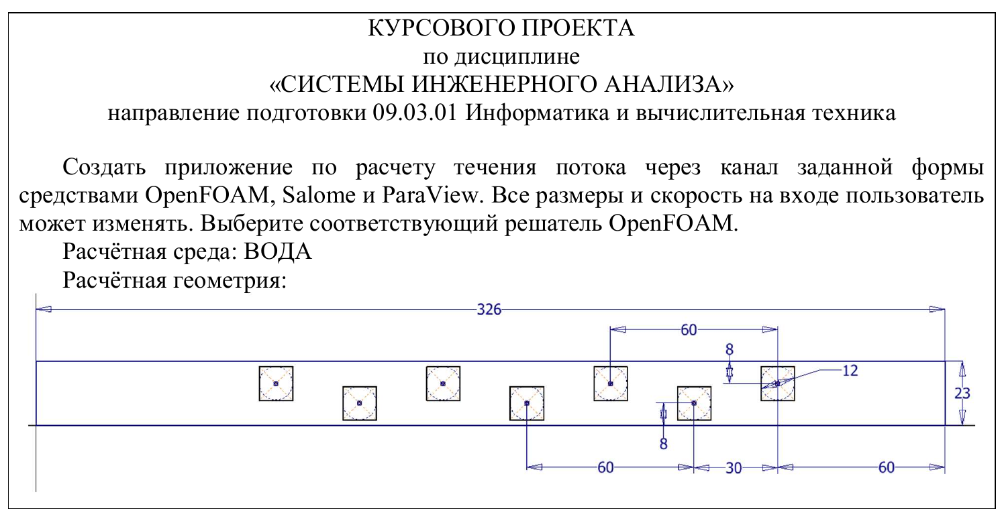

**Рисунок 1 — Исходная геометрия варианта № 3 из задания на курсовой проект.**

Канал имеет длину 326 мм и высоту 23 мм. Внутри расположены четыре верхних и три нижних квадратных препятствия со стороной 12 мм. Шаг одного ряда равен 60 мм, а второй ряд сдвинут на 30 мм. Центры препятствий находятся на расстоянии 8 мм от соответствующих стенок. Центр последнего верхнего квадрата расположен на 60 мм левее выходной границы.

### 2.2 Исходные и изменяемые параметры

Таблица 1 связывает обозначения исходного рисунка с полями приложения. Значения не были перенесены из другой работы: они совпадают в официальной схеме, `settings.json` и функции вычисления координат.

**Таблица 1 — Соответствие размеров варианта и параметров программы**

| Параметр | Название и физический смысл | Baseline | Единица |
|---|---|---:|---|
| L | Полная длина канала от входа до выхода | 326 | мм |
| H | Высота канала между стенками | 23 | мм |
| a | Сторона квадратного препятствия | 12 | мм |
| P | Шаг между центрами препятствий одного ряда | 60 | мм |
| S | Горизонтальное смещение шахматного ряда | 30 | мм |
| Y | Расстояние центра до соответствующей стенки | 8 | мм |
| R | Расстояние от центра последнего верхнего препятствия до outlet | 60 | мм |
| Uin | Скорость воды на входной границе | 0.10 | м/с |

В приложении все параметры размещены рядом с динамической схемой. Так проще сопоставить обозначение из задания с полем ввода.

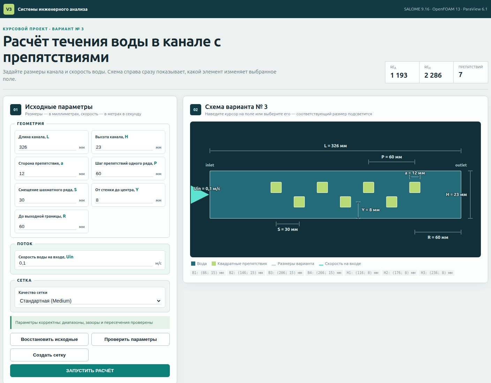

**Рисунок 2 — Обозначения изменяемых параметров на схеме приложения.**

Координаты отсчитываются от нижнего левого угла. Положение последнего верхнего препятствия определяется как `L − R`, остальные центры верхнего ряда отстоят на `P`. Нижний ряд сдвинут на `S`, его координата по высоте равна `Y`, а верхнего — `H − Y`. Для baseline верхние центры равны `(86;15)`, `(146;15)`, `(206;15)`, `(266;15)` мм, нижние — `(116;8)`, `(176;8)`, `(236;8)` мм.

Для оценки режима используются числа Рейнольдса

`Re = U · l / ν`,

где `U` — характерная скорость, м/с; `l` — характерный размер, м; `ν` — кинематическая вязкость, м²/с. В программе рассчитываются `Re_a` по стороне препятствия и `Re_H` по высоте канала. Для baseline получено `Re_a = 1192.84`, `Re_H = 2286.28`. Эти величины используются как характеристики режима, а не как автоматическое доказательство ламинарности сложного потока между препятствиями.

**Листинг 1 — Baseline-настройки**

```json
"geometryMm": { "L": 326.0, "H": 23.0, "a": 12.0,
  "P": 60.0, "S": 30.0, "Y": 8.0, "R": 60.0 },
"flow": { "Uin": 0.1, "nu": 1.006e-6,
  "rho": 998.2, "turbulenceModel": "kOmegaSST" }
```

### 2.3 Построение геометрии в SALOME

Скрипт `salome/generate_mesh.py` создаёт прямоугольную грань `L × H`. Для каждого центра строится квадрат со стороной `a`. Семь квадратов вычитаются из прямоугольника, поэтому полученная грань соответствует области, занятой водой. После этого область выдавливается по оси Z на 1 мм. Толщина является технологической: передняя и задняя грани имеют тип `empty`, поэтому расчёт остаётся псевдодвумерным.

**Листинг 2 — Вычисление центров препятствий**

```python
last_upper = L - R
upper_x = [last_upper - multiplier * P for multiplier in (3, 2, 1, 0)]
lower_x = [value + S for value in upper_x[:3]]
```

На рисунке 3 видно полную геометрию и дерево объектов SALOME. Отдельные группы нужны не только для удобства просмотра: их имена затем становятся названиями участков границы в OpenFOAM.


**Рисунок 3 — Геометрия канала с семью квадратными препятствиями в SALOME.**

### 2.4 Создание сетки

На двумерной грани используется NETGEN 1D–2D. В настройках разрешены четырёхугольники (`SetQuadAllowed`), поэтому сетка имеет преимущественно четырёхугольную структуру с переходными треугольными элементами. Коэффициент роста задан равным 0.2. Для пресета Medium, использованного в baseline, максимальный размер равен 1.25 мм, минимальный — 0.6 мм, а локальный размер на рёбрах препятствий — 0.75 мм.

**Таблица 2 — Пресеты размера сетки**

| Preset | Max size, мм | Min size, мм | Размер у препятствий, мм | Назначение |
|---|---:|---:|---:|---|
| Coarse | 2.0 | 0.9 | 1.0 | быстрая черновая сетка |
| Medium | 1.25 | 0.6 | 0.75 | основной пресет для расчётов A/B/C |
| Fine | 0.8 | 0.35 | 0.45 | более подробная сетка с большими затратами |

Размер элементов около квадратных препятствий уменьшен, поскольку именно здесь возникают сильные градиенты скорости, отрыв потока и вихревые следы. Локальное сгущение повышает разрешение решения в важных участках без равномерного увеличения числа ячеек во всей области. При уменьшении `obstacleSizeMm` локальная сетка становится мельче, а уменьшение `maxSizeMm` повышает разрешение всей области. Оба изменения увеличивают вычислительные затраты.

Двумерная сетка выдавливается на один слой толщиной 1 мм по оси Z. Поскольку границы `frontAndBack` имеют тип `empty`, расчёт остаётся псевдодвумерным.

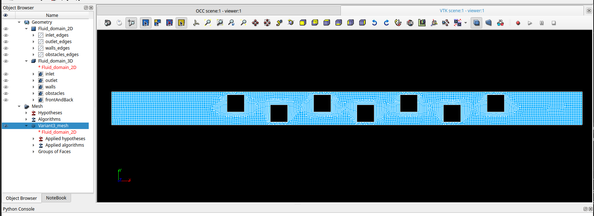

**Рисунок 4 — Расчётная сетка в модуле SMESH.**

На крупном плане виден переход от мелких элементов у рёбер квадратов к более крупным ячейкам вдали от препятствий.

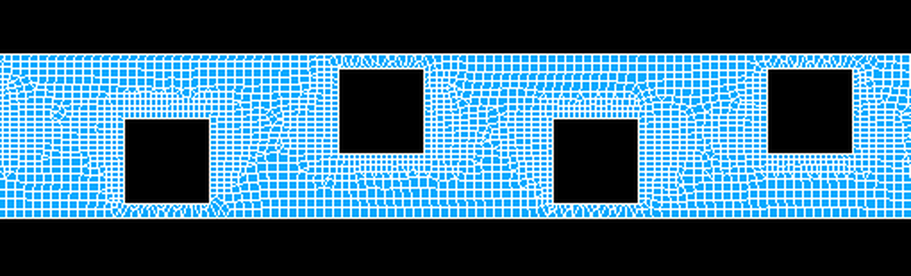

**Рисунок 5 — Локальное сгущение сетки около квадратных препятствий.**

Baseline-сетка содержит 11 364 узла и 5 267 объёмных ячеек: 5 101 гексаэдр и 166 призм. Группы `inlet`, `outlet`, `walls`, `obstacles`, `frontAndBack` показаны на рисунке 4.


**Рисунок 6 — Именованные группы границ расчётной сетки.**

После экспорта выполняются команды `ideasUnvToFoam`, `transformPoints "scale=(0.001 0.001 0.001)"` и `checkMesh -allGeometry -allTopology`. Максимальное отношение сторон равно 2.5618, максимальная неортогональность — 41.5969°, средняя — 4.8437°, максимальная скошенность — 2.5948, минимальный determinant — 0.02754. Итог проверки — `Mesh OK`.

### 2.5 Настройка OpenFOAM

Расчётная среда считается несжимаемой и изотермической. Вязкость задаётся в `constant/physicalProperties`, модель `kOmegaSST` — в `constant/momentumTransport`. Поля `U`, `p`, `k`, `omega`, `nut` находятся в каталоге `0`. Файлы `controlDict`, `fvSchemes`, `fvSolution` задают ход расчёта, дискретизацию и алгоритмы решения.

**Таблица 3 — Основные параметры расчёта**

| Параметр | Принятое значение | Где задано |
|---|---|---|
| Рабочая среда | вода, несжимаемая, изотермическая | `physicalProperties`, постановка задачи |
| Кинематическая вязкость ν | 1.006·10⁻⁶ м²/с | `settings.json`, `physicalProperties` |
| Плотность ρ | 998.2 кг/м³ | `settings.json`, пересчёт давления |
| Модель турбулентности | RAS `kOmegaSST` | `momentumTransport` |
| Решатель | `foamRun -solver incompressibleFluid` | `run_pipeline.py`, журналы |
| Начальная стадия | стационарная SIMPLE до отметки 2500 | шаблон `system` |
| Продолжение | нестационарная PIMPLE от 2500 до 2501 | `openfoam/transient/system` |
| Ограничение Куранта | `maxCo = 0.7` | transient `controlDict` |

Стационарный этап формирует начальное поле для последующего нестационарного расчёта. Итоговые величины берутся из последнего состояния PIMPLE. Для входных значений `k` и `omega` используются оценки `k = 3/2(Uin·I)²` и `ω = √k/(Cμ^(1/4)·lт)`, где `lт = 0.07H`, `Cμ = 0.09`.

**Листинг 3 — Передача Uin в поле U**

```python
velocity = float(flow["Uin"])
replace_all(case / "0" / "U",
    rf"uniform\s+\({NUMBER}\s+0\s+0\);",
    f"uniform ({velocity:.12g} 0 0);", minimum=2)
```

### 2.6 Граничные условия

Вход задаёт постоянную скорость по оси X. На выходе фиксируется нулевое кинематическое давление, а скорость получает `zeroGradient`. Стенки канала и поверхности квадратов неподвижны. Передняя и задняя грани являются `empty`, поскольку по толщине не решается третье направление.

**Таблица 4 — Граничные условия расчётного случая**

| Граница | Поле | Тип и значение | Физический смысл |
|---|---|---|---|
| inlet | U | `fixedValue uniform (Uin 0 0)` | заданная скорость воды на входе |
| inlet | p | `zeroGradient` | давление определяется решением |
| inlet | k, omega | `fixedValue` | входные турбулентные величины |
| inlet | nut | `calculated` | турбулентная вязкость вычисляется моделью |
| outlet | U | `zeroGradient` | поток свободно выходит из области |
| outlet | p | `fixedValue uniform 0` | опорное кинематическое давление |
| outlet | k, omega | `zeroGradient` | вынос турбулентных величин |
| outlet | nut | `calculated` | значение вычисляется моделью |
| walls, obstacles | U | `noSlip` | неподвижные твёрдые поверхности |
| walls, obstacles | p | `zeroGradient` | нет заданного градиента давления по нормали |
| walls, obstacles | k | `kqRWallFunction` | пристеночное условие для k |
| walls, obstacles | omega | `omegaWallFunction` | пристеночное условие для omega |
| walls, obstacles | nut | `nutkWallFunction` | пристеночная турбулентная вязкость |
| frontAndBack | все поля | `empty` | псевдодвумерная постановка |

В OpenFOAM поле `p` имеет размерность кинематического давления, м²/с². Для отображения в паскалях ParaView вычисляет `pПа = ρ·p`.

### 2.7 Результаты в ParaView

В baseline максимальный модуль скорости по ячейкам равен 0.466276 м/с, минимальный — 0.001868 м/с. На рисунке 7 видно, что наиболее высокие скорости появляются в проходах между квадратами и стенками. Это связано с уменьшением доступного сечения.

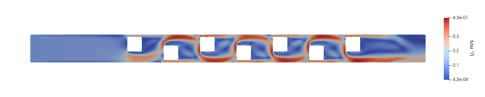

**Рисунок 7 — Поле модуля скорости воды для baseline-расчёта.**

Крупный план на рисунке 8 показывает, как поток ускоряется в узких проходах и как за плоскими гранями квадратов формируются зоны пониженной скорости. Именно для этих участков в сетке задано локальное сгущение.

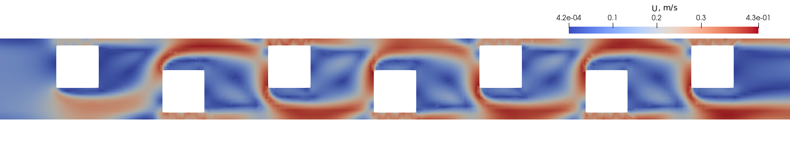

**Рисунок 8 — Поле скорости вблизи квадратных препятствий.**

Средний перепад давления между входом и выходом составил 305.9707 Па. Диапазон давления по ячейкам равен от −138.0307 до 315.5801 Па. На входной части давление выше, затем оно уменьшается по мере прохождения потока через массив препятствий.

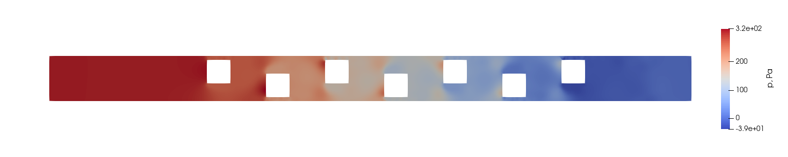

**Рисунок 9 — Поле давления для baseline-расчёта.**

Линии тока на рисунке 10 показывают последовательное отклонение потока вверх и вниз. За квадратами образуются области пониженной скорости, а основные струи проходят через чередующиеся зазоры.

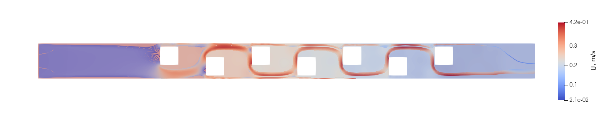

**Рисунок 10 — Линии тока в канале с препятствиями.**

## 3 РАЗРАБОТКА ПРИЛОЖЕНИЯ

### 3.1 Архитектура

Клиентская часть написана на HTML, CSS и JavaScript без стороннего frontend framework. Сервер использует встроенные модули Node.js `http`, `fs`, `path`, `child_process`. Python отвечает за расчёт координат, подготовку case и последовательный вызов внешних программ.

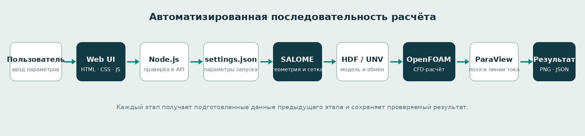

**Рисунок 11 — Последовательность автоматизированной подготовки и выполнения расчёта.**

Браузер не запускает SALOME или OpenFOAM напрямую. Он отправляет JSON серверу. Сервер проверяет значения, создаёт отдельный каталог расчёта и запускает Python-сценарий. Состояние каждого этапа записывается в `status.json`, а итоговые параметры и результаты — в `summary.json`. Одновременно допускается только один вычислительный процесс, что снижает нагрузку на виртуальную машину.

### 3.2 Пользовательский интерфейс

Параметры разделены на три блока: «Геометрия», «Поток» и «Сетка». У каждого поля есть полное название, единица измерения и короткая подсказка. Кнопки позволяют отдельно проверить параметры, создать сетку или запустить полный расчёт. Интерфейс показан на рисунке 12.

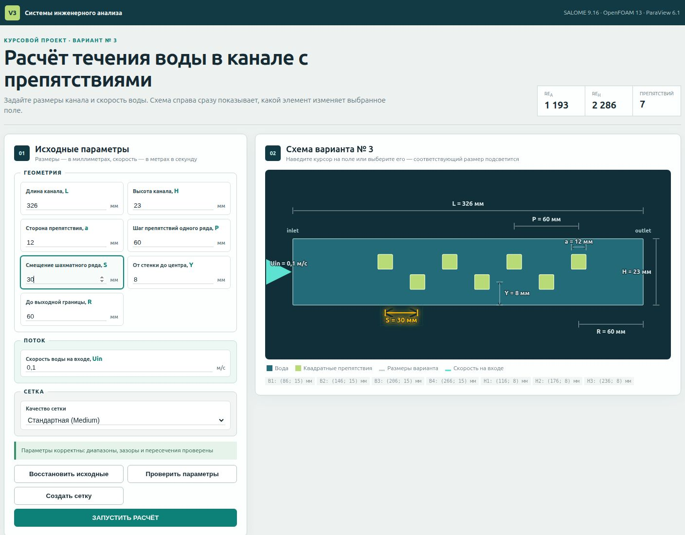

**Рисунок 12 — Интерфейс приложения с подсветкой выбранного размера S.**

Схема построена как SVG и обновляется после успешной серверной проверки. Она показывает канал, семь квадратов, inlet, outlet, направление воды и все размеры. Вертикальный масштаб сделан крупнее геометрического, чтобы подписи и препятствия оставались читаемыми на экране; числовые координаты при этом рассчитываются без изменения.

### 3.3 Связь размеров варианта с параметрами программы

При наведении, выборе или изменении поля соответствующая размерная линия и подпись подсвечиваются. Для `a` дополнительно выделяется квадрат, для `L` и `H` — контур канала, для `Uin` — входная стрелка. На рисунке 12 выбран `S`, который задаёт горизонтальный сдвиг нижнего ряда.

Сервер принимает диапазоны `L=100…1000`, `H=15…200`, `a=2…50`, `P=10…250`, `S=1…250`, `Y=1…199`, `R=10…500` мм и `Uin=0.005…2 м/с`. Кроме диапазонов, проверяются условия `S≥a`, `P−S≥a`, `P≥a`, зазоры до стенок, положение всех квадратов внутри канала и попарные пересечения.

### 3.4 Автоматизация расчёта

После проверки параметров сервер создаёт каталог `runs/web-<дата-время>` и сохраняет `settings.json`. Python-сценарий работает во временном каталоге, чтобы не менять исходный шаблон. Он вызывает SALOME, импортирует UNV, назначает типы границ, запускает `checkMesh`, параметризует case, выполняет две стадии решения и постобработку. Только после успешного завершения файлы копируются в каталог расчёта.

**Листинг 4 — Последовательный вызов решателя**

```python
self.command("solver_steady",
    ["foamRun", "-solver", "incompressibleFluid"], self.case, openfoam=True)
transient = self.command("solver_transient",
    ["foamRun", "-solver", "incompressibleFluid"], self.case, openfoam=True)
```

Каждая внешняя команда получает явный рабочий каталог и отдельный журнал. Ненулевой код завершения останавливает последовательность, а интерфейс показывает сообщение. MPI в проекте не используется.

### 3.5 Получение результата

После расчёта OpenFOAM выполняются функции для расхода, среднего давления и экстремумов полей. Затем `pvpython` создаёт пять PNG и JSON с диапазонами. Интерфейс показывает входные параметры выбранного расчёта, число ячеек, максимальную скорость, перепад давления, дисбаланс расхода и максимальное число Куранта.

**Листинг 5 — Формирование изображений ParaView**

```python
ColorBy(display, ("POINTS", "U", "Magnitude"))
display.RescaleTransferFunctionToDataRange(True, False)
SaveScreenshot(os.path.join(output_dir, "velocity.png"), view)

ColorBy(display, ("POINTS", "p_Pa"))
SaveScreenshot(os.path.join(output_dir, "pressure.png"), view)
```

Результаты каждого расчёта хранятся отдельно. Пользователь может выбрать ранее завершённый набор в списке, посмотреть журнал и открыть соответствующий case в ParaView. Вместо нескольких маленьких карточек в интерфейсе используется одна крупная область просмотра с вкладками «Скорость», «Давление», «Линии тока», «Локальный вид» и «Сетка». Выбранный кадр показывается на всю ширину блока.

## 4 ТЕСТИРОВАНИЕ

Для проверки использованы три уже выполненных расчёта. Их параметры и итоговые величины приведены в таблице 5.

**Таблица 5 — Результаты расчётов A, B и C**

| Расчёт | Изменённые параметры | Сетка | max |U|, м/с | Δp, Па | Re_a / Re_H | Итог |
|---|---|---:|---:|---:|---:|---|
| A, baseline | исходные значения, Uin=0.10 м/с | 5267 ячеек | 0.4663 | 305.97 | 1192.84 / 2286.28 | Mesh OK, End |
| B, скорость | Uin=0.15 м/с | 5267 ячеек | 0.7375 | 682.07 | 1789.26 / 3429.42 | Mesh OK, End |
| C, геометрия | L=350, H=25, a=11, P=62, S=31 мм | 6518 ячеек | 0.3999 | 180.96 | 1093.44 / 2485.09 | Mesh OK, End |

### 4.1 Базовый запуск

Baseline использует размеры официального варианта и скорость 0.10 м/с. Расход на входе и выходе равен 2.3·10⁻⁶ м³/с; дисбаланс в точности сохранённого вывода равен 0 %. Максимальное число Куранта в конце расчёта равно 0.6915, то есть не превышает ограничения 0.7.

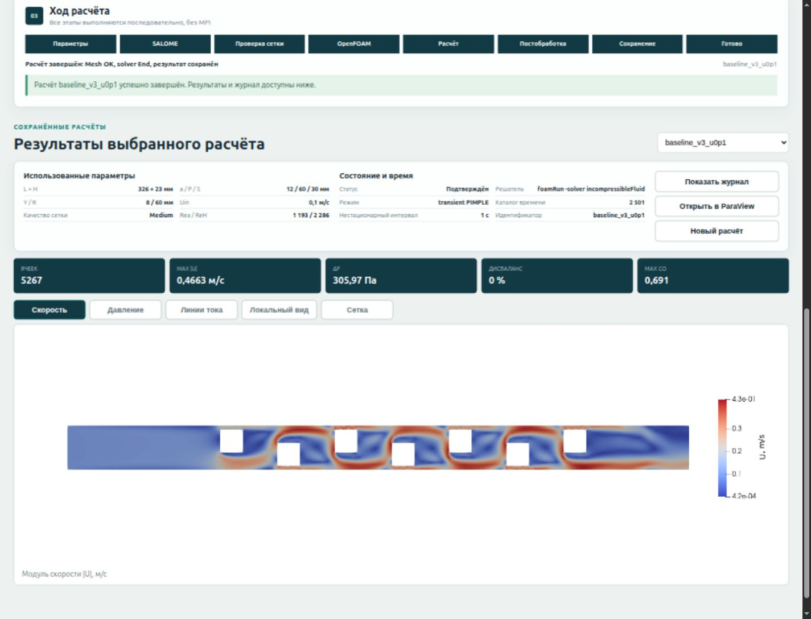

**Рисунок 13 — Завершённый baseline-расчёт и вкладка поля скорости.**

### 4.2 Изменение скорости

Во втором расчёте геометрия и сетка не менялись, а `Uin` увеличена до 0.15 м/с. Максимальная скорость увеличилась приблизительно в 1.58 раза, перепад давления — в 2.23 раза. Это показывает, что значение из формы передаётся в OpenFOAM и влияет на поле потока, а приложение не открывает один неизменяемый результат.

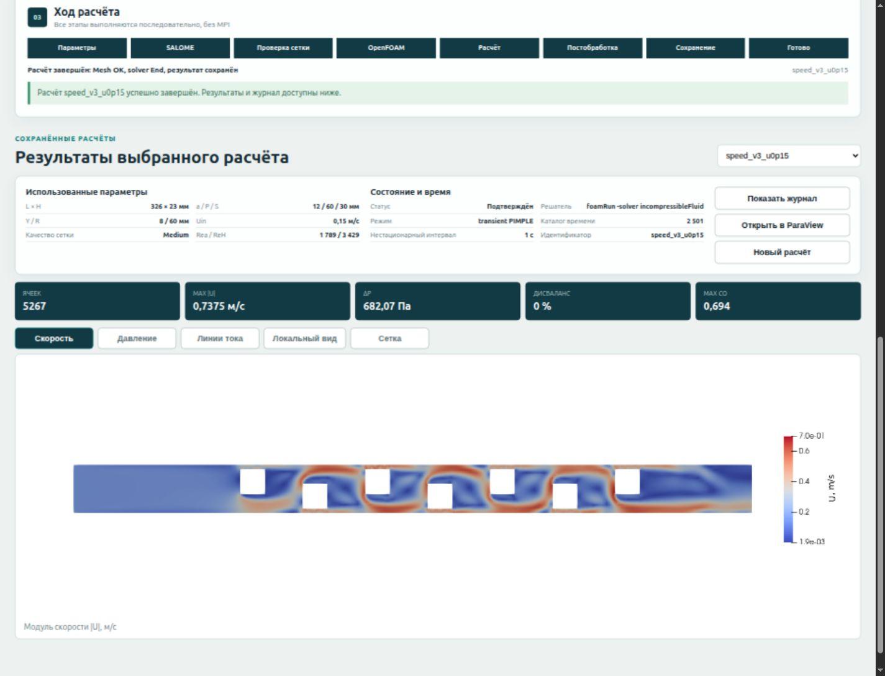

**Рисунок 14 — Результат при увеличении Uin до 0.15 м/с.**

### 4.3 Изменение геометрии

В третьем расчёте приняты `L=350`, `H=25`, `a=11`, `P=62`, `S=31`, `Y=8`, `R=60` мм. Изменились координаты препятствий и сетка: число ячеек выросло до 6518. Максимальная скорость составила 0.3999 м/с, перепад давления — 180.96 Па. Расчёт подтвердил, что геометрические поля проходят всю последовательность от формы до новой сетки.

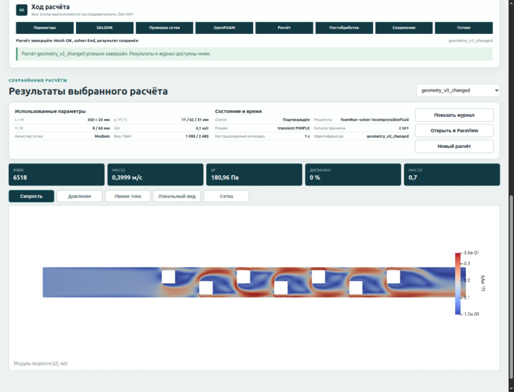

**Рисунок 15 — Результат при изменённых размерах канала и препятствий.**

### 4.4 Обработка ошибочного ввода

При `S=5 мм` и `a=12 мм` нарушается условие `S≥a`. Сервер возвращает сообщение «Смещение S должно быть не меньше стороны препятствия a», блокируя создание сетки и запуск расчёта. Аналогично обрабатываются пустые поля, выход за диапазон, касание стенки и пересечение квадратов.

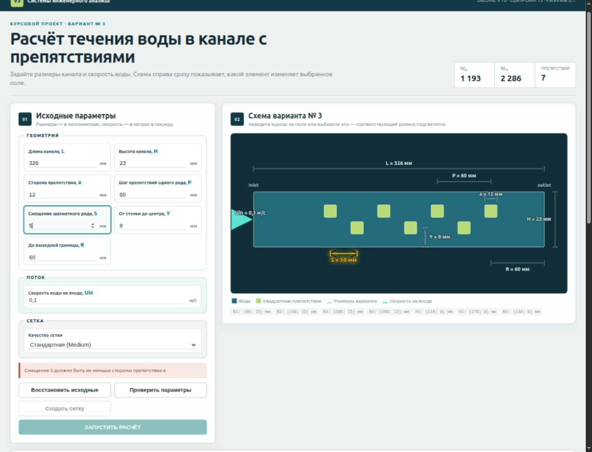

**Рисунок 16 — Сообщение при геометрически недопустимом значении S.**

## ЗАКЛЮЧЕНИЕ

В курсовом проекте разработано приложение для расчёта течения воды через канал варианта № 3. Официальные размеры связаны с понятными полями формы, а динамическая схема показывает, какой участок геометрии изменяет каждый параметр. Скорость Uin отделена от геометрии и обозначена стрелкой на входной границе.

В SALOME реализовано параметрическое построение области с семью квадратными препятствиями, создание групп и однослойной сетки. Сетка передаётся в OpenFOAM через UNV, переводится в метры и проходит расширенную проверку. Для воды задана модель RAS `kOmegaSST`; расчёт выполняется решателем `incompressibleFluid` последовательно, без MPI. ParaView автоматически формирует поля скорости и давления, линии тока и крупный план препятствий.

Работа приложения показана на трёх сохранённых расчётах. Увеличение скорости входа изменило скорость и перепад давления при той же сетке. Изменение размеров привело к новой геометрии и сетке с другим числом ячеек. Недопустимые параметры отклоняются до запуска SALOME и OpenFOAM. Таким образом, поставленная цель достигнута: подготовка, расчёт и получение результата объединены в понятную параметрическую программу.

## СПИСОК ИСПОЛЬЗОВАННЫХ ИСТОЧНИКОВ

1. OpenFOAM Foundation. OpenFOAM v13 User Guide [Электронный ресурс]. URL: <https://doc.cfd.direct/openfoam/user-guide-v13/contents> (дата обращения: 25.09.2026).
2. SALOME Platform. User Documentation, version 9.16 [Электронный ресурс]. URL: <https://docs.salome-platform.org/latest/> (дата обращения: 25.09.2026).
3. Kitware. ParaView User’s Guide [Электронный ресурс]. URL: <https://docs.paraview.org/en/latest/> (дата обращения: 25.09.2026).
4. Node.js. Documentation [Электронный ресурс]. URL: <https://nodejs.org/docs/latest/api/> (дата обращения: 25.09.2026).
5. Ferziger J. H., Perić M., Street R. L. Computational Methods for Fluid Dynamics. 4th ed. Cham: Springer, 2020. DOI: 10.1007/978-3-319-99693-6.
6. Moukalled F., Mangani L., Darwish M. The Finite Volume Method in Computational Fluid Dynamics. Cham: Springer, 2016. DOI: 10.1007/978-3-319-16874-6.
7. Versteeg H. K., Malalasekera W. An Introduction to Computational Fluid Dynamics: The Finite Volume Method. 2nd ed. Harlow: Pearson, 2007. ISBN 978-0-13-127498-3.
8. Pope S. B. Turbulent Flows. Cambridge: Cambridge University Press, 2000. DOI: 10.1017/CBO9780511840531.
9. Menter F. R. Two-equation eddy-viscosity turbulence models for engineering applications // AIAA Journal. 1994. Vol. 32, no. 8. P. 1598–1605. DOI: 10.2514/3.12149.
10. Темы курсового проекта по дисциплине «Системы инженерного анализа». Вариант № 3, печатная страница 48. Локальный файл `reference/ТКП (1).pdf`.

## ПРИЛОЖЕНИЯ

### Приложение А — Основные файлы приложения

В приложение А следует включить `app/server.js`, `app/public/index.html`, `app/public/style.css`, `app/public/app.js`.

### Приложение Б — Автоматизация SALOME

В приложение Б следует включить `salome/generate_mesh.py` и связанную функцию `scripts/geometry.py`.

### Приложение В — Подготовка и запуск OpenFOAM

В приложение В следует включить `scripts/parameterize_case.py`, `scripts/set_patch_types.py`, `scripts/run_pipeline.py`, а также основные dictionaries шаблона.

### Приложение Г — Постобработка

В приложение Г следует включить `postprocessing/render_results.py` и `scripts/build_summary.py`.
