# Лабораторная работа №2

**Поток в полости при движении верхней грани**

## Цель работы

Освоить структуру расчётного case OpenFOAM, построение и проверку сетки, задание начальных и граничных условий, перенос полей между сетками и постобработку результатов в ParaView на примере течения в полости с движущейся крышкой.

## Постановка задачи

Рассматривается двумерное изотермическое течение несжимаемой жидкости в квадратной полости. Верхняя стенка движется вправо со скоростью 1 м/с, остальные стенки неподвижны. Исследованы базовая и уточнённая сетки, сетка со сгущением, режимы Re=10, 100 и 10000, а также полость с вырезом.

## Используемое программное обеспечение

- Ubuntu 26.04.
- OpenFOAM Foundation 13: `blockMesh`, `checkMesh`, `mapFields`, `icoFoam`, совместимый вызов `pisoFoam`, `foamPostProcess`.
- ParaView 6.1.1: отображение сетки, давления, векторов, линий тока и профиля скорости.

## Исходные данные

Базовая область имеет размеры 0,1×0,1×0,01 м. В направлении z задана одна ячейка и граница `empty`, поэтому решается двумерная задача. При U=1 м/с и характерном размере L=0,1 м число Рейнольдса равно `Re=UL/nu`.

| Case | nu, м²/с | Re | Сетка | Конечное время |
|---|---:|---:|---:|---:|
| `cavityBase` | 0,01 | 10 | 20×20×1 | 1 с |
| `cavityFine` | 0,01 | 10 | 40×40×1 | 1 с |
| `cavityGrade` | 0,01 | 10 | 4 блока по 10×10×1 | 0,8 с |
| `cavityHighRe` | 0,001 | 100 | 20×20×1 | 2 с |
| `cavityRAS` | 1·10⁻⁵ | 10000 | 20×20×1 | 20 с |
| `cavityClipped` | 0,01 | 10 | 336 ячеек | 0,6 с |

## Теоретическая часть

Для несжимаемой ньютоновской жидкости плотность считается постоянной. Расчёт основан на уравнении неразрывности

`div(U)=0`

и уравнении импульса

`∂U/∂t + div(UU) = -grad(p) + nu·laplacian(U)`,

где `U` — скорость, м/с; `t` — время, с; `p` — кинематическое давление, м²/с²; `nu` — кинематическая вязкость, м²/с. В OpenFOAM для несжимаемых решателей поле `p` обычно нормировано на плотность, поэтому его размерность отличается от давления в паскалях.

Соотношение сил инерции и вязкости характеризуется числом Рейнольдса:

`Re = U·L/nu`,

где `U=1 м/с` — скорость крышки, `L=0,1 м` — сторона полости. Поэтому `nu=0,01 м²/с` соответствует `Re=10`, `nu=0,001 м²/с` — `Re=100`, а `nu=1·10⁻5 м²/с` — `Re=10000`. При росте `Re` вязкое сглаживание ослабевает, усиливаются вихревые и нестационарные эффекты.

Для переходного расчёта важен критерий Куранта:

`Co = |U|·Δt/Δx`,

где `Δt` — шаг времени, с; `Δx` — характерный размер ячейки, м. Он показывает, какую долю ячейки перенос проходит за один шаг. Методичка требует подбирать шаг так, чтобы `Co` не превышал 1. В выполненных ламинарных случаях это условие соблюдено. Для RAS на последнем шаге получено `Co=1,00305`; это небольшое превышение явно фиксируется как ограничение результата.

Связь скорости и давления обеспечивается алгоритмом PISO: на каждом временном шаге сначала прогнозируется скорость, затем выполняются коррекции давления и потока, удовлетворяющие неразрывности. Для `Re=10000` применена RAS-модель `kEpsilon`, то есть решаются уравнения для осреднённого потока и дополнительных турбулентных величин `k` и `epsilon`.

## Расчётная область

В `cavityBase`, `cavityFine`, `cavityHighRe` и `cavityRAS` используется квадратная полость. `cavityGrade` делит её на четыре блока для сгущения к стенкам. В `cavityClipped` из нижнего правого угла исключён участок 0,04×0,04 м; верхняя движущаяся граница переименована в `lid`.

## Построение сетки

Сетки созданы утилитой `blockMesh` по реальным файлам `system/blockMeshDict`.

| Case | Ячейки | Группы/patches | Результат проверки |
|---|---:|---|---|
| `cavityBase` | 400 hex | `movingWall`, `fixedWalls`, `frontAndBack` | `Mesh OK`, max non-orthogonality 0°, max aspect ratio 1 |
| `cavityFine` | 1600 hex | те же | `Mesh OK`, max non-orthogonality 0°, max aspect ratio 1, max skewness `3,19779·10⁻14` |
| `cavityGrade` | 400 hex | те же | `Mesh OK`, max non-orthogonality 0°, max aspect ratio 2 |
| `cavityHighRe` | 400 hex | те же | `Mesh OK`, max non-orthogonality 0° |
| `cavityRAS` | 400 hex | те же | `Mesh OK`, max non-orthogonality 0° |
| `cavityClipped` | 336 hex | `lid`, `fixedWalls`, `frontAndBack` | `Mesh OK`, max non-orthogonality 0° |

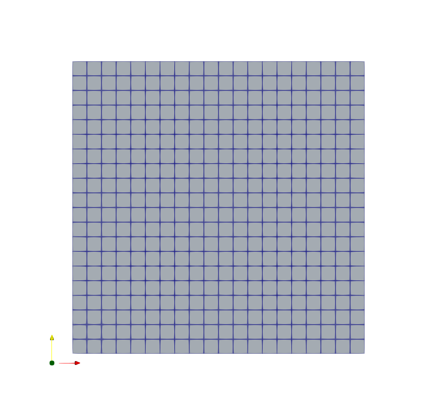

*Рисунок 1 — Базовая равномерная сетка 20×20×1.*


*Рисунок 2 — Уточнённая равномерная сетка 40×40×1.*

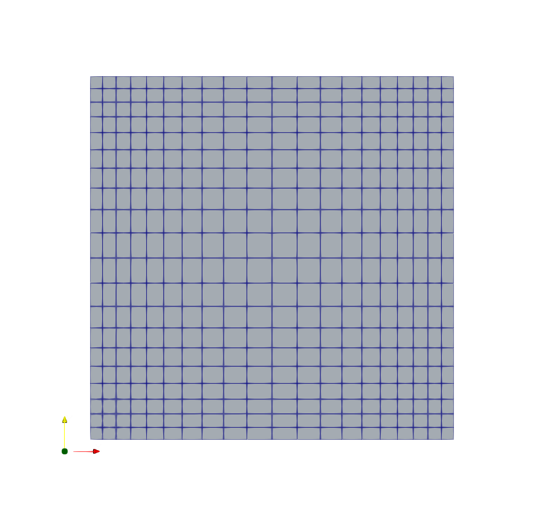

*Рисунок 3 — Четырёхблочная сетка со сгущением к стенкам полости.*

## Граничные условия

Условия одинаковы для всех квадратных ламинарных cases; в `cavityClipped` patch `movingWall` называется `lid`.

| Patch | Поле | Тип | Значение | Физический смысл |
|---|---|---|---|---|
| `movingWall` / `lid` | `U` | `fixedValue` | `(1 0 0)` м/с | движущаяся верхняя крышка |
| `fixedWalls` | `U` | `noSlip` | 0 | неподвижные твёрдые стенки |
| `movingWall` / `lid` | `p` | `zeroGradient` | нормальный градиент 0 | давление не фиксируется на стенке |
| `fixedWalls` | `p` | `zeroGradient` | нормальный градиент 0 | то же |
| `frontAndBack` | `U`, `p` | `empty` | — | двумерность задачи |

Для `cavityRAS` дополнительно присутствуют `k`, `epsilon` и `nut`; в `constant/momentumTransport` реально заданы `simulationType RAS` и модель `kEpsilon`.

`fixedValue` непосредственно задаёт значение поля на границе. `noSlip` является специальной записью нулевой скорости на неподвижной стенке и эквивалентен `fixedValue uniform (0 0 0)`. `zeroGradient` задаёт нулевую нормальную производную, поэтому значение на границе экстраполируется из внутренней области. `empty` исключает производные и поток через переднюю и заднюю плоскости, превращая одноячеечную по `z` область в квазидвумерную.

## Структура OpenFOAM case

Каждый case содержит три обязательные части:

- `0/` — начальные и граничные условия. В ламинарных вариантах это `U` и `p`; после постобработки появляются `Ux`, `Uy`, `Uz`. В `cavityRAS` дополнительно заданы `k`, `epsilon`, `nut`.
- `constant/physicalProperties` — модель ньютоновской жидкости и `nu`. В RAS-варианте `constant/momentumTransport` выбирает `simulationType RAS` и `kEpsilon`.
- `system/blockMeshDict` — вершины, блоки и patches; `controlDict` — время и запись; `fvSchemes` — схемы дискретизации; `fvSolution` — линейные решатели и параметры PISO. Только `cavityClipped` дополнительно использует `system/mapFieldsDict` для соответствия `lid` и `movingWall`.

Каталоги `0.1`, `0.2` и далее являются записанными временными слоями, а файлы `log.*` сохраняют фактический ход выполнения и окончание `End`.

## Настройка solver

Ламинарные cases решались `icoFoam`. В `constant/physicalProperties` задана кинематическая вязкость. Для базового случая `controlDict` содержит `endTime=1`, `deltaT=0.005`, `writeInterval=20`; для fine шаг уменьшен до 0,0025 с. `fvSchemes` использует Euler по времени, Gauss linear для градиентов и интерполяции, `div(phi,U) Gauss linear`. В `fvSolution` применены PCG/DIC для `p`, `smoothSolver/symGaussSeidel` для `U` и два корректора PISO.

Для `cavityRAS`: `endTime=20`, `deltaT=0.02`; алгоритм относится к модулю `incompressibleFluid`. Финальный maxCo=1,00305 на 0,3% выше единицы; расчёт завершился штатно, но это превышение нельзя скрывать.

## Выполнение работы

В журналах зафиксирована следующая последовательность.

```bash
blockMesh
```

Создаёт сетку по `system/blockMeshDict`.

```bash
checkMesh -allGeometry -allTopology
```

Проверяет геометрию и топологию. Для `cavityFine` проверка дополнительно выполнена на существующей сетке без её пересоздания; результат `Mesh OK` сохранён в `fast_finish_2026/LR2/cavityFine/log.checkMesh`.

```bash
icoFoam
```

Выполняет переходный ламинарный расчёт. Так рассчитаны `cavityBase`, `cavityFine`, `cavityGrade`, `cavityHighRe` и `cavityClipped`.

```bash
mapFields -consistent ../cavity
```

Так поля базового решения были перенесены на fine-сетку. Для graded-сетки журнал фиксирует `mapFields -consistent -sourceTime 0.7 /home/pavel/openfoam-lab/cavityFine`.

```bash
mapFields -sourceTime 0.5 /home/pavel/openfoam-lab/cavity
```

Переносит поля на отличающуюся геометрию `cavityClipped`; `mapFieldsDict` задаёт `patchMap (lid movingWall)`.

```bash
pisoFoam
```

Запускает расчёт RAS. В OpenFOAM 13 устаревшее имя перенаправляется на общий модуль `foamRun -solver incompressibleFluid`.

```bash
foamPostProcess -func components(U)
```

Создаёт скалярные компоненты `Ux`, `Uy`, `Uz` для построения профилей.

## Результаты и обсуждение

Все solver logs заканчиваются строкой `End`. Финальные значения числа Куранта: base 0,852134; fine 0,926452; graded 0,440057; highRe 0,839937; clipped 0,834722; RAS 1,00305.

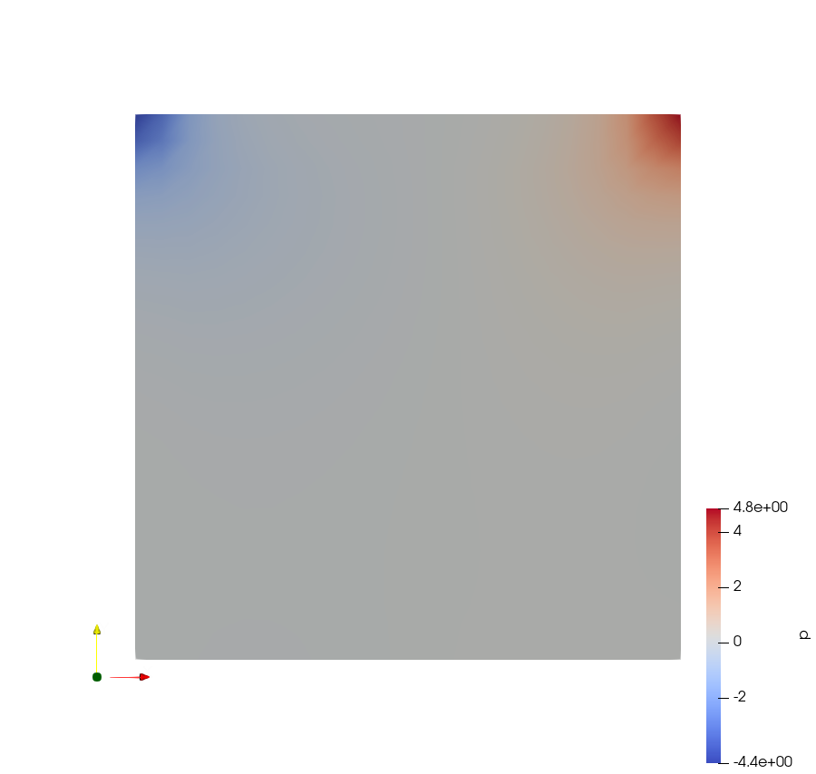

*Рисунок 4 — Поле кинематического давления в базовой полости на конечном времени.*

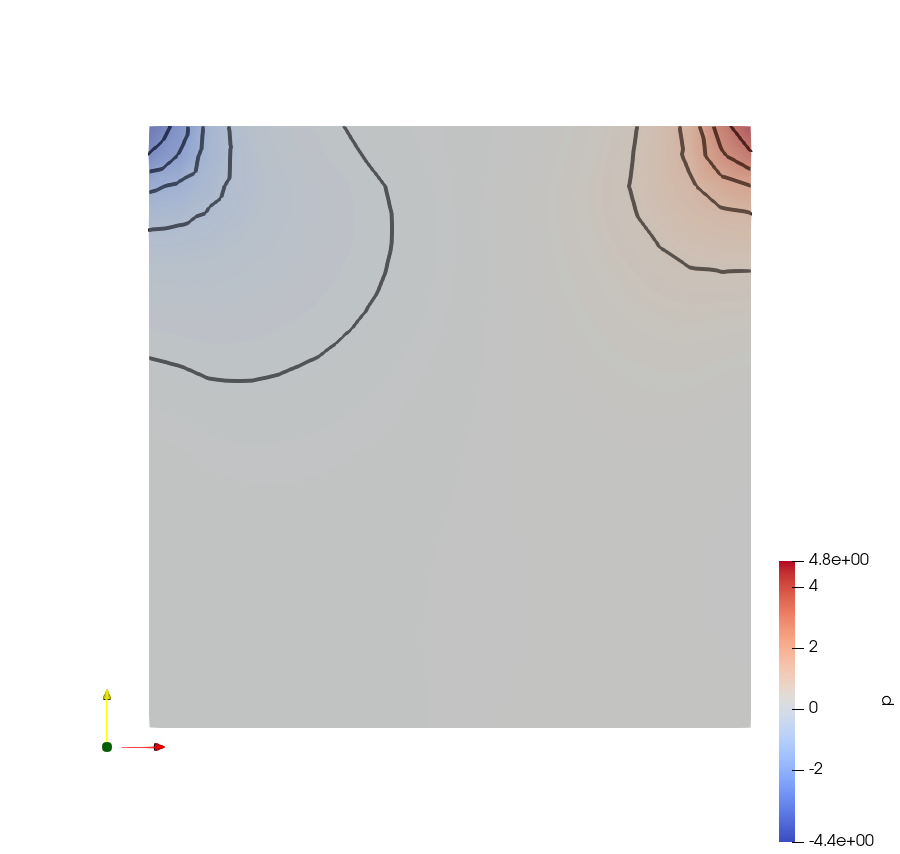

*Рисунок 5 — Контурное представление кинематического давления.*

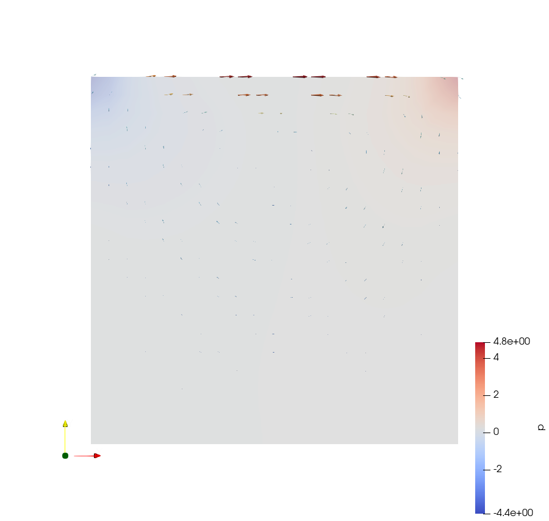

*Рисунок 6 — Векторное представление скорости в базовой полости.*

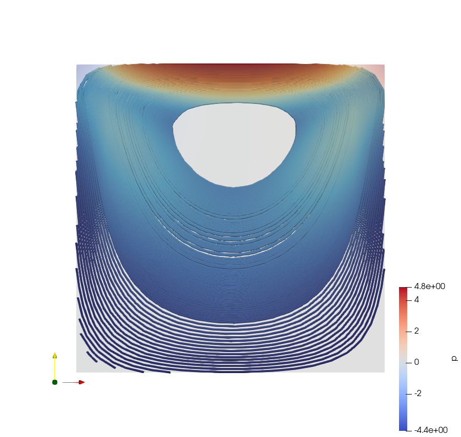

*Рисунок 7 — Линии тока базового случая.*

Движущаяся крышка формирует главный вихрь по часовой стрелке: поток идёт вправо у крышки, вниз вдоль правой стенки и возвращается влево у дна.

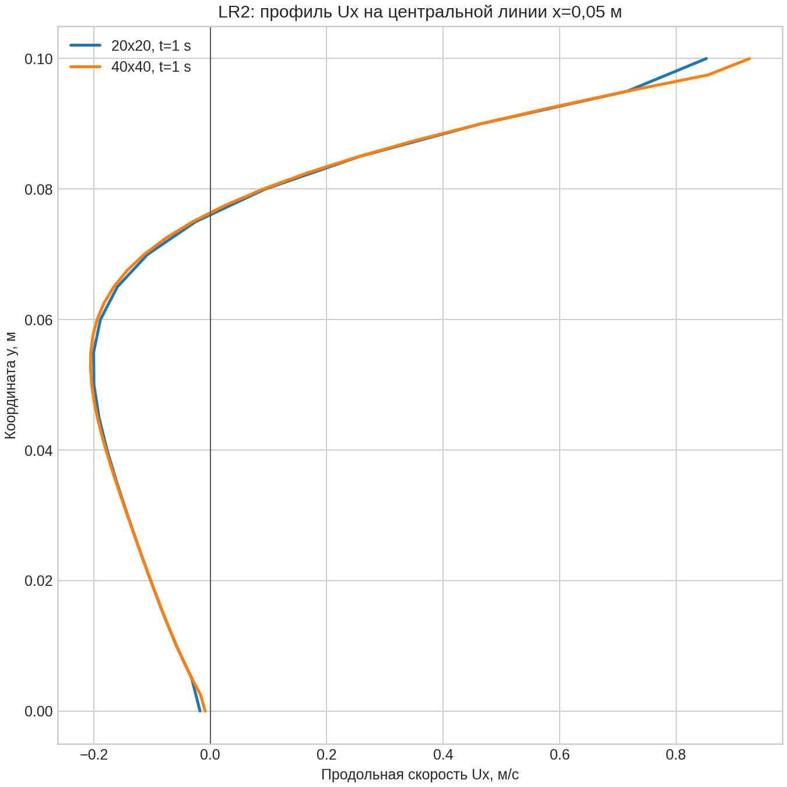

*Рисунок 8 — Сравнение профиля `Ux` на базовой и уточнённой сетках.*

Сравнение профилей показывает влияние разрешения сетки, особенно около стенок с большими градиентами скорости.

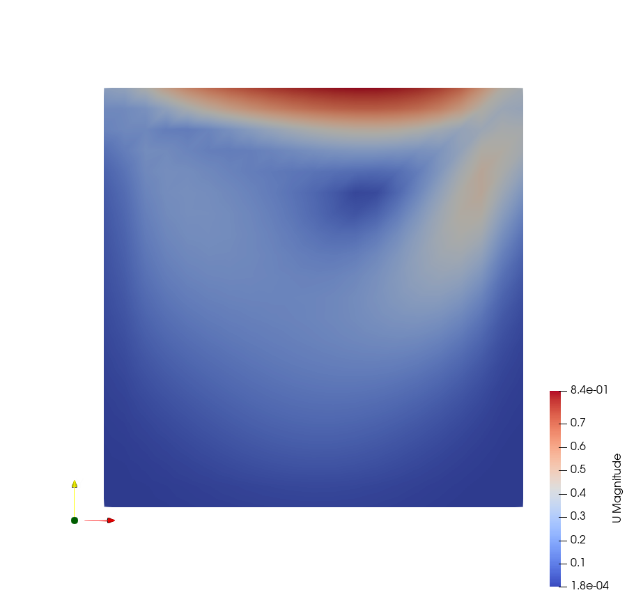

*Рисунок 9 — Поле модуля скорости при `Re=100`.*

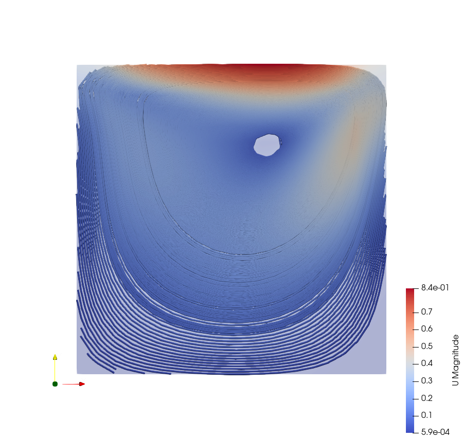

*Рисунок 10 — Линии тока при `Re=100`.*

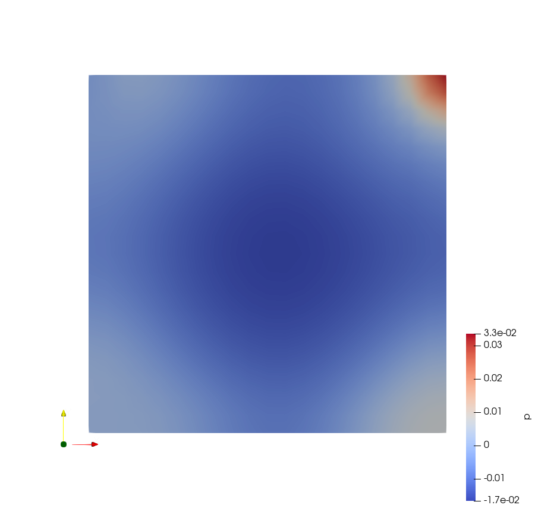

*Рисунок 11 — Поле кинематического давления в RAS-расчёте при `Re=10000`.*

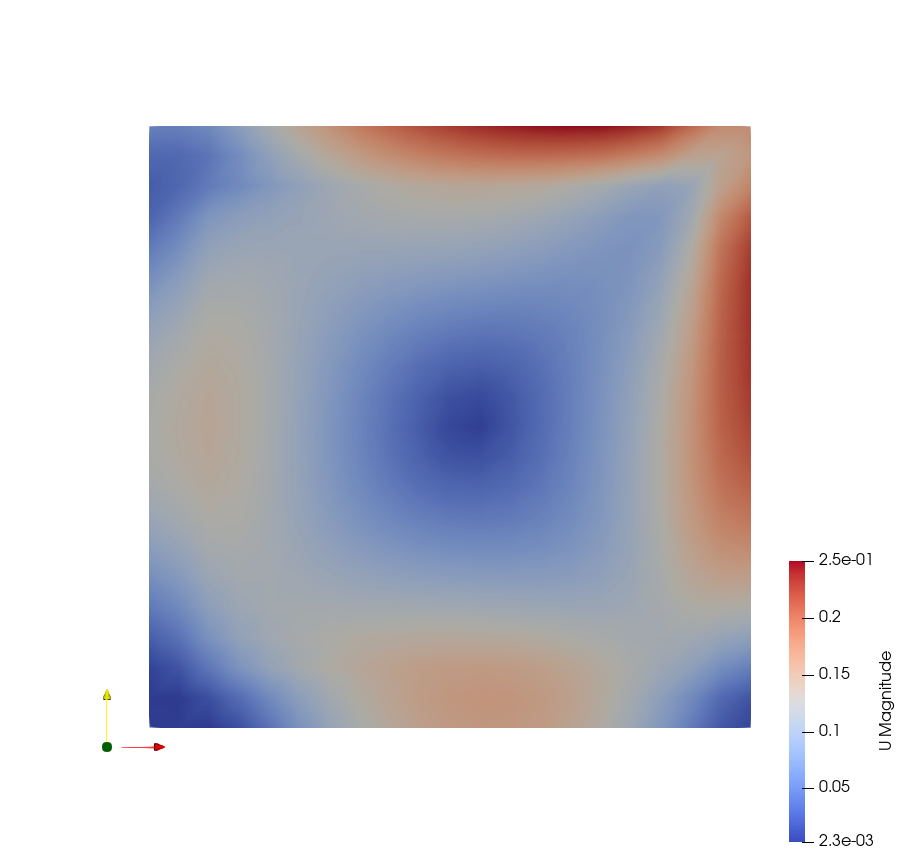

*Рисунок 12 — Поле скорости в RAS-расчёте при `Re=10000`.*

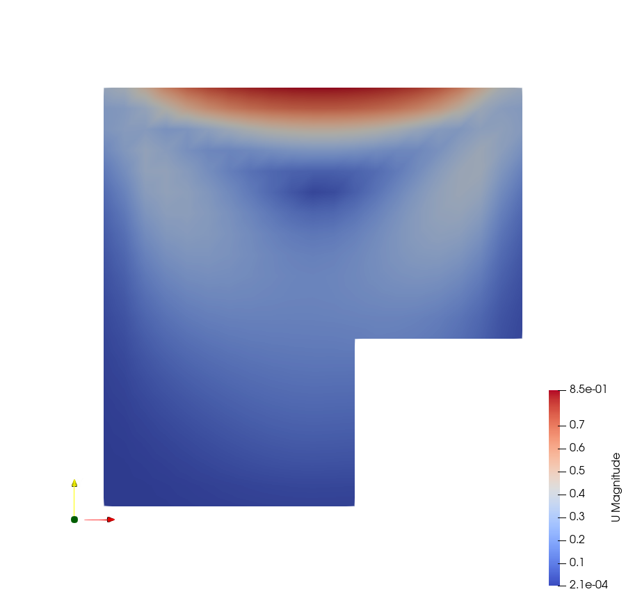

*Рисунок 13 — Поле скорости после переноса на геометрию с вырезом при `t=0,5 с`.*

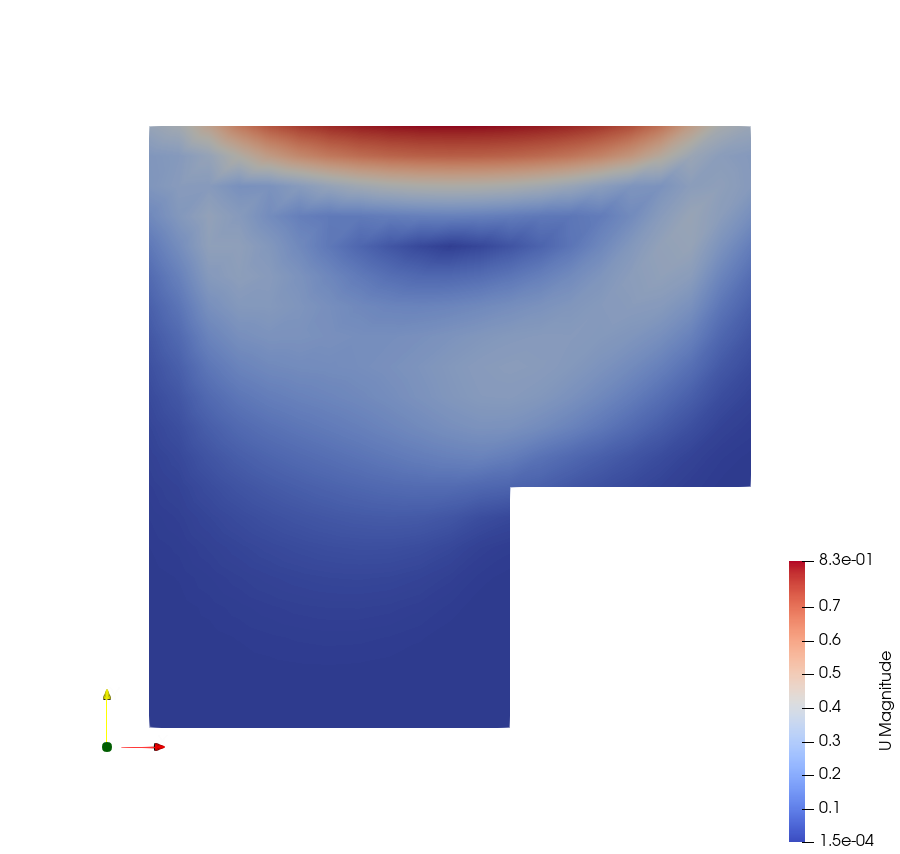

*Рисунок 14 — Поле скорости после продолжения расчёта до `t=0,6 с`.*

## Вопросы для самоконтроля

### 1. В чем заключается основное отличие решателя icoFoam от решателя pisoFoam?

**Краткий ответ:** `icoFoam` предназначен для переходного ламинарного изотермического несжимаемого течения, а `pisoFoam` в контексте методички применяется к переходному несжимаемому течению с моделями турбулентности.

**Развёрнутый ответ:** Оба решателя используют связь давления и скорости на основе PISO, но различаются набором подключаемых физических моделей. В OpenFOAM Foundation 13 старое имя `pisoFoam` перенаправляется на модуль `foamRun -solver incompressibleFluid`.

**Пример из нашей работы:** `cavityBase`, `cavityFine`, `cavityGrade`, `cavityHighRe` и `cavityClipped` рассчитаны командой `icoFoam`, а `cavityRAS` — совместимым вызовом `pisoFoam` при `simulationType RAS` и модели `kEpsilon`.

### 2. Для чего используется утилита mapFields?

**Краткий ответ:** Для переноса уже рассчитанных полей из одного case в другой, в том числе на другую сетку.

**Развёрнутый ответ:** `mapFields` интерполирует значения `U`, `p` и других полей из источника в целевую область. При совпадающих геометрии и patches используется `-consistent`.

**Пример из нашей работы:** решение `cavityBase` перенесено в `cavityFine`, а состояние fine при `t=0,7 с` — в `cavityGrade`. Для `cavityClipped` геометрия отличается, поэтому `system/mapFieldsDict` задаёт `patchMap (lid movingWall)` и `cuttingPatches`.

### 3. Как выполнить решение 2D задачи в OpenFOAM?

**Краткий ответ:** Построить область толщиной в одну ячейку и назначить передней и задней граням тип `empty` во всех полях.

**Развёрнутый ответ:** OpenFOAM хранит трёхмерную сетку, поэтому плоская задача представляется тонким параллелепипедом. Условие `empty` отключает решение в направлении толщины.

**Пример из нашей работы:** в cases cavity размер по `z` равен 0,01 м и имеется одна ячейка; patch `frontAndBack` имеет тип `empty`.

### 4. Какое правило необходимо соблюдать для того, чтобы обеспечить сходимость решения?

**Краткий ответ:** Контролировать число Куранта и подбирать шаг времени так, чтобы оно оставалось не больше 1.

**Развёрнутый ответ:** Для явных и переходных составляющих слишком большой перенос за шаг ухудшает устойчивость. Поэтому `deltaT` уменьшают при сгущении сетки или росте скорости.

**Пример из нашей работы:** финальные `Co` для ламинарных вариантов находятся от 0,440057 до 0,926452. Для RAS получено 1,00305 — расчёт завершился, но значение немного превышает формальный критерий и потому отдельно отмечено.

### 5. С помощью какой утилиты можно построить график в OpenFOAM?

**Краткий ответ:** Методичка использует `postProcess` для получения нужного скалярного поля, а график строится фильтром ParaView `Plot Over Line`.

**Развёрнутый ответ:** Команда `postProcess -func components(U)` (в OpenFOAM 13 — `foamPostProcess -func components(U)`) создаёт компоненты `Ux`, `Uy`, `Uz`. Затем в ParaView применяется `Plot Over Line` к линии через область.

**Пример из нашей работы:** выполнено `foamPostProcess -func components(U)`, после чего построено подтверждённое сравнение `Ux` для coarse- и fine-сеток.

## Дополнительные вопросы для защиты

### Почему на fine-сетке уменьшен `deltaT`?

Размер ячейки уменьшился вдвое, поэтому для сохранения сопоставимого числа Куранта шаг также уменьшен с 0,005 до 0,0025 с.

### Почему уточнение сетки особенно заметно около стенок?

У стенок скорость меняется от заданного значения до внутреннего потока на малом расстоянии. Более мелкие ячейки лучше описывают большой градиент и уменьшают ошибку интерполяции.

### Что подтверждает корректность сеток?

Для всех вариантов имеются журналы `checkMesh` с `Mesh OK`. Повторная проверка существующей fine-сетки подтвердила 1600 hex, одну область, нулевую non-orthogonality, aspect ratio 1 и корректные patches.

### Почему давление на выходе/стенке часто задаётся иначе, чем скорость?

Для несжимаемого расчёта абсолютный уровень кинематического давления определяется с точностью до константы. На стенках применяется `zeroGradient`, а опорное значение задаётся в подходящей точке или на выходной границе; скорость при этом задаёт физическое движение стенки.

## Вывод

Выполнен полный цикл OpenFOAM: генерация и контроль сеток, расчёты при разных Re, перенос полей и постобработка. Уточнение и сгущение сетки лучше разрешают пристеночные градиенты; уменьшение вязкости усиливает инерционные и вихревые эффекты. Все вычислительные варианты завершены штатно, а сетки всех перечисленных cases имеют сохранённое подтверждение `Mesh OK`.
