# Лабораторная работа №3

**Многофазный поток**

## Цель работы

Построить структурированную гексаэдрическую сетку в SALOME, передать её в OpenFOAM и рассчитать нестационарное движение воды и воздуха методом объёма жидкости VOF.

## Постановка задачи

В двумерной области моделируется обрушение столба воды под действием тяжести. Дополнительно исследуются два начальных распределения воды: центральный параллелепипед и сфера. Свободная поверхность определяется полем объёмной доли `alpha.water`.

## Используемое программное обеспечение

- Ubuntu 26.04 — операционная система рабочей виртуальной машины.
- SALOME 9.16.0: построение геометрии, Hexahedron mesh, группы граней, сохранение HDF и экспорт UNV.
- OpenFOAM Foundation 13: `ideasUnvToFoam`, `transformPoints`, `checkMesh`, `setFields`, `foamRun` с модулем `incompressibleVoF`.
- ParaView 6.1.1: визуализация сетки и `alpha.water`.

## Исходные данные

Фазы: вода и воздух; поверхностное натяжение `sigma=0.07`. Для воды заданы `nu=1e-6 м²/с`, `rho=1000 кг/м³`; для воздуха `nu=1.48e-5 м²/с`, `rho=1 кг/м³`. Вектор тяжести `(0 -9.81 0) м/с²`. Модель переноса импульса — ламинарная.

Базовый столб воды задаётся box-областью `(0 0 -1)`—`(0.1461 0.292 1)`. Вне неё `alpha.water=0`, внутри `alpha.water=1`.

## Теоретическая часть

В задаче одновременно присутствуют две несмешивающиеся среды — вода и воздух. Метод VOF (Volume of Fluid) хранит в каждой ячейке объёмную долю воды `alpha.water`: значение 1 соответствует воде, 0 — воздуху, а промежуточные значения отмечают ячейки, пересечённые свободной поверхностью. Для доли решается уравнение переноса

\[
\frac{\partial \alpha}{\partial t}+\nabla\cdot(\alpha\mathbf{U})+\nabla\cdot\left(\alpha(1-\alpha)\mathbf{U}_r\right)=0,
\]

где `alpha` — объёмная доля воды, `t` — время, `U` — скорость смеси, а `U_r` — искусственная относительная скорость, сжимающая размазанный численной схемой интерфейс. В case это отражено схемой `interfaceCompression vanLeer 1` и ограниченным решением MULES.

Плотность и вязкость смеси определяются локальной долей фаз. Поверхностное натяжение `sigma=0,07 Н/м` создаёт силу на искривлённой границе раздела. Давление хранится как `p_rgh`, то есть давление с вычтенной гидростатической составляющей; это удобно при наличии тяжести `g=(0 -9,81 0) м/с²`.

Число Куранта `Co=|U| deltaT/deltaX` показывает, какую долю характерного размера ячейки проходит жидкость за один шаг. Отдельный `alphaCo` контролирует перенос свободной поверхности. Автоматический шаг времени поддерживал оба ограничения не выше единицы.

## Расчётная область

После масштабирования область имеет размеры 0,584×0,584×0,0146 м и включает нижнюю перегородку. Толщина содержит одну ячейку. Геометрия и сетка сохранены в `fast_finish_2026/LR3/damBreakLaminar/Lab3-final.hdf`, экспорт — `Mesh_1.unv`.

## Построение сетки

Сетка построена в SALOME алгоритмом Hexahedron. Реальный dump фиксирует локальные числа сегментов: 23 и 19 по сторонам X, 2 на перегородке по X, 4 на перегородке по Y, 42 в верхней части по Y и 1 по Z. Получено 4222 узла и 2016 гексаэдров.

Созданы группы:

| Группа | Число граней | Назначение |
|---|---:|---|
| `leftWall` | 46 | левая стенка |
| `rightWall` | 46 | правая стенка |
| `lowerWall` | 52 | дно и перегородка |
| `atmosphere` | 44 | открытая верхняя граница |
| `frontAndBack` | 4032 | передняя/задняя плоскости 2D-задачи |

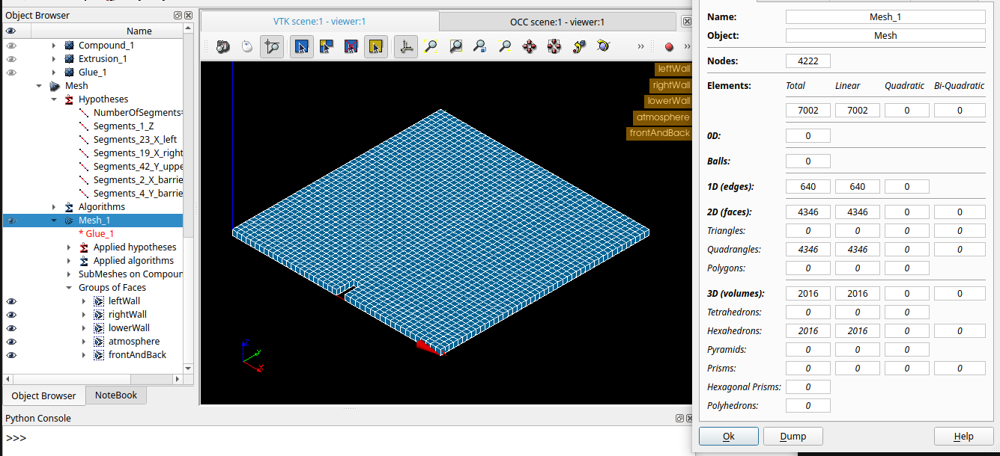

*Рисунок 1 — Структурированная сетка damBreak и группы граничных поверхностей в SALOME.*

После UNV-импорта `checkMesh -allGeometry -allTopology` подтвердил: 2016 hex, одна область, max non-orthogonality 0°, max skewness `4.53·10⁻14`, `Mesh OK`.

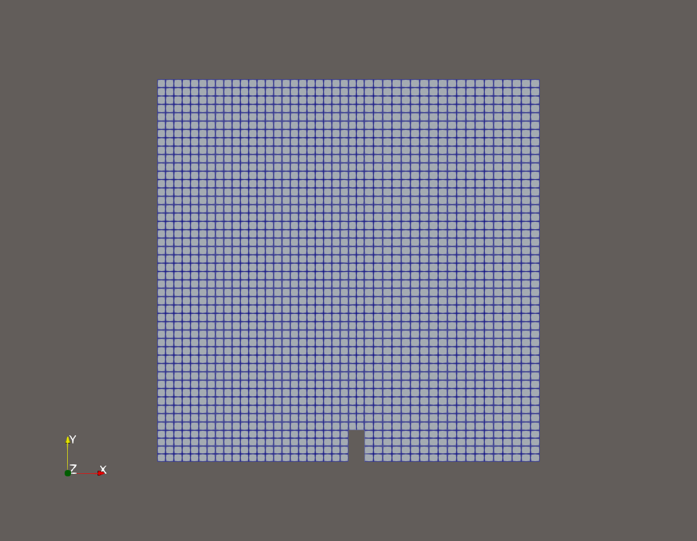

*Рисунок 2 — Гексаэдрическая сетка после импорта UNV и масштабирования в OpenFOAM.*

## Граничные условия

В полях используется групповой шаблон `wall`, который применяется к patches типа `wall` (`leftWall`, `rightWall`, `lowerWall`).

| Patch | Поле | Тип | Значение | Физический смысл |
|---|---|---|---|---|
| стены | `U` | `noSlip` | 0 | неподвижные твёрдые стенки |
| стены | `p_rgh` | `fixedFluxPressure` | начальное 0 | согласование давления с потоком у стенки |
| стены | `alpha.water` | `zeroGradient` | градиент 0 | фаза не задаётся извне |
| `atmosphere` | `U` | `pressureInletOutletVelocity` | начальное `(0 0 0)` | открытая граница с учётом направления потока |
| `atmosphere` | `p_rgh` | `prghTotalPressure` | `p0=0` | атмосферное опорное давление |
| `atmosphere` | `alpha.water` | `inletOutlet` | `inletValue=0` | при втекании поступает воздух |
| `frontAndBack` | все поля | constraint `empty` | — | двумерность задачи |

`noSlip` обнуляет скорость на твёрдой стенке. `zeroGradient` не фиксирует само значение, а задаёт нулевую нормальную производную. Условие `empty` исключает уравнения в направлении толщины и превращает однослойную трёхмерную сетку в квазидвумерную. Верхняя граница допускает как выход, так и обратный вход воздуха.

## Структура OpenFOAM case

- `0/`: начальные и граничные условия для `U`, `p_rgh` и `alpha.water`; исходный шаблон доли хранится как `alpha.water.orig`.
- `constant/`: свойства воды и воздуха в `physicalProperties`, поверхностное натяжение, `g`, ламинарная модель в `momentumTransport`, импортированная `polyMesh`.
- `system/`: `controlDict`, `fvSchemes`, `fvSolution` и `setFieldsDict`.

`setFieldsDict` задаёт значение по умолчанию `alpha.water=0` и геометрическую область, где оно заменяется на 1. Для вариантов `centerBox` и `sphere` изменена только эта область.

## Настройка solver

`controlDict` содержит `solver incompressibleVoF`, `endTime=1`, начальный `deltaT=0.001`, `adjustTimeStep=yes`, `maxCo=1`, `maxAlphaCo=1`, запись через 0,05 с. В `fvSchemes`: Euler, `div(phi,alpha) Gauss interfaceCompression vanLeer 1`, `div(rhoPhi,U) Gauss linearUpwind grad(U)`. В `fvSolution` для `alpha.water` заданы два корректора MULES, а PIMPLE работает с одним внешним и тремя внутренними корректорами.

Модуль `incompressibleVoF` решает переходное несжимаемое двухфазное течение с явным отслеживанием объёмной доли. Он является актуальным для OpenFOAM Foundation 13 модульным соответствием историческому `interFoam`, указанному в методичке. Расчёт однофазным solver здесь невозможен, поскольку требуется одновременно переносить интерфейс вода–воздух.

## Выполнение работы

```bash
ideasUnvToFoam Mesh_1.unv
```

Импортирует сетку и именованные группы SALOME. Журнал подтверждает 4222 точки, 2016 ячеек и все пять patches.

```bash
transformPoints -scale '(0.146 0.146 0.146)'
```

Масштабирует импортированную геометрию до физических размеров; выполнение подтверждено `log.transformPoints`.

```bash
checkMesh -allGeometry -allTopology
```

Проверяет импортированную сетку; результат `Mesh OK`.

```bash
setFields
```

Записывает начальную объёмную долю воды по `system/setFieldsDict`.

```bash
foamRun
```

Читает `solver incompressibleVoF` из `controlDict` и выполняет двухфазный расчёт до 1 с.

Эта же последовательность применена к `centerBox` и `sphere` после изменения только начальной зоны воды.

## Результаты и обсуждение

Основной журнал завершается `Time = 1s` и `End`; на последнем шаге maxCo=0,829702, maxAlphaCo=0,404696, wall-clock 53 с. Вода обрушается, растекается по дну, взаимодействует с перегородкой и стенками.

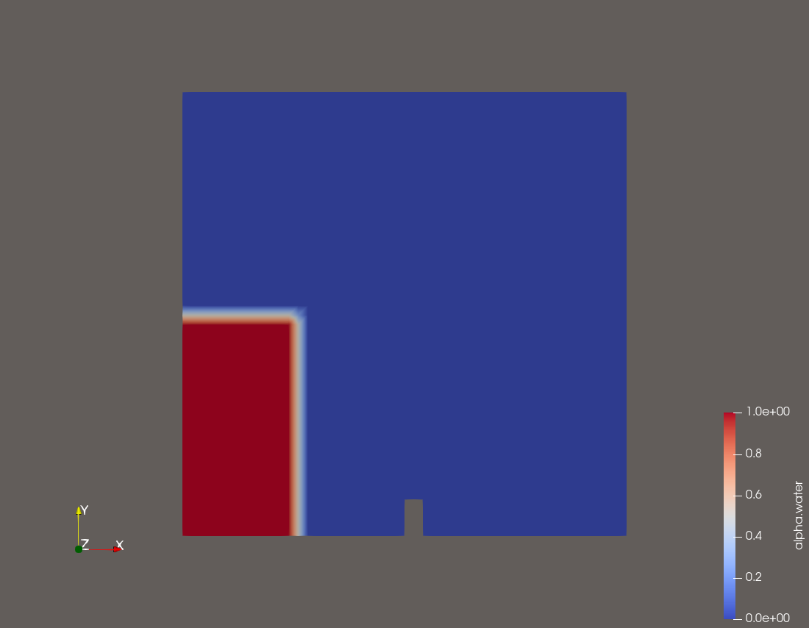

*Рисунок 3 — Начальное распределение `alpha.water` в основном варианте, `t=0 с`.*

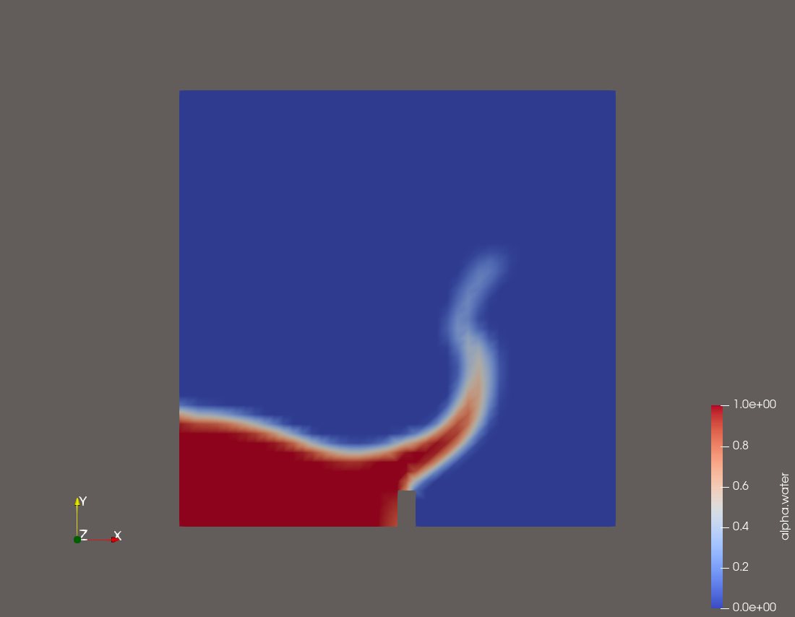

*Рисунок 4 — Обрушение столба воды, `t=0,25 с`.*

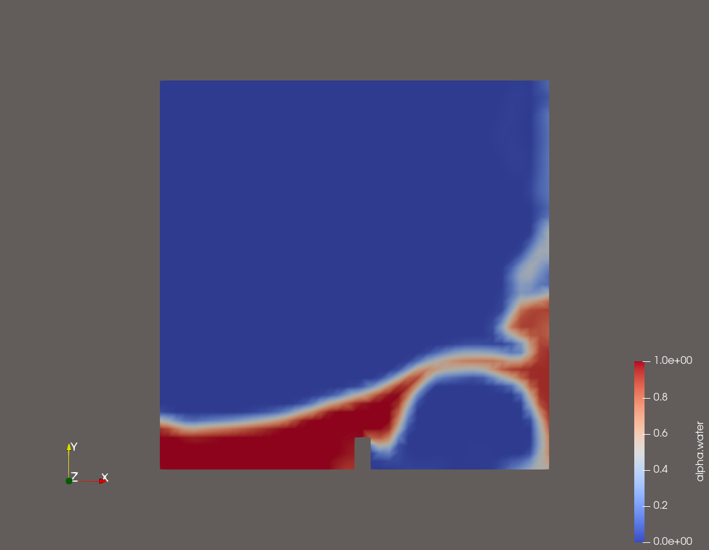

*Рисунок 5 — Положение свободной поверхности, `t=0,50 с`.*

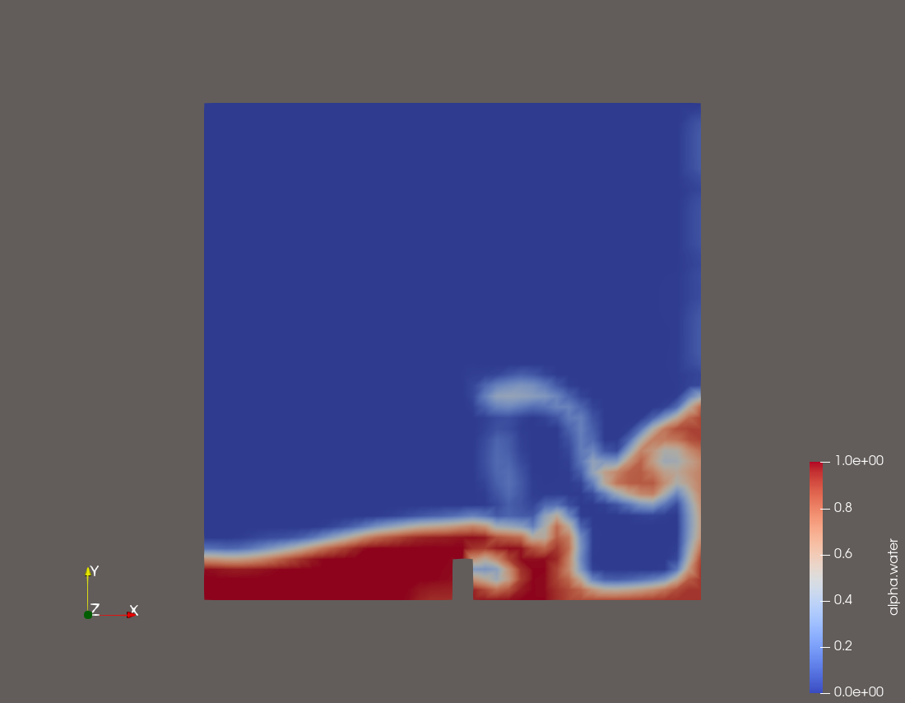

*Рисунок 6 — Взаимодействие воды с перегородкой и стенками, `t=0,65 с`.*

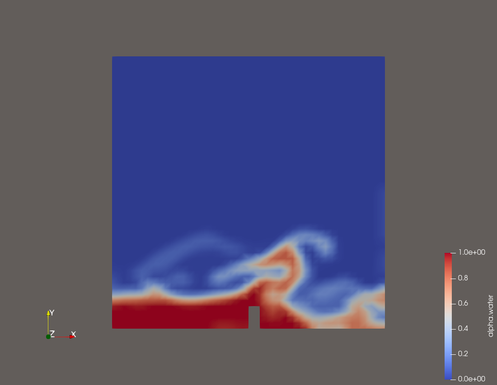

*Рисунок 7 — Распределение фаз основного варианта, `t=0,85 с`.*

В `centerBox` вода задана box-зоной `(0.2 0.2 -0.5)`—`(0.4061 0.392 1)`; финальный maxCo=0,70523. В `sphere` центр `(0.3 0.3 0)`, радиус 0,1 м; финальный maxCo=0,952242. Оба журнала дошли до 1 с и завершились `End`.


*Рисунок 8 — Расчётная сетка варианта `centerBox`.*

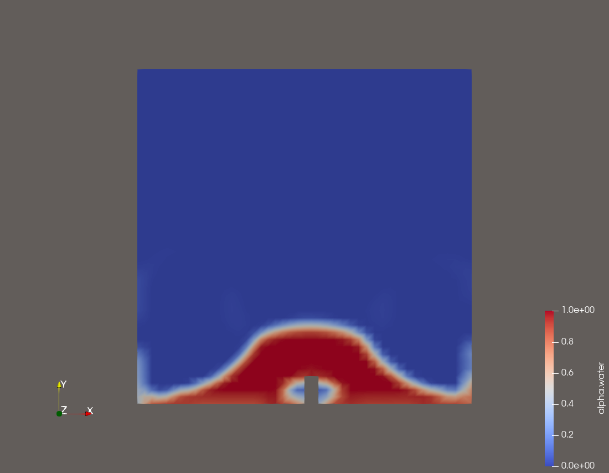

*Рисунок 9 — Объёмная доля воды варианта `centerBox`, `t=0,25 с`.*

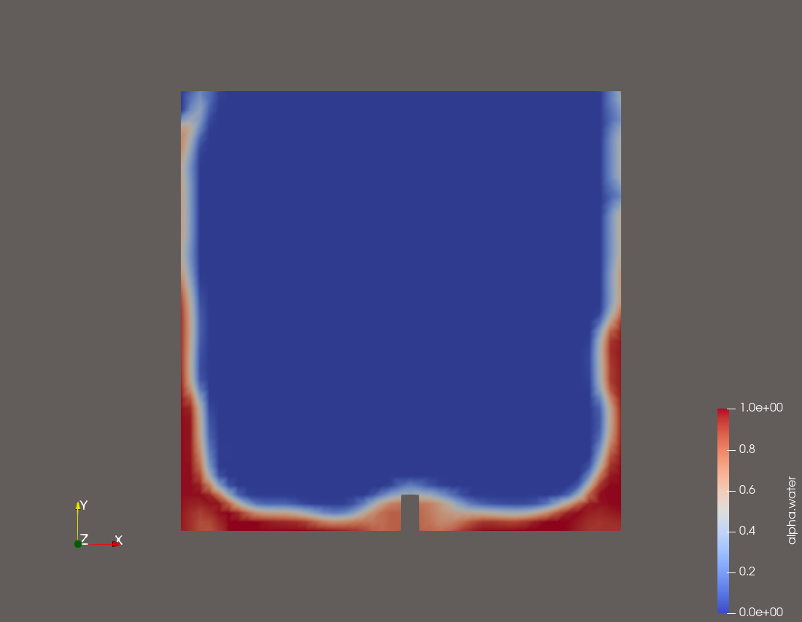

*Рисунок 10 — Объёмная доля воды варианта `centerBox`, `t=0,50 с`.*

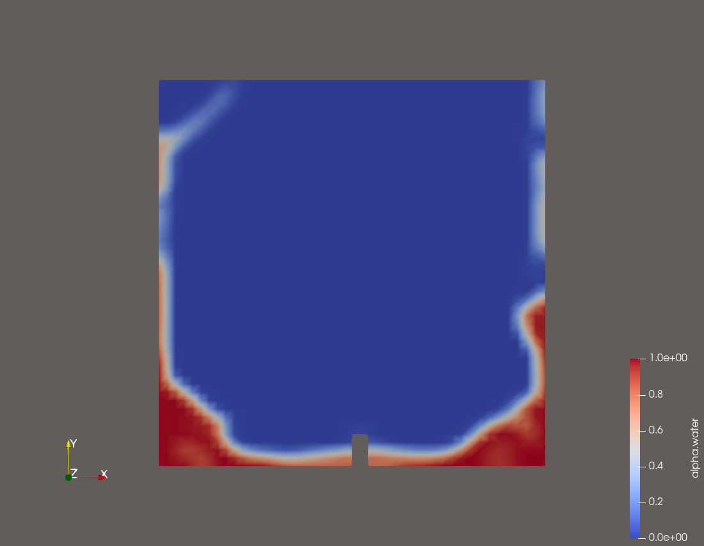

*Рисунок 11 — Объёмная доля воды варианта `centerBox`, `t=0,65 с`.*

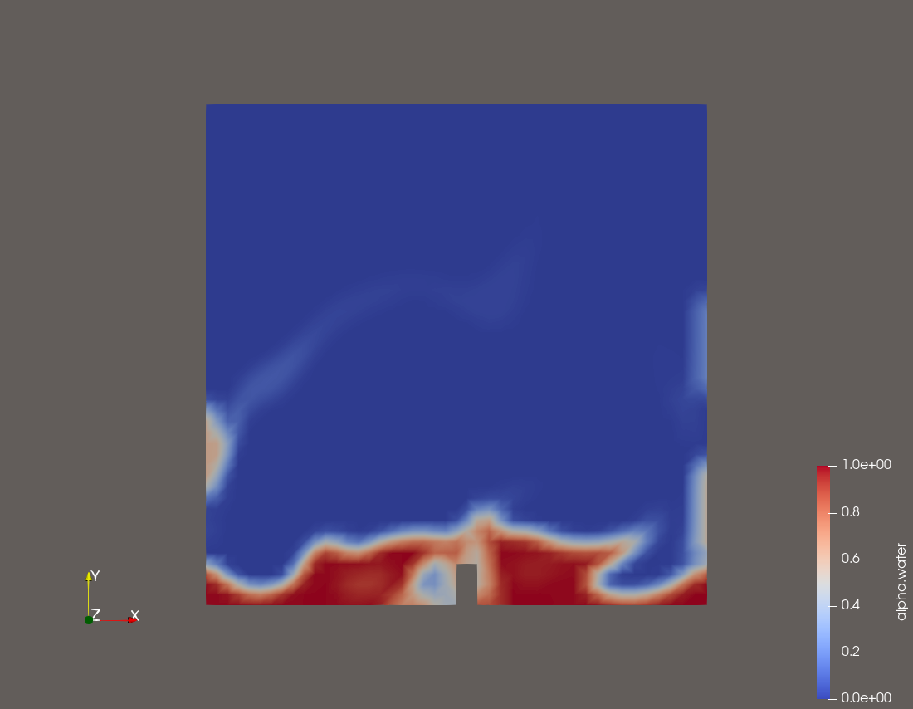

*Рисунок 12 — Объёмная доля воды варианта `centerBox`, `t=0,85 с`.*


*Рисунок 13 — Расчётная сетка варианта `sphere`.*

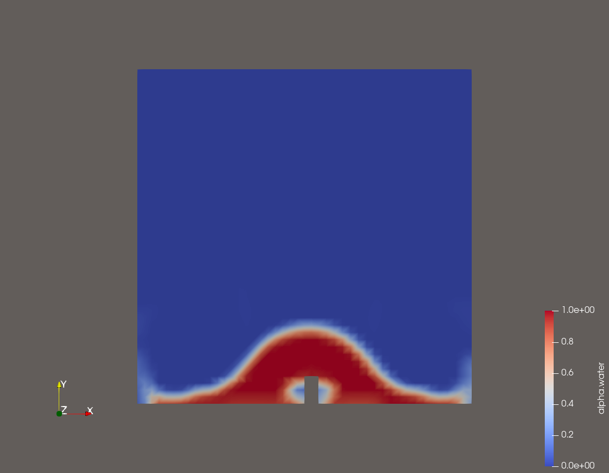

*Рисунок 14 — Объёмная доля воды варианта `sphere`, `t=0,25 с`.*

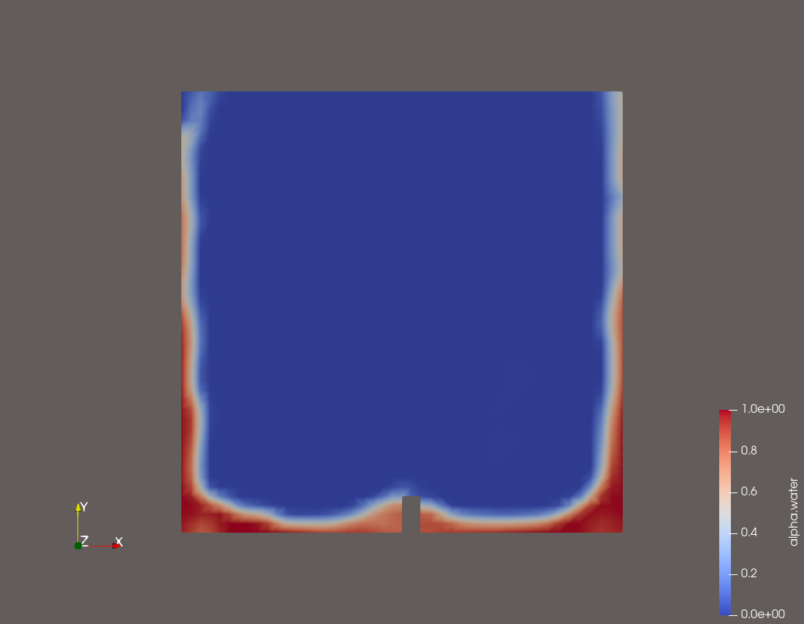

*Рисунок 15 — Объёмная доля воды варианта `sphere`, `t=0,50 с`.*

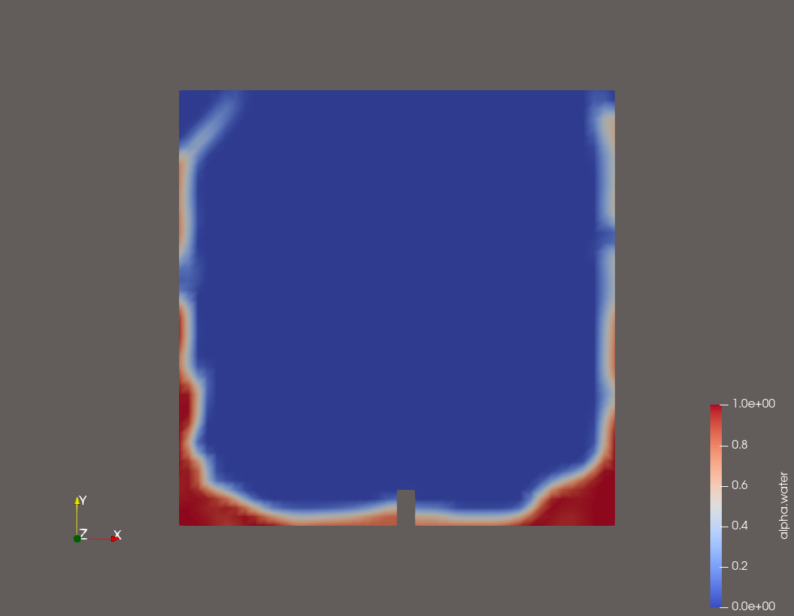

*Рисунок 16 — Объёмная доля воды варианта `sphere`, `t=0,65 с`.*

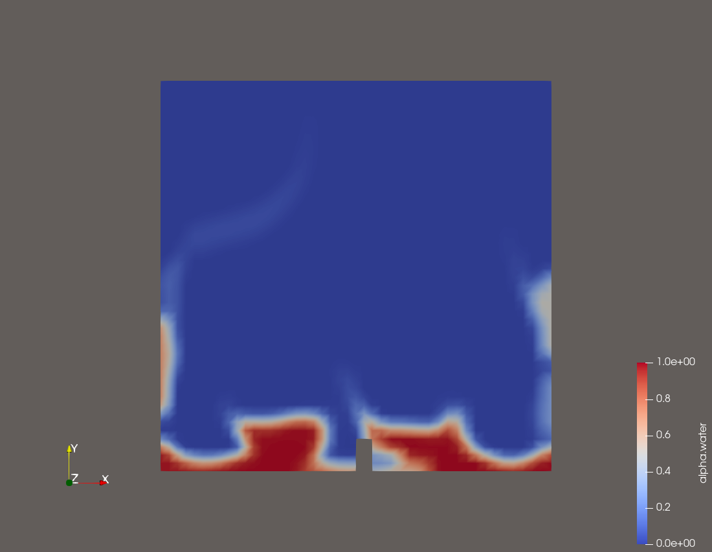

*Рисунок 17 — Объёмная доля воды варианта `sphere`, `t=0,85 с`.*

## Вопросы для самоконтроля

### 1. Какой решатель используется в задачах многофазного потока? На чем основан метод решения?

**Краткий ответ:** В методичке используется `interFoam`; в OpenFOAM 13 его задачу выполняет модуль `incompressibleVoF`. Метод основан на VOF — переносе объёмной доли фаз.

**Развёрнутый ответ:** В каждой ячейке решается поле `alpha.water`; по нему вычисляются свойства смеси и положение интерфейса. MULES ограничивает долю диапазоном 0–1, а interface compression сохраняет резкость свободной поверхности.

**Пример из нашей работы:** case использует `solver incompressibleVoF`, поля `alpha.water`, `U`, `p_rgh` и два корректора MULES.

### 2. Для чего используется операция Glue Faces?

**Краткий ответ:** Для объединения совпадающих граней отдельных геометрических тел в единую согласованную геометрию.

**Развёрнутый ответ:** При построении составной области в SALOME соседние блоки могут иметь геометрически совпадающие, но топологически раздельные поверхности. `Glue Faces` склеивает их в пределах заданного допуска, чтобы затем получить конформную гексаэдрическую сетку без внутренних дублированных границ.

**Пример из нашей работы:** итоговая сетка damBreak после UNV-импорта имеет одну cell region, что подтверждено `checkMesh`.

### 3. С помощью какой команды можно изменять текстовые файлы из терминала?

**Краткий ответ:** В методичке для запуска графического редактора из терминала используется `gedit имя_файла`.

**Развёрнутый ответ:** Команда открывает словарь как обычный текстовый файл; применим и любой другой текстовый редактор.

**Пример из нашей работы:** редактировались `system/setFieldsDict` и файлы каталога `0`, а итоговое содержимое проверялось непосредственно по case.

### 4. В каком файле настраивается начальное распределение? Какие варианты настройки возможны?

**Краткий ответ:** В `system/setFieldsDict`; область можно задать, например, параллелепипедом `boxToCell` или сферой `sphereToCell`.

**Развёрнутый ответ:** Сначала задаётся `defaultFieldValues`, затем в `regions` перечисляются геометрические селекторы и значения поля внутри них. После изменения файла выполняется `setFields`.

**Пример из нашей работы:** в базовом case используется box столба воды, в `centerBox` — центральный box, а в `sphere` — сфера радиусом 0,1 м.

### 5. Зачем нужен файл alpha.water.orig?

**Краткий ответ:** Это исходный шаблон поля объёмной доли, из которого перед новой инициализацией восстанавливают `alpha.water`.

**Развёрнутый ответ:** `setFields` изменяет рабочий файл `0/alpha.water` с учётом текущей сетки и выбранных областей. Копия `.orig` сохраняет чистые граничные условия и позволяет повторить инициализацию, не используя поле от прошлого варианта.

**Пример из нашей работы:** перед запуском `setFields` для вариантов `centerBox` и `sphere` рабочее поле восстанавливается из шаблона `alpha.water.orig`.

## Дополнительные вопросы для защиты

### Почему верхняя граница не является обычной стенкой?

Она моделирует открытую атмосферу: жидкость и воздух могут выходить, а при обратном потоке задаётся поступление воздуха с `alpha.water=0`.

### Зачем нужен `p_rgh`?

Он исключает из решаемого давления известную гидростатическую составляющую, что улучшает постановку задачи с гравитацией. Физическое давление восстанавливается с учётом плотности, `g` и высоты.

### Что подтверждает качество SALOME-сетки?

Реальный импорт дал 4222 точки и 2016 гексаэдров, `checkMesh` подтвердил одну область, нулевую non-orthogonality, практически нулевую skewness и `Mesh OK`; отдельный GUI-кадр показывает те же группы и числа элементов.

## Вывод

Построена и проверена структурированная SALOME-сетка с корректными именованными группами, выполнены импорт, инициализация VOF и три нестационарных расчёта. Все solver logs завершены штатно. Параметры сетки подтверждены журналами импорта и `checkMesh`, а её структура и группы — сохранённым GUI-скриншотом SALOME.
