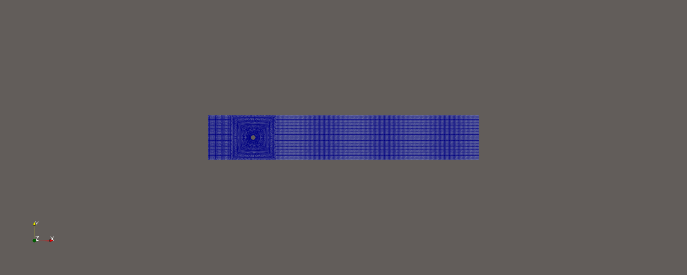
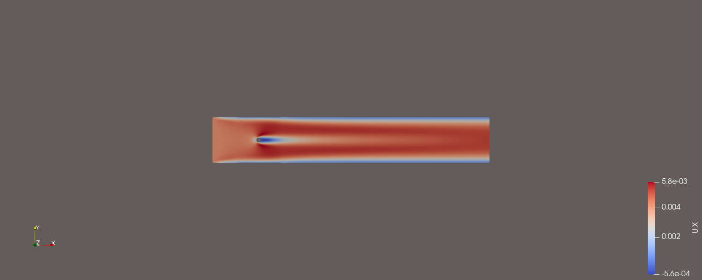
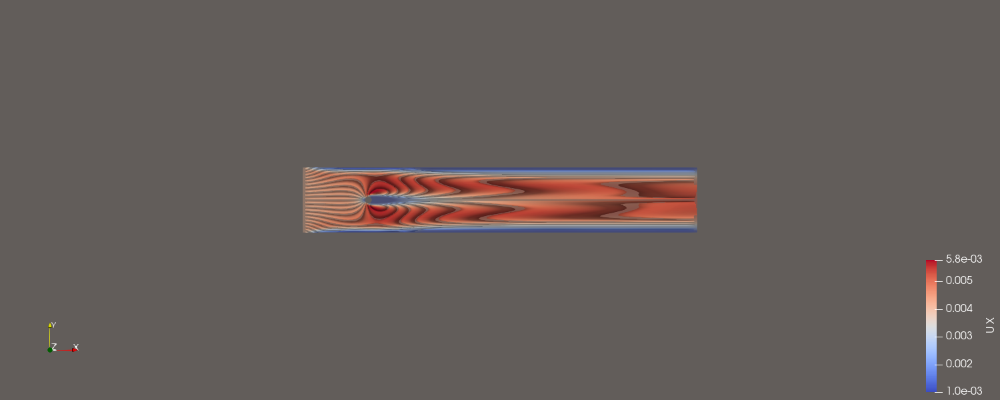
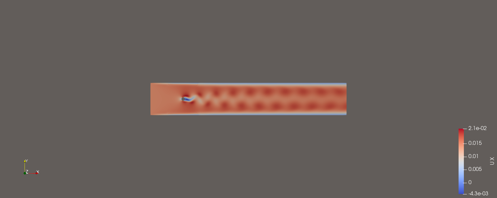
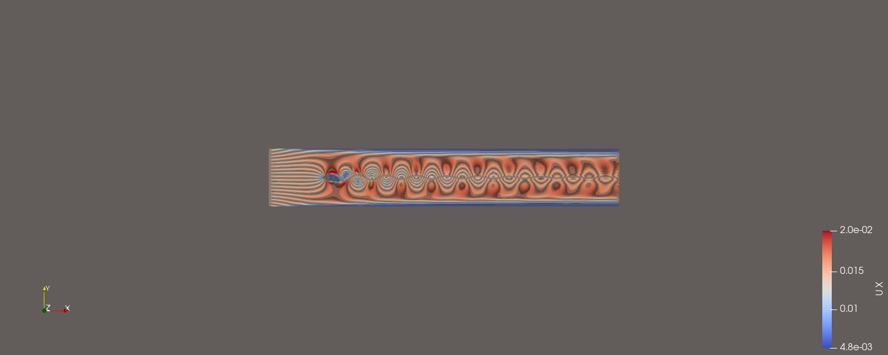

# Лабораторная работа №4

**Обтекание цилиндра потоком воды**

## Цель работы

Построить расчётную область вокруг цилиндра и сравнить нестационарное обтекание водой при числах Рейнольдса 41 и 140.

## Постановка задачи

Вода при 293,2 K обтекает неподвижный цилиндр диаметром 0,01 м. Для постоянных диаметра и вязкости рассчитаны две входные скорости. Требуется получить поля скорости и структуру следа, а также объяснить влияние Re.

## Используемое программное обеспечение

- Ubuntu 26.04 — рабочая операционная система.
- OpenFOAM Foundation 13: `blockMesh`, `checkMesh`, `foamRun -solver incompressibleFluid`, `foamPostProcess`.
- ParaView 6.1.1: Surface, Surface With Edges и Stream Tracer.

## Исходные данные

Кинематическая вязкость воды `nu=1.006·10⁻6 м²/с`, диаметр `D=0.01 м`. По формуле `U=Re·nu/D`:

| Re | U, м/с |
|---:|---:|
| 41 | 0,0041246 |
| 140 | 0,014084 |

Эти значения непосредственно записаны в `0/U` cases `Re_41` и `Re_140`.

## Теоретическая часть

Число Рейнольдса характеризует соотношение инерционных и вязких сил:

\[
Re=\frac{UD}{\nu},
\]

где `U` — скорость набегающего потока, м/с; `D` — диаметр цилиндра, м; `nu` — кинематическая вязкость, м²/с. При неизменных `D=0,01 м` и `nu=1,006·10^-6 м²/с` увеличение Re в этой работе достигнуто увеличением входной скорости.

Для несжимаемой ньютоновской жидкости решаются уравнение неразрывности `div(U)=0` и уравнение импульса Навье—Стокса. Условие прилипания заставляет скорость жидкости на цилиндре быть равной нулю. Из-за этого формируется пограничный слой, который отделяется от поверхности и образует след. При Re=41 вязкость ещё заметно сглаживает возмущения; при Re=140 инерционные эффекты сильнее и возникает нестационарный срыв вихрей.

Число Куранта `Co=|U| deltaT/deltaX` связывает скорость, шаг времени и размер ячейки. В обоих cases шаг автоматически изменялся, чтобы не превысить заданный `maxCo`.

## Расчётная область

Центр цилиндра расположен в `(0 0 0)`. Область простирается от −0,1 до 0,5 м по x, от −0,05 до 0,05 м по y и имеет толщину 0,01 м. Геометрия разбита на шесть блоков: пять около цилиндра/входа и один вытянутый блок следа.

## Построение сетки

Сетка создана `blockMesh`. В пяти блоках задано по 30×1×30 ячеек, в выходном блоке — 200×1×30. Для каждого Re получено 10500 hex, 21700 точек и 42350 граней.

Patches: `inlet`, `outlet`, `wall`, `cylinder`, `frontAndBack`. Полная проверка обоих cases дала одинаковый результат: `Mesh OK`, max non-orthogonality 43,96335°, средняя 14,40096°, max skewness 1,05258.



*Рисунок 1 — Шестиблочная расчётная сетка около цилиндра.*

## Граничные условия

| Patch | Поле | Тип | Значение | Физический смысл |
|---|---|---|---|---|
| `inlet` | `U` | `fixedValue` | `(0.0041246 0 0)` или `(0.014084 0 0)` | равномерный набегающий поток |
| `outlet` | `U` | `zeroGradient` | градиент 0 | свободный выход |
| `wall` | `U` | `noSlip` | 0 | неподвижные верхняя и нижняя стенки |
| `cylinder` | `U` | `noSlip` | 0 | прилипание на цилиндре |
| `inlet`, `wall`, `cylinder` | `p` | `zeroGradient` | градиент 0 | давление определяется решением |
| `outlet` | `p` | `fixedValue` | 0 м²/с² | опорное кинематическое давление |
| `frontAndBack` | `U`, `p` | `empty` | — | двумерная задача |

Поля `k`, `omega`, `nut` присутствуют в каталоге `0`, но `constant/momentumTransport` реально задаёт `simulationType laminar`; они не означают, что финальный расчёт был RAS.

`fixedValue` на входе непосредственно задаёт скорость набегающего потока. `zeroGradient` на выходе позволяет скорости определяться внутренним решением без навязанного профиля. `noSlip` эквивалентно нулевому `fixedValue` для неподвижной стенки. Условие `empty` применяется к однослойным передней и задней плоскостям квазидвумерной задачи.

## Структура OpenFOAM case

- `0/`: `U`, кинематическое давление `p` и дополнительные поля `k`, `omega`, `nut`.
- `constant/`: `physicalProperties` с `nu=1.006e-6`, `momentumTransport` с ламинарным режимом и сгенерированная `polyMesh`.
- `system/`: `blockMeshDict`, `controlDict`, `fvSchemes`, `fvSolution` и `functions` для сил, коэффициентов, невязок и линий тока.

Cases `Re_41` и `Re_140` имеют одинаковую геометрию и свойства воды; принципиально различаются входной скоростью и ограничением `maxCo`.

## Настройка solver

В `controlDict` задан `solver incompressibleFluid`, `startFrom latestTime`, `endTime=100`, `adjustTimeStep=yes`. Для Re=41 `maxCo=0.8`, для Re=140 — `maxCo=0.95`. В `physicalProperties` выбрана ньютоновская жидкость и `nu=1.006e-6`.

`fvSchemes` использует Euler по времени, ограниченные linearUpwind/limitedLinear схемы конвекции и corrected для лапласиана. В реально использованном `fvSolution` Re=140: GAMG/DICGaussSeidel для `p`, PBiCGStab/DILU для `U`, два корректора и один non-orthogonal corrector. Case Re=41 имеет более общий совместимый словарь; фактический solver log подтверждает тот же модуль `incompressibleFluid`.

Файл `system/functions` подключает силы, коэффициенты сил, residuals и streamlines. Для коэффициентов заданы patch `cylinder`, `Aref=0.0001 м²`, `lRef=0.01 м`, направления drag `(1 0 0)` и lift `(0 1 0)`.

`incompressibleFluid` — переходный однородный однофазный несжимаемый solver. Режим ламинарный: турбулентная модель не участвует. Такой выбор соответствует малым и умеренным Re и позволяет непосредственно увидеть развитие нестационарного следа.

## Выполнение работы

Для каждого case использована одна последовательность:

```bash
blockMesh
```

Создаёт шестиблочную сетку вокруг цилиндра.

```bash
checkMesh -allGeometry -allTopology
```

Выполняет полную проверку; оба журнала завершаются `Mesh OK` и `End`.

```bash
foamRun -solver incompressibleFluid
```

Выполняет переходный ламинарный расчёт. Такое значение `Exec` записано в обоих solver logs, хотя сами файлы журналов исторически называются `log.pimpleFoam`.

```bash
foamPostProcess -latestTime -func components(U)
```

Создаёт компоненты скорости на последнем времени для постобработки.

## Результаты и обсуждение

| Case | Конечное время | Wall-clock | Финальный maxCo | Завершение |
|---|---:|---:|---:|---|
| Re=41 | 100 с | 550 с | 0,779234 | `End` |
| Re=140 | 100 с | 791 с | 0,919757 | `End` |



*Рисунок 2 — Поле модуля скорости при `Re=41`.*



*Рисунок 3 — Линии тока и след за цилиндром при `Re=41`.*



*Рисунок 4 — Поле модуля скорости при `Re=140`.*



*Рисунок 5 — Линии тока и вихревой след при `Re=140`.*

При Re=41 вязкость сильнее стабилизирует след, поэтому за цилиндром формируется сравнительно устойчивое вихревое течение. При Re=140 инерционность выше и след становится нестационарным с чередующимся срывом вихрей. Методичка приводит для сопоставления только изображения SOLIDWORKS FLOW SIMULATION 2018: траектории и фотографию потока при Re=41, а также цветовое поле скорости при Re=140; табличных значений, одинаковых линий выборки или временных рядов в ней нет. Качественное сравнение корректно: при Re=41 и в эталонном, и в нашем изображении присутствует протяжённая зона возвратного течения за цилиндром; при Re=140 оба решения показывают асимметричный периодический след. Численную норму погрешности по этим иллюстрациям вычислять методически некорректно, поэтому она в отчёте не приводится.

## Вопросы для самоконтроля

### 1. Что происходит с потоком при высоких числах Рейнольдса?

**Краткий ответ:** Инерционные силы преобладают над вязкими, течение легче теряет устойчивость, появляются отрыв, вихри и затем турбулентность.

**Развёрнутый ответ:** Рост Re уменьшает относительное демпфирование возмущений вязкостью. За цилиндром пограничный слой отделяется, а вихри могут срываться попеременно, формируя дорожку Кармана.

**Пример из нашей работы:** при Re=140 получен более выраженный нестационарный след, чем при Re=41; различие видно на рисунках 3 и 5.

### 2. Как можно построить линии тока в ParaView?

**Краткий ответ:** Выбрать dataset, применить фильтр `Stream Tracer`, задать источник стартовых точек и нажать `Apply`.

**Развёрнутый ответ:** После загрузки case выбирают поле `U`, создают `Stream Tracer`, размещают line/point source перед цилиндром, задают направление интегрирования и отображают результат линиями или трубками.

**Пример из нашей работы:** этим способом получены изображения линий тока для Re=41 и Re=140.

### 3. Что означает нулевой градиент в граничных условиях?

**Краткий ответ:** Нормальная производная поля на границе равна нулю: `d(phi)/dn=0`.

**Развёрнутый ответ:** Значение не фиксируется заранее, а экстраполируется из внутренней области.

**Пример из нашей работы:** `zeroGradient` используется для `U` на `outlet` и для `p` на входе и твёрдых поверхностях.

### 4. Чем отличается ламинарное течение от турбулентного?

**Краткий ответ:** Ламинарное течение описывается упорядоченным движением слоёв, турбулентное — нерегулярными пульсациями и интенсивным перемешиванием.

**Развёрнутый ответ:** Для турбулентного режима обычно требуется разрешать или моделировать дополнительные масштабы движения.

**Пример из нашей работы:** в `momentumTransport` обоих cases стоит `simulationType laminar`; нестационарные вихри рассчитываются непосредственно, без RAS-модели.

### 5. Что означает тип noSlip в граничных условиях? Как можно записать его иначе?

**Краткий ответ:** Скорость жидкости равна скорости неподвижной стенки, то есть нулю; эквивалентная запись — `fixedValue uniform (0 0 0)`.

**Развёрнутый ответ:** Условие запрещает как нормальное проникновение, так и касательное скольжение.

**Пример из нашей работы:** `noSlip` задан для patches `wall` и `cylinder`, где он создаёт пристеночный градиент скорости и пограничный слой.

## Дополнительные вопросы для защиты

### Почему значение давления на выходе фиксируется равным нулю?

Для несжимаемой задачи кинематическое давление определено с точностью до константы. Нулевое значение на `outlet` задаёт опорный уровень, а не утверждает, что абсолютное физическое давление отсутствует.

### Почему сравнение cases корректно?

Геометрия, сетка, диаметр и вязкость одинаковы; изменена входная скорость, то есть непосредственно контролируемый параметр числа Рейнольдса.

### Можно ли считать Re=140 полностью развитой турбулентностью?

Нет. Он даёт нестационарный вихревой след, но финальный case сознательно рассчитан в ламинарной постановке. Называть его RAS-расчётом было бы неверно.

## Вывод

Для Re=41 и 140 построены одинаковые проверенные сетки и выполнены реальные расчёты до 100 с. Увеличение Re достигнуто только изменением входной скорости при неизменных D и nu. Оба журнала завершены штатно, а визуализация показывает усиление нестационарности следа при Re=140.
