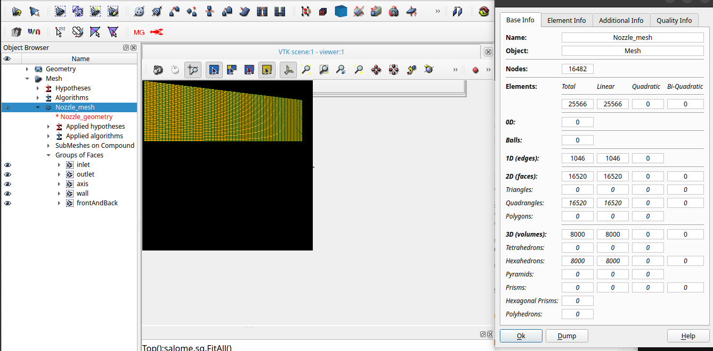
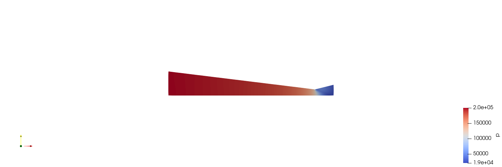
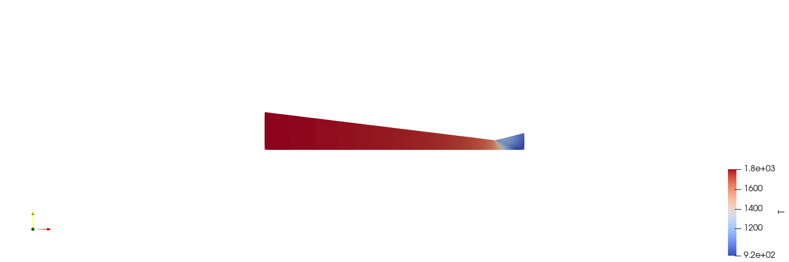
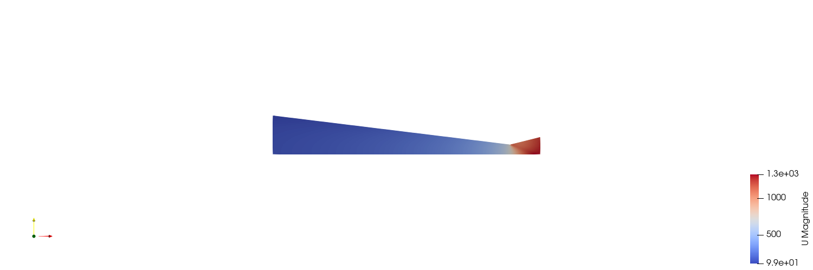
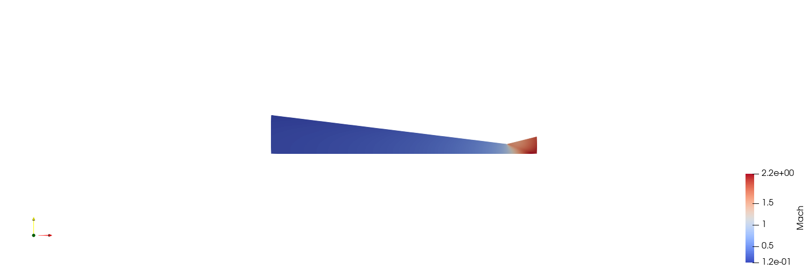

# Лабораторная работа №6

**Параметрическое построение сопла Лаваля в Salome для анализа течения газа с использованием инструментария вычислительной гидродинамики OpenFOAM**

## Цель работы

Рассчитать основные сечения конического сопла Лаваля, построить параметрическую геометрию и сетку в SALOME и получить решение сжимаемого газового течения в OpenFOAM.

## Постановка задачи

Для заданных полных параметров воздуха, расхода и углов определяются размеры входа, горла и выхода. Затем создаются SALOME HDF/UNV, проверяется импортированная сетка и выполняется переходный расчёт, в котором дозвуковой поток ускоряется через критическое сечение.

## Используемое программное обеспечение

- Ubuntu 26.04 — рабочая операционная система.
- Python 3.14.4: аналитический расчёт `calc_nozzle.py`.
- SALOME 9.16.0: `generate_salome.py`, HDF/UNV, Hexahedron mesh и boundary groups.
- OpenFOAM Foundation 13: `ideasUnvToFoam`, `checkMesh`, `setFields`, `foamRun` с solver module `shockFluid`.
- ParaView 6.1.1: контроль полей давления, температуры, скорости и числа Маха.

## Исходные данные

| Параметр | Значение |
|---|---:|
| Полное давление `p0` | 200000 Па |
| Полная температура `T0` | 1800 K |
| Расчётное выходное давление `pout` | 9000 Па |
| Массовый расход `G` | 1,5 кг/с |
| Угол сходящейся части `alpha` | 14° |
| Угол расходящейся части `beta` | 28° |
| Газовая постоянная `R` | 287 Дж/(кг·K) |
| Показатель адиабаты `gamma` | 1,4 |

Аналитический скрипт использует одномерные изоэнтропические соотношения. Подтверждённые значения из `analytic.json`:

| Сечение | p, Па | T, K | U, м/с | M | Диаметр, мм |
|---|---:|---:|---:|---:|---:|
| вход | 199800 | 1799,486 | 32,149 | 0,03781 | 391,862 |
| горло | 105656,36 | 1500 | 776,338 | 1,000 | 100,118 |
| выход | 9000 | 742,123 | 1457,832 | 2,6697 | 176,078 |

Длины сходящейся и расходящейся частей равны 1,188030 и 0,152328 м.

## Теоретическая часть

Сопло Лаваля состоит из сходящейся части, критического сечения и расходящейся части. Для идеального газа локальная скорость звука

\[
a=\sqrt{\gamma RT}, \qquad M=\frac{|U|}{a},
\]

где `a` — скорость звука, м/с; `gamma=1,4` — показатель адиабаты; `R=287 Дж/(кг·K)`; `T` — температура, K; `M` — число Маха. При `M<1` течение дозвуковое, при `M=1` — звуковое, при `M>1` — сверхзвуковое.

В квазиизэнтропическом одномерном приближении площадь и число Маха связаны соотношением

\[
\frac{A}{A^*}=\frac{1}{M}\left[\frac{2}{\gamma+1}\left(1+\frac{\gamma-1}{2}M^2\right)\right]^{\frac{\gamma+1}{2(\gamma-1)}},
\]

где `A` — площадь сечения, а `A*` — критическая площадь при `M=1`. Для дозвукового потока сужение ускоряет газ; при достижении критического режима расход «запирается». После горла расширение способно дальше ускорять уже сверхзвуковой поток, одновременно снижая статические давление и температуру.

Аналитический скрипт применяет одномерные изоэнтропические зависимости. OpenFOAM-расчёт, напротив, является двумерным переходным численным решением и учитывает конечную сетку, начальную ступень давления и граничные условия. Поэтому аналитические и CFD-значения не обязаны совпадать точно.

## Расчётная область

Модель представляет верхнюю половину осевого сечения сопла, вытянутую по z на 4 мм. Координата горла x=0; вход расположен при x=−1,188030 м, выход при x=0,152328 м. По нижней границе задана ось симметрии.

SALOME-артефакты: `fast_finish_2026/LR6/LR6-nozzle.hdf` и `Mesh.unv`.

## Построение сетки

`generate_salome.py` создаёт два четырёхугольных участка, вытягивает их по толщине и использует Segment → Quadrangle → Hexahedron. Локальные разбиения: 120 по сходящейся части, 80 по расходящейся, 40 по радиусу, 1 по толщине. Получено 16482 узла и 8000 hex.

Группы SALOME и OpenFOAM: `inlet` — 40 граней, `outlet` — 40, `axis` — 200, `wall` — 200, `frontAndBack` — 16000.



*Рисунок 1 — Параметрическая сетка сопла Лаваля и группы граничных поверхностей в SALOME.*

Импортированный `Mesh.unv` отдельно проверен в `salomeMeshCheck`: 8000 hex, max non-orthogonality 13,8336°, max skewness 0,269705, `Mesh OK`.

Финальный CFD case `nozzleShockFluidFresh` использует эквивалентную нативную двухблочную OpenFOAM-сетку с теми же 8000 hex и patches. Его собственный `checkMesh`: max non-orthogonality 13,9226°, max skewness 0,619734, `Mesh OK`. Поэтому не утверждается, что финальные поля рассчитаны непосредственно на UNV-import mesh: SALOME-сетка и final CFD mesh — два отдельно проверенных артефакта.

## Граничные условия

| Patch | Поле | Тип | Значение | Физический смысл |
|---|---|---|---|---|
| `inlet` | `p` | `fixedValue` | 200000 Па | давление во входном резервуаре |
| `inlet` | `T` | `fixedValue` | 1800 K | температура во входном резервуаре |
| `inlet` | `U` | `zeroGradient` | градиент 0 | скорость определяется решением |
| `outlet` | `p`, `T`, `U` | `zeroGradient` | градиент 0 | сверхзвуковой выход без переопределения исходящих характеристик |
| `axis` | `p`, `T`, `U` | `symmetryPlane` | — | ось симметрии |
| `wall` | `U` | `slip` | нулевая нормальная скорость | невязкая стенка |
| `wall` | `p`, `T` | `zeroGradient` | градиент 0 | адиабатическая невязкая стенка |
| `frontAndBack` | все поля | `empty` | — | двумерность |

Значение 9000 Па не навязано на выходном patch. Оно используется в аналитике/геометрии и как начальное давление вне входного резервуара. `setFields` задаёт `p=200000 Па` в box `(-2 -1 -1)`—`(0 1 1)` и `p=9000 Па` в остальной области; `T=1800 K`, `U=0` изначально везде.

`symmetryPlane` на оси исключает нормальный поток и нормальные градиенты. `slip` на стенке также запрещает нормальную скорость, но не создаёт вязкого касательного торможения; это согласуется с `mu=0`. `zeroGradient` на сверхзвуковом выходе не навязывает данным, уходящим из области, дополнительное фиксированное значение.

## Структура OpenFOAM case

- `0/`: начальные и граничные поля `p`, `T`, `U`.
- `constant/`: `physicalProperties` с perfect gas, `momentumTransport` с ламинарным режимом, сетка `polyMesh`.
- `system/`: `controlDict`, `fvSchemes`, `fvSolution`, `setFieldsDict`.

В каталоге ЛР6 также находятся `calc_nozzle.py`, `analytic.json`, `generate_salome.py`, HDF и UNV. Они описывают аналитическую геометрию и SALOME-сетку; финальный CFD case `nozzleShockFluidFresh` хранится отдельно, что исключает смешение происхождения сеток.

## Настройка solver

`controlDict`: `solver shockFluid`, `startFrom latestTime`, `endTime=0.015`, `deltaT=1e-6`, `adjustTimeStep=yes`, `maxCo=0.3`, `maxDeltaT=1e-6`, запись через 0,0005 с.

`physicalProperties`: `hePsiThermo`, perfect gas, `sensibleInternalEnergy`, молярная масса 28,9 кг/кмоль, `Cp=1005`, `mu=0`, `Pr=0.7`. `momentumTransport`: laminar.

`fvSchemes`: central-upwind flux `Kurganov`; реконструкция `rho` и `T` — van Leer, `U` — van Leer V; Euler по времени. `fvSolution`: diagonal для консервативных `rho`, `rhoU`, `rhoE`; два внешних PIMPLE-corrector.

`shockFluid` — переходный сжимаемый однофазный solver на основе shock-capturing центральной схемы. Он решает консервативные уравнения массы, импульса и полной энергии и подходит для сильных волн давления и трансзвукового/сверхзвукового течения. Вязкость в данном case равна нулю, поэтому постановка соответствует невязкому газу, а не RAS-модели.

## Выполнение работы

Аналитический расчёт и SALOME-экспорт выполняются соответствующими проектными скриптами:

```bash
python3 fast_finish_2026/LR6/calc_nozzle.py --p0 200000 --t0 1800 --pout 9000 --mass-flow 1.5 --alpha 14 --beta 28
```

Печатает рассчитанные параметры сечений и геометрии в JSON.

```bash
/home/pavel/openfoam-lab/tools/SALOME-9.16.0/run_salome.sh -t fast_finish_2026/LR6/generate_salome.py
```

Это воспроизводимая команда для существующего SALOME 9.16 launcher: параметр `-t` включает терминальный режим, а позиционный Python-файл выполняется внутри SALOME. Скрипт не требует пользовательских аргументов, использует подтверждённые параметры ЛР6 и формирует `LR6-nozzle.hdf`, `Mesh.unv` и именованные группы. Команда документирует воспроизводимый интерфейс текущего скрипта и не выдаётся за дословную запись прежней shell-сессии.

Подтверждённая журналами OpenFOAM-последовательность:

```bash
ideasUnvToFoam Mesh.unv
```

Импортирует SALOME-сетку для отдельной проверки.

```bash
checkMesh
```

Проверяет final CFD mesh; журнал содержит `Mesh OK`.

```bash
setFields
```

Создаёт начальную ступень давления.

```bash
foamRun
```

Запускает `shockFluid`. Расчёт выполнен последовательно, без MPI, тремя продолжениями от `latestTime` до 0,015 с.

## Результаты и обсуждение

Журналы трёх последовательных участков заканчиваются `End`; wall-clock 496+617+335≈1448 с. Последний maxCo=0,29984.

Прямой разбор внутренних списков полей времени 0,015 дал:

| Поле | Минимум | Максимум |
|---|---:|---:|
| `p` | 19,3982 кПа | 200,286 кПа |
| `T` | 923,139 K | 1800,76 K |
| `|U|` | 98,523 м/с | 1327,723 м/с |
| `rho` | 0,0730395 кг/м³ | 0,386599 кг/м³ |

По осевому профилю давление и температура падают, скорость и M растут; за горлом поток становится сверхзвуковым. Конкретные сопоставления трёх сечений приведены в ЛР8.



*Рисунок 2 — Распределение статического давления в финальном CFD-решении сопла.*



*Рисунок 3 — Распределение статической температуры в сопле.*



*Рисунок 4 — Распределение модуля скорости в сопле.*



*Рисунок 5 — Распределение числа Маха: переход от дозвукового к сверхзвуковому режиму.*

## Вопросы для самоконтроля

### 1. Что будет с потоком воздуха в сопле Лаваля, если до критического сечения скорость не достигнет звуковой?

**Краткий ответ:** Сверхзвуковое расширение не сформируется: в расходящейся части оставшийся дозвуковым поток будет замедляться.

**Развёрнутый ответ:** Геометрическое расширение ускоряет сверхзвуковую ветвь, но для дозвукового потока действует противоположно. Чтобы пройти через гладкое минимальное сечение с `M=1`, нужен достаточный перепад давлений и критический режим.

**Пример из нашей работы:** аналитический расчёт дал в горле `M=1`, а численная визуализация показывает сверхзвуковую область после горла.

### 2. Опишите порядок расчета профиля конического сопла Лаваля?

**Краткий ответ:** По полным параметрам и давлению определить M, T, p, скорость и плотность в характерных сечениях, затем из расхода найти площади/диаметры и из углов — длины конусов.

**Развёрнутый ответ:** Для входа, критического сечения и выхода применяются изоэнтропические зависимости; площадь следует из `G=rho U A`, диаметр — из `D=sqrt(4A/pi)`, длины — из разности радиусов и тангенсов углов.

**Пример из нашей работы:** `calc_nozzle.py` принимает `p0`, `T0`, `pout`, расход, `alpha`, `beta`, `R`, `gamma`; подтверждённые диаметры горла и выхода равны 100,118 и 176,078 мм.

### 3. Опишите порядок построения конического сопла Лаваля?

**Краткий ответ:** Построить профиль по рассчитанным точкам входа, горла и выхода, сформировать две поверхности, вытянуть их по толщине и создать граничные группы.

**Развёрнутый ответ:** Профиль строится по точкам характерных сечений, после чего поверхности объединяются, вытягиваются и получают граничные группы.

**Пример из нашей работы:** `generate_salome.py` строит два четырёхугольника верхней половины сечения, вытягивает область на 4 мм и формирует `inlet`, `outlet`, `axis`, `wall`, `frontAndBack`; результат сохранён в HDF и UNV.

### 4. Какие алгоритмы и гипотезы использовались при построении сетки?

**Краткий ответ:** `Segment`/Wire Discretisation с `Number of Segments`, затем `Quadrangle` на гранях и `Hexahedron` в объёме.

**Развёрнутый ответ:** Одномерная сегментация задаёт разбиение рёбер, `Quadrangle` строит согласованную сетку граней, а `Hexahedron` заполняет объём.

**Пример из нашей работы:** локально задано 120 сегментов по сходящейся части, 80 по расходящейся, 40 по радиусу и 1 по толщине; получено 16482 узла и 8000 hex.

### 5. Как построить сгущение сетки в Salome?

**Краткий ответ:** Назначить локальную одномерную гипотезу на выбранное ребро и использовать распределение сегментов с изменяющейся длиной, затем согласовать поверхностный и объёмный алгоритмы.

**Развёрнутый ответ:** Для целевого ребра в `Segment` можно вместо равномерного `Number of Segments` выбрать гипотезу с прогрессией либо начальной и конечной длиной. Разбиения сопряжённых рёбер должны оставаться совместимыми для `Quadrangle` и `Hexahedron`.

**Пример из нашей работы:** в `generate_salome.py` применены фиксированные количества сегментов, поэтому прогрессия в фактической сетке не заявляется.

## Дополнительные вопросы для защиты

### Почему выходное давление 9000 Па не задано как `fixedValue`?

Финальная постановка использует его при аналитическом подборе площади и как начальное состояние. На предполагаемом сверхзвуковом выходе все характеристики уходят из области, поэтому поля имеют `zeroGradient`.

### Почему CFD и аналитика различаются?

Аналитика одномерна, стационарна и изоэнтропична. CFD представляет двумерный переходный процесс на конечной сетке и на времени 0,015 с; поэтому численная диффузия, неравномерность по сечению и незавершённая установившаяся перестройка дают расхождение.

### Какая сетка использована для финальных полей?

Нативная двухблочная OpenFOAM-сетка `nozzleShockFluidFresh`, 8000 hex. SALOME UNV имеет то же число ячеек и отдельно проверена, но происхождение финального поля от UNV не подтверждено, поэтому эти артефакты в отчёте не смешиваются.

## Вывод

Аналитически рассчитана геометрия сопла, созданы и проверены SALOME- и OpenFOAM-варианты сетки, а последовательный `shockFluid`-расчёт завершён до 0,015 с. Финальные поля подтверждены реальными time directories, сетка и группы SALOME — HDF/UNV, скриптом и сохранённым GUI-скриншотом. Для повторения документирована команда, соответствующая фактическому интерфейсу установленного launcher и существующего скрипта.
