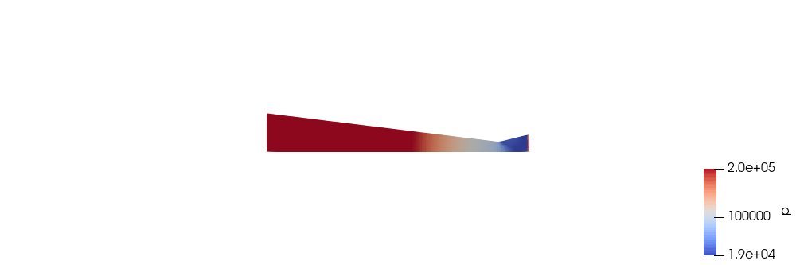

# Лабораторная работа №8

**Постобработка результатов расчёта сопла Лаваля в ParaView**

## Цель работы

Выполнить воспроизводимую постобработку реального расчёта сопла Лаваля в ParaView: получить поля p, T, |U| и M, осевые графики, анимацию и сравнение CFD с аналитикой.

## Постановка задачи

Без повторного запуска solver открыть финальные поля LR6/LR7 на времени 0,015 с, вычислить число Маха, построить изображения и снять 601 точку вдоль оси. По 30 сохранённым временам создать анимацию давления. В трёх характерных сечениях сравнить CFD с расчётом `calc_nozzle.py`.

## Используемое программное обеспечение

- Ubuntu 26.04 — рабочая операционная система.
- ParaView 6.1.1 `pvpython`: OpenFOAMReader, Cell Data to Point Data, Calculator, Plot Over Line, SaveScreenshot.
- Python 3.14.4, Matplotlib и Pillow: графики, таблица и GIF.
- Исходные результаты OpenFOAM LR6/LR7; CFD заново не рассчитывался.

## Исходные данные

Источник — case с полями `U`, `T`, `p` и временами 0,0005…0,015 с. Финальный слой `0.015` подтверждён solver log. Число Маха вычисляется как

`M = |U| / sqrt(1.4·287·T)`.

В аналитическом сравнении используются те же параметры: 200000 Па, 1800 K, 9000 Па, 1,5 кг/с, 14° и 28°.

## Теоретическая часть

Постобработка преобразует дискретные поля solver в физически читаемые изображения и графики, не изменяя само решение. Давление `p`, температура `T` и скорость `U` прочитаны из временных каталогов. Число Маха вычислено как

\[
M=\frac{|\mathbf{U}|}{\sqrt{\gamma RT}},
\]

где `|U|` — модуль скорости, м/с; `gamma=1,4`; `R=287 Дж/(кг·K)`; `T` — K. `M<1` соответствует дозвуковому, `M>1` — сверхзвуковому режиму.

OpenFOAM хранит значения преимущественно в центрах ячеек. Фильтр `Cell Data to Point Data` интерполирует их в узлы для гладкого цветового представления и выборки вдоль линии. `Plot Over Line` создаёт одномерный набор точек и значений; при resolution 600 получено 601 значение, включая оба конца.

Анимация — последовательность одних и тех же визуальных настроек на разных временах. Чтобы изменение давления сравнивалось корректно, все 30 кадров отрисованы с общей шкалой 19–201 кПа; иначе автоматическое растяжение палитры могло бы визуально скрыть абсолютное изменение.

## Расчётная область

Обрабатывается верхняя половина двумерного сечения сопла от x=−1,18803 до 0,152328 м. Горло расположено при x=0. Для Plot Over Line линия проходит от `(-1.1880 0.001 0)` до `(0.1523 0.001 0)`, resolution 600, что даёт 601 точку.

## Построение сетки

Новая сетка в ЛР8 не строилась. OpenFOAMReader читает готовый internalMesh LR6/LR7: 8000 hex, 16482 точки; исходный `checkMesh` дал `Mesh OK`, max non-orthogonality 13,9226°. Для визуализации применяется Cell Data to Point Data, но топология mesh не изменяется.


*Рисунок 1 — Готовая гексаэдрическая сетка исходного расчёта сопла.*

## Граничные условия

ЛР8 не изменяет граничные условия. Для прослеживаемости используются фактические условия исходного LR6 case:

| Patch | Поле | Тип | Значение | Физический смысл |
|---|---|---|---|---|
| `inlet` | `p`, `T` | `fixedValue` | 200000 Па; 1800 K | входные параметры |
| `inlet` | `U` | `zeroGradient` | градиент 0 | скорость из решения |
| `outlet` | `p`, `T`, `U` | `zeroGradient` | градиент 0 | сверхзвуковой выход |
| `axis` | все поля | `symmetryPlane` | — | ось симметрии |
| `wall` | `U` | `slip` | — | невязкая стенка |
| `wall` | `p`, `T` | `zeroGradient` | градиент 0 | адиабатическая стенка |
| `frontAndBack` | все поля | `empty` | — | двумерность |

Граничные условия в ЛР8 только читаются. `fixedValue` фиксирует входные параметры, `zeroGradient` оставляет выходные значения внутреннему решению, `symmetryPlane` реализует ось, `slip` — невязкую стенку, `empty` — однослойную двумерность.

## Структура OpenFOAM case и данных постобработки

Исходный case содержит `0/`, `constant/`, `system/` и временные каталоги до `0.015`. Маркер `nozzle.foam` позволяет `OpenFOAMReader` определить корень case. Скрипты ЛР8 находятся в `fast_finish_2026/LR8/`: `postprocess_nozzle.py`, `plot_centerline.py`, `render_animation_frames.py`, `make_animation_gif.py`.

Результаты сохраняются отдельно: PNG полей, `centerline.csv`, два графика, `section_comparison.csv`, кадры и GIF. Solver dictionaries и временные поля при этом не изменяются.

## Настройка solver и pipeline

Вычислительная настройка не менялась: source case использует `shockFluid`, perfect gas, Kurganov/van Leer и `maxCo=0.3`. Настройка ЛР8 относится только к pipeline:

1. чтение `internalMesh` и cell arrays `U`, `T`, `p`;
2. Cell Data to Point Data;
3. Calculator для `Mach`;
4. фиксированный белый фон и палитра Cool to Warm;
5. Plot Over Line и CSV;
6. отдельные кадры одинаковой шкалы p=19…201 кПа.

## Выполнение работы

Основная команда, реально вызванная LR7-runner и подтверждённая `log.postprocess`:

```bash
pvpython fast_finish_2026/LR8/postprocess_nozzle.py nozzle.foam result
```

Скрипт читает финальное время, создаёт `mesh.png`, `pressure.png`, `temperature.png`, `velocity.png`, `mach.png` и `centerline.csv`. Журнал содержит `LR8_POSTPROCESS_OK`, `time=0.015`, 30 времён и `points=601`.

```bash
python3 fast_finish_2026/LR8/plot_centerline.py centerline.csv output_directory
```

Строит два графика и `section_comparison.csv`. Интерфейс проверен повторным запуском только постобработки во временный каталог: получено 601 строка данных, а вновь созданный `section_comparison.csv` побайтово совпал с файлом отчёта. Эта команда является воспроизводимым способом запуска существующего скрипта, а не цитатой shell history.

```bash
pvpython fast_finish_2026/LR8/render_animation_frames.py nozzle.foam frame_directory
python3 fast_finish_2026/LR8/make_animation_gif.py frame_directory pressure_evolution.gif
```

Первая команда создаёт кадры для всех времён, вторая объединяет их в циклический GIF. Их аргументы непосредственно соответствуют интерфейсам существующих скриптов. Итоговый GIF проверен библиотекой Pillow: формат GIF, размер 1000×333, 30 кадров, задержка 180 мс, `loop=0` (бесконечный цикл).

## Результаты и обсуждение


*Рисунок 2 — Распределение статического давления при `t=0,015 с`.*


*Рисунок 3 — Распределение статической температуры при `t=0,015 с`.*


*Рисунок 4 — Распределение модуля скорости при `t=0,015 с`.*


*Рисунок 5 — Вычисленное распределение числа Маха.*


*Рисунок 6 — Скорость и температура вдоль оси сопла.*


*Рисунок 7 — Давление и число Маха вдоль оси сопла.*

Подтверждённая таблица `screenshots/LR8/section_comparison.csv`:

| Сечение | U CFD / аналитика, м/с | T CFD / аналитика, K | p CFD / аналитика, Па | M CFD / аналитика |
|---|---:|---:|---:|---:|
| вход | 138,221 / 32,149 | 1800,688 / 1799,486 | 200263,5 / 199800 | 0,1625 / 0,03781 |
| горло | 702,504 / 776,338 | 1555,245 / 1500 | 120045,7 / 105656,4 | 0,8887 / 1,000 |
| выход | 1298,798 / 1457,832 | 963,467 / 742,123 | 22503,1 / 9000 | 2,0875 / 2,6697 |

Качественные тенденции совпадают: по ходу сопла p и T уменьшаются, U и M растут, в расширяющейся части поток сверхзвуковой. Численные расхождения нельзя называть ошибкой без исследования сеточной/временной сходимости: аналитика одномерная и изоэнтропическая, а CFD-профиль снят из двумерного переходного слоя t=0,015 с с конкретными начальными и граничными условиями.



*Рисунок 8 — Изменение поля давления по 30 сохранённым моментам времени.*

## Вопросы для самоконтроля

### 1. Перечислите варианты создания файла для постобработки в ParaView?

**Краткий ответ:** Создать marker-файл командой `touch имя.foam` и открыть его в ParaView либо вызвать `paraFoam`, который создаёт временный файл OpenFOAM и запускает ParaView.

**Развёрнутый ответ:** Расширение `.foam` служит указателем на каталог case; содержимое marker обычно не требуется. Методичка показывает `touch foam.foam` и File → Open, а также `paraFoam`.

**Пример из нашей работы:** автоматический pipeline передаёт существующий `nozzle.foam` в `OpenFOAMReader` через `pvpython`.

### 2. Какие существуют варианты типа загрузки данных из OpenFOAM в ParaView (Case Type)?

**Краткий ответ:** `Reconstructed Case` и `Decomposed Case`.

**Развёрнутый ответ:** Первый режим читает объединённые временные каталоги в корне case, второй — результаты из `processor*` до реконструкции.

**Пример из нашей работы:** источник последовательный (`nProcs: 1`) и читается как reconstructed case; каталоги `processor*` для ЛР8 не требуются.

### 3. Как создать анимацию в ParaView?

**Краткий ответ:** Настроить вид и диапазон времени, выбрать File → Save Animation, указать имя, формат и параметры кадров.

**Развёрнутый ответ:** В GUI задают вид, временной диапазон, разрешение и формат. Фиксированная цветовая шкала позволяет сравнивать значения между кадрами.

**Пример из нашей работы:** pipeline отрисовал 30 PNG и объединил их в GIF 1000×333 с задержкой 180 мс и бесконечным циклом.

### 4. Опишите этапы построения графиков в ParaView?

**Краткий ответ:** Открыть case, выбрать время и поля, применить `Plot Over Line`, задать две точки и resolution, нажать `Apply`, выбрать серии и при необходимости экспортировать CSV.

**Развёрнутый ответ:** Для векторной скорости предварительно получают модуль или компоненту; для Mach применяют Calculator. После `Apply` выбирают отображаемые серии и экспортируют данные.

**Пример из нашей работы:** линия идёт от `(-1.1880 0.001 0)` до `(0.1523 0.001 0)` при resolution 600; 601 точка использована для двух графиков и таблицы сечений.

### 5. Как объяснить погрешность между расчетами, выполненными аналитическим и численным методом?

**Краткий ответ:** Аналитика использует идеализированную одномерную стационарную изоэнтропическую модель, CFD — двумерное переходное дискретное решение с конкретными начальными и граничными условиями.

**Развёрнутый ответ:** Влияют неравномерность поля по сечению, конечные размеры ячеек и шага времени, численная диффузия, способ выборки и степень установления решения. Без исследования сеточной и временной сходимости расхождение нельзя автоматически объявлять ошибкой solver.

**Пример из нашей работы:** сравнение выполнено на `t=0,015 с`; качественные тренды совпадают, но CFD-значения в трёх сечениях отличаются от одномерной аналитики.

## Дополнительные вопросы для защиты

### Зачем фиксировать цветовую шкалу в анимации?

Чтобы одинаковый цвет означал одинаковое давление на всех временах; иначе автоподстройка диапазона искажает визуальное сравнение.

### Почему точек 601, если resolution равен 600?

Resolution задаёт число отрезков. Набор включает оба конца, поэтому число точек на единицу больше.

### Почему `Cell Data to Point Data` не является пересчётом CFD?

Это интерполяция уже рассчитанных значений для визуализации. Она не решает уравнения и не изменяет исходные временные каталоги.

## Вывод

Постобработка выполнена без пересчёта CFD. Из реальных полей получены пять видов, профиль на 601 точке, два графика, таблица трёх сечений и 30-кадровая GIF-анимация. Значения взяты из существующих CSV; размеры изображений и параметры GIF проверены непосредственно, а построение графиков и таблицы воспроизведено во временном каталоге.
