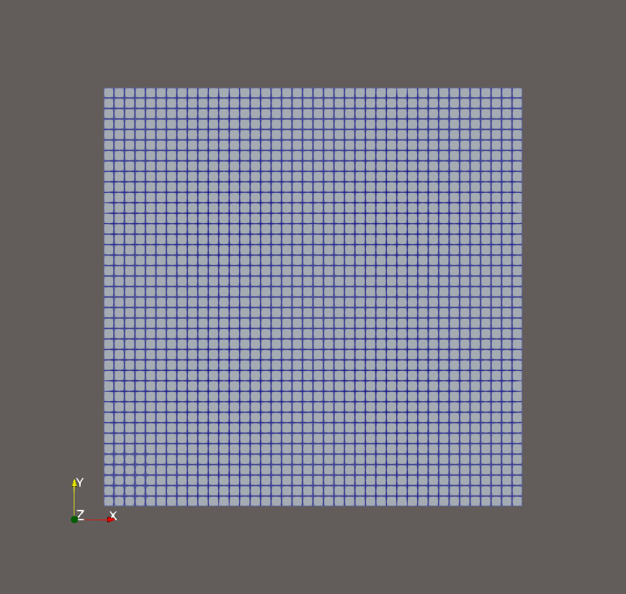
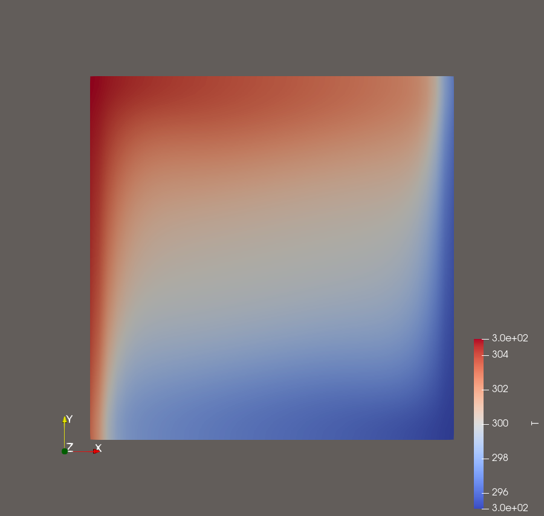
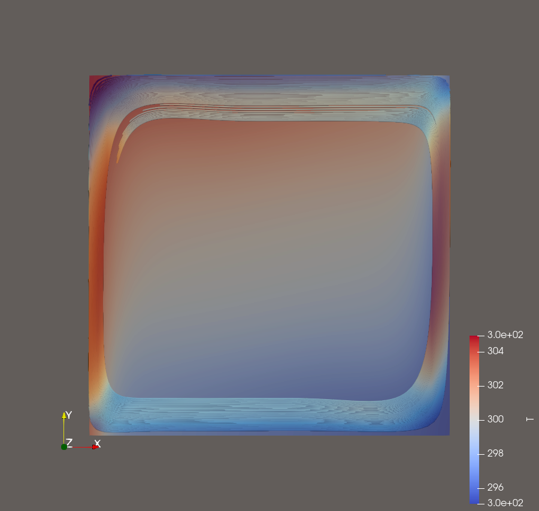

# Лабораторная работа №5

## Цель работы

Смоделировать естественную конвекцию воздуха в замкнутой полости и реализовать веб-интерфейс для безопасной параметризации размера области и температур стенок.

## Постановка задачи

В квадратной полости левая стенка нагрета до 305 K, правая охлаждена до 295 K, начальная температура воздуха равна 300 K. Верхняя и нижняя границы теплоизолированы. Из-за зависимости плотности от температуры и действия тяжести возникает замкнутая циркуляция.

## Используемое программное обеспечение

- OpenFOAM Foundation 13: `blockMesh`, `checkMesh`, `foamRun`, `foamPostProcess`.
- ParaView 6.1.1: поля температуры и линии тока.
- Node.js и Python: локальное веб-приложение без внешних npm-зависимостей.

## Исходные данные

Размер области 0,1×0,1×0,01 м; `g=(0 -9.81 0) м/с²`; опорное давление 100000 Па. Воздух задан как perfect gas: молярная масса 28,96 кг/кмоль, `Cp=1004.4 Дж/(кг·K)`, `mu=1.831·10⁻5 Па·с`, `Pr=0.705`.

Начальные поля: `U=(0 0 0)`, `T=300 K`, `p=100000 Па`, `p_rgh=0`. Модель переноса импульса — RAS `kOmegaSST`.

## Расчётная область / геометрия

Прямоугольный параллелепипед: x=0…0,1 м, y=0…0,1 м, z=−0,005…0,005 м. Patches: `hot` слева, `cold` справа, `topAndBottom`, `frontAndBack`.

## Построение сетки

`blockMeshDict` задаёт один блок 40×40×5 с `simpleGrading (1 1 1)`. Получено 8000 гексаэдров. `checkMesh -allGeometry -allTopology` подтвердил трёхмерную сетку, max aspect ratio 1,25, max non-orthogonality 0°, `Mesh OK`.



## Граничные условия

| Patch | Поле | Тип | Значение | Физический смысл |
|---|---|---|---|---|
| все стенки | `U` | `noSlip` | 0 | замкнутая неподвижная полость |
| `hot` | `T` | `fixedValue` | 305 K | нагретая левая стенка |
| `cold` | `T` | `fixedValue` | 295 K | охлаждённая правая стенка |
| `topAndBottom` | `T` | `zeroGradient` | градиент 0 | адиабатические стенки |
| `frontAndBack` | `T` | `zeroGradient` | градиент 0 | теплоизолированные торцы |
| все стенки | `p_rgh` | `fixedFluxPressure` | начальное 0 | гидростатически согласованное давление |
| все стенки | `p` | `calculated` | начальное 100000 Па | термодинамическое давление вычисляется моделью |
| все стенки | `k` | `kqRWallFunction` | 3,75·10⁻4 м²/с² | стеночное условие турбулентной энергии |
| все стенки | `omega` | `omegaWallFunction` | 0,12 с⁻¹ | стеночное условие удельной диссипации |
| все стенки | `nut` | `nutUWallFunction` | 0 | турбулентная вязкость у стенки |
| все стенки | `alphat` | `compressible::alphatWallFunction` | 0, `Prt=0.85` | турбулентная температуропроводность |

## Настройка расчёта

В `controlDict`: `solver fluid`, `endTime=500`, `deltaT=1`, запись через 50 итераций с хранением трёх последних записей. В `fvSchemes` задан `steadyState`; конвективные члены используют bounded Gauss limitedLinear 0.2. В `fvSolution` применяются GAMG для `p_rgh`, PBiCGStab/DILU для `U`, `h`, `k`, `epsilon`, `omega`; PIMPLE работает как SIMPLE с residual control `1e-4` для `p_rgh`, `U`, `h` и `1e-3` для турбулентных полей.

## Выполнение работы

```bash
blockMesh
```

Создаёт сетку 40×40×5.

```bash
checkMesh -allGeometry -allTopology
```

Проверяет все топологические и геометрические критерии; журнал содержит `Mesh OK`.

```bash
foamRun
```

Читает `solver fluid`, perfect-gas thermodynamics и RAS `kOmegaSST`; выполняет стационарные итерации до 500.

```bash
foamPostProcess -func components(U) -latestTime
```

Успешно создаёт компоненты скорости на финальном времени.

Попытки `foamPostProcess -func fieldMinMax(T) -latestTime` и аналогичной команды для `U` завершились `FOAM FATAL IO ERROR: Cannot find configuration file fieldMinMax`. Поэтому численные extrema T и U в отчёт не добавляются — **UNVERIFIED**.

Локальное приложение запускается предусмотренным проектом сценарием:

```bash
npm start
```

`package.json` раскрывает его как `node server.js`. Форма передаёт `sideMm`, `coldK`, `hotK`; Python-runner создаёт отдельную копию case, обновляет vertices, число ячеек и поле `T`, затем последовательно вызывает те же `blockMesh`, `checkMesh`, `foamRun`.

## Результаты и обсуждение

Главный solver log дошёл до `Time = 500s`, завершился `End`; wall-clock 58 с. Нагретый воздух у левой стенки поднимается, движется вдоль верхней границы, охлаждается справа и опускается, формируя естественно-конвективную циркуляцию.





Веб-job `2026-09-12T23-50-01-637Z` имеет `state=done`, `resultTime=500` и параметры 100 мм, 295 K, 305 K.


## Вывод

Расчёт естественной конвекции выполнен на проверенной сетке до 500 итераций и завершён штатно. Получены реальные изображения температуры и циркуляции. Веб-интерфейс параметризует case через изолированные задания. Неуспешные вызовы `fieldMinMax` явно отделены от подтверждённых результатов.
