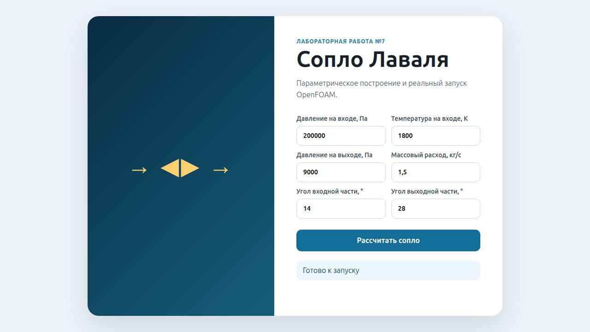
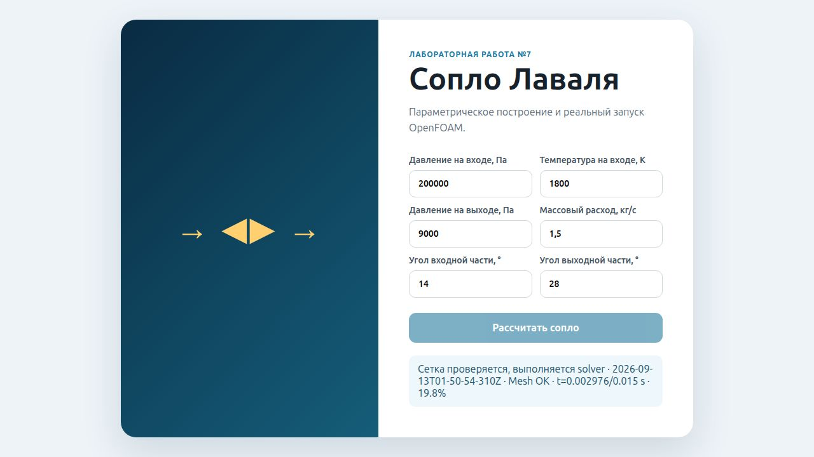
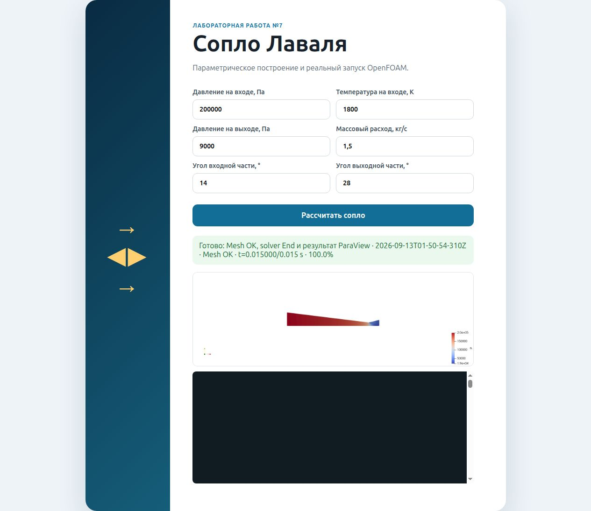

# Лабораторная работа №7

## Цель работы

Создать локальное веб-приложение, которое принимает параметры сопла Лаваля, формирует изолированный OpenFOAM case, запускает проверяемую расчётную цепочку и показывает прогресс и результат.

## Постановка задачи

Пользователь вводит `pInput`, `tInput`, `pOutput`, `massFlow`, `alpha`, `beta`. Сервер обязан валидировать их, создать отдельный каталог задания, рассчитать геометрию, обновить dictionaries, выполнить mesh/solver/post-processing и не помечать задание готовым без `Mesh OK`, `End` и изображения ParaView.

## Используемое программное обеспечение

- Node.js: HTTP-сервер `server.js` и статический клиент HTML/CSS/JavaScript.
- Python 3: runner `run_calculation.py` и аналитика LR6.
- OpenFOAM Foundation 13: `blockMesh`, `checkMesh`, `setFields`, `foamRun`/`shockFluid`.
- ParaView 6.1.1 `pvpython`: автоматическое создание результата.

## Исходные данные

Подтверждённый полный job: `full-2026-09-13T01-50-54-310Z`.

| Параметр | Значение |
|---|---:|
| `pInput` | 200000 Па |
| `tInput` | 1800 K |
| `pOutput` | 9000 Па |
| `massFlow` | 1,5 кг/с |
| `alpha` | 14° |
| `beta` | 28° |

Сервер проверяет диапазоны и условие `0 < pOutput < pInput`; пользовательские строки не передаются непосредственно в shell.

## Расчётная область / геометрия

Runner вызывает реальную функцию `calc_nozzle.calculate`, сохраняет `analytic.json` и формирует вершины двух блоков по рассчитанным длинам и радиусам. Для подтверждённого job границы области: x=−1,18803…0,152328 м, y=0…0,195931 м, z=−0,002…0,002 м.

## Построение сетки

Каждый job получает чистую копию проверенного шаблона LR6 без старых time directories, logs, `processor*` и `polyMesh`. Затем `blockMesh` строит 8000 hex, 16482 точки, 32240 граней. Patches: `inlet` 40, `outlet` 40, `axis` 200, `wall` 200, `frontAndBack` 16000.

`checkMesh -allGeometry -allTopology` полного job: max non-orthogonality 13,9226°, max skewness 0,619734, `Mesh OK`.

## Граничные условия

Runner создаёт те же физические условия, что и финальный LR6 case.

| Patch | Поле | Тип | Значение | Физический смысл |
|---|---|---|---|---|
| `inlet` | `p` | `fixedValue` | `pInput` | входное давление |
| `inlet` | `T` | `fixedValue` | `tInput` | входная температура |
| `inlet` | `U` | `zeroGradient` | градиент 0 | скорость определяется решением |
| `outlet` | `p`, `T`, `U` | `zeroGradient` | градиент 0 | сверхзвуковой выход |
| `axis` | все поля | `symmetryPlane` | — | ось симметрии |
| `wall` | `U` | `slip` | — | невязкая стенка |
| `wall` | `p`, `T` | `zeroGradient` | градиент 0 | невязкая адиабатическая стенка |
| `frontAndBack` | все поля | `empty` | — | двумерность |

`setFields` задаёт `pOutput` по умолчанию, `pInput` во входной части, `T=tInput`, `U=0`.

## Настройка расчёта

Шаблон использует `solver shockFluid`, Kurganov/van Leer, ламинарную perfect-gas модель и `maxCo=0.3`, как описано в LR6. Веб-часть не меняет численный метод, а безопасно оркестрирует его.

Архитектура:

1. `POST /api/calculate` валидирует JSON, создаёт job и запускает фиксированный Python-runner.
2. `GET /api/status` читает только `status.json` и подтверждённые logs; прогресс вычисляется как последнее solver time / 0,015.
3. `GET /api/log` возвращает хвост solver log.
4. `GET /api/result` выдаёт только созданный `result.png`.

## Выполнение работы

```bash
npm start
```

Реальный script из `package.json` запускает `node server.js`; приложение слушает `127.0.0.1:8082`.

После отправки формы runner выполняет подтверждённую исходным кодом и журналами цепочку:

```bash
blockMesh
checkMesh -allGeometry -allTopology
setFields
foamRun
```

`blockMesh` создаёт параметрическую сетку; `checkMesh` требует `Mesh OK`; `setFields` задаёт начальную ступень давления; `foamRun` выполняет `shockFluid`. Команды соединены `&&`, поэтому следующий этап не запускается после ошибки.

После solver запускается существующий `pvpython`-скрипт `LR8/postprocess_nozzle.py`; статус `done` выставляется только при нулевом коде, наличии `pressure.png` и solver log, заканчивающемся `End`.

## Результаты и обсуждение







Полный job имеет `state=done`, `resultTime=0.015`, `Mesh OK`, 30 временных слоёв постобработки и 601 точку осевого профиля. Solver log: `Exec: foamRun`, выбран `shockFluid`, `nProcs: 1`, конечное время 0,015 с, wall-clock 1402 с, финальный maxCo=0,299853, последняя строка `End`. `result.png` реально существует.

## Вывод

Создано работающее локальное приложение, которое связывает форму, валидацию, отдельные job-каталоги, реальный OpenFOAM-расчёт и ParaView-результат. Полный сквозной job подтверждён файлами параметров, аналитики, status, сеточными/solver logs и тремя скриншотами интерфейса.
