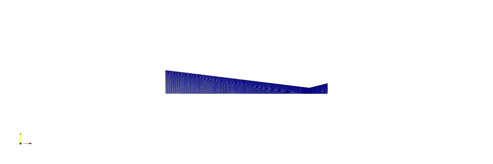
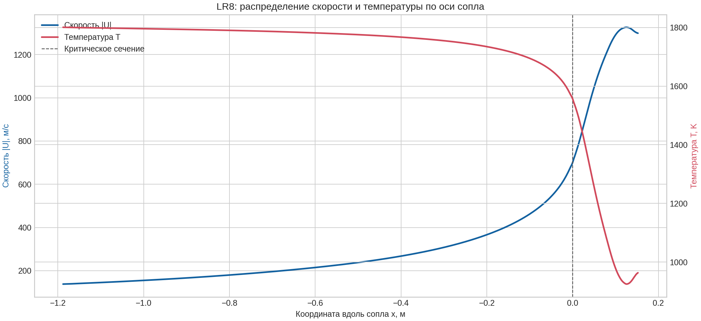
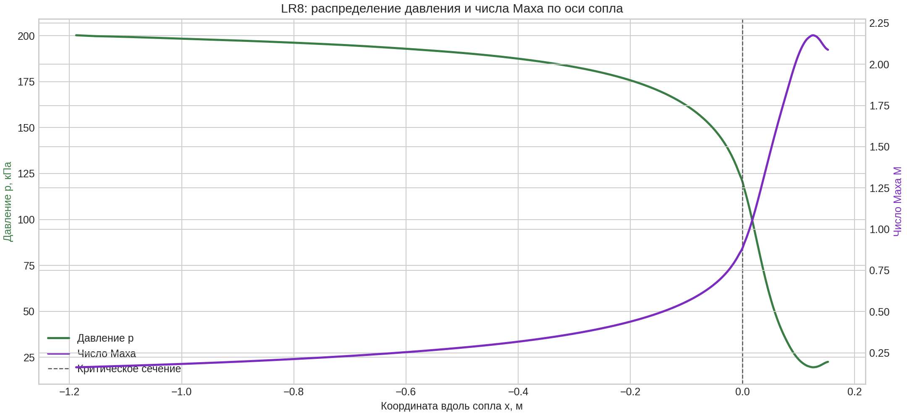

# Лабораторная работа №8

## Цель работы

Выполнить воспроизводимую постобработку реального расчёта сопла Лаваля в ParaView: получить поля p, T, |U| и M, осевые графики, анимацию и сравнение CFD с аналитикой.

## Постановка задачи

Без повторного запуска solver открыть финальные поля LR6/LR7 на времени 0,015 с, вычислить число Маха, построить изображения и снять 601 точку вдоль оси. По 30 сохранённым временам создать анимацию давления. В трёх характерных сечениях сравнить CFD с расчётом `calc_nozzle.py`.

## Используемое программное обеспечение

- ParaView 6.1.1 `pvpython`: OpenFOAMReader, Cell Data to Point Data, Calculator, Plot Over Line, SaveScreenshot.
- Python 3, Matplotlib и Pillow: графики, таблица и GIF.
- Исходные результаты OpenFOAM LR6/LR7; CFD заново не рассчитывался.

## Исходные данные

Источник — case с полями `U`, `T`, `p` и временами 0,0005…0,015 с. Финальный слой `0.015` подтверждён solver log. Число Маха вычисляется как

`M = |U| / sqrt(1.4·287·T)`.

В аналитическом сравнении используются те же параметры: 200000 Па, 1800 K, 9000 Па, 1,5 кг/с, 14° и 28°.

## Расчётная область / геометрия

Обрабатывается верхняя половина двумерного сечения сопла от x=−1,18803 до 0,152328 м. Горло расположено при x=0. Для Plot Over Line линия проходит от `(-1.1880 0.001 0)` до `(0.1523 0.001 0)`, resolution 600, что даёт 601 точку.

## Построение сетки

Новая сетка в ЛР8 не строилась. OpenFOAMReader читает готовый internalMesh LR6/LR7: 8000 hex, 16482 точки; исходный `checkMesh` дал `Mesh OK`, max non-orthogonality 13,9226°. Для визуализации применяется Cell Data to Point Data, но топология mesh не изменяется.



## Граничные условия

ЛР8 не изменяет граничные условия. Для прослеживаемости используются фактические условия исходного LR6 case:

| Patch | Поле | Тип | Значение | Физический смысл |
|---|---|---|---|---|
| `inlet` | `p`, `T` | `fixedValue` | 200000 Па; 1800 K | входные параметры |
| `inlet` | `U` | `zeroGradient` | градиент 0 | скорость из решения |
| `outlet` | `p`, `T`, `U` | `zeroGradient` | градиент 0 | сверхзвуковой выход |
| `axis` | все поля | `symmetryPlane` | — | ось симметрии |
| `wall` | `U` | `slip` | — | невязкая стенка |
| `wall` | `p`, `T` | `zeroGradient` | градиент 0 | адиабатическая стенка |
| `frontAndBack` | все поля | `empty` | — | двумерность |

## Настройка расчёта

Вычислительная настройка не менялась: source case использует `shockFluid`, perfect gas, Kurganov/van Leer и `maxCo=0.3`. Настройка ЛР8 относится только к pipeline:

1. чтение `internalMesh` и cell arrays `U`, `T`, `p`;
2. Cell Data to Point Data;
3. Calculator для `Mach`;
4. фиксированный белый фон и палитра Cool to Warm;
5. Plot Over Line и CSV;
6. отдельные кадры одинаковой шкалы p=19…201 кПа.

## Выполнение работы

Основная команда, реально вызванная LR7-runner и подтверждённая `log.postprocess`:

```bash
pvpython fast_finish_2026/LR8/postprocess_nozzle.py nozzle.foam result
```

Скрипт читает финальное время, создаёт `mesh.png`, `pressure.png`, `temperature.png`, `velocity.png`, `mach.png` и `centerline.csv`. Журнал содержит `LR8_POSTPROCESS_OK`, `time=0.015`, 30 времён и `points=601`.

```bash
python3 fast_finish_2026/LR8/plot_centerline.py centerline.csv output_directory
```

Строит два графика и `section_comparison.csv`. Точная историческая строка вызова не сохранена — **UNVERIFIED**, но скрипт и все три результата существуют.

```bash
pvpython fast_finish_2026/LR8/render_animation_frames.py nozzle.foam frame_directory
python3 fast_finish_2026/LR8/make_animation_gif.py frame_directory pressure_evolution.gif
```

Первая команда создаёт кадры для всех времён, вторая объединяет их в циклический GIF. Исторические stdout этих двух вызовов не сохранены — **UNVERIFIED**. Сам итоговый GIF проверен непосредственно: размер 1000×333, 30 кадров, задержка 180 мс, бесконечный цикл.

## Результаты и обсуждение






Подтверждённая таблица `screenshots/LR8/section_comparison.csv`:

| Сечение | U CFD / аналитика, м/с | T CFD / аналитика, K | p CFD / аналитика, Па | M CFD / аналитика |
|---|---:|---:|---:|---:|
| вход | 138,221 / 32,149 | 1800,688 / 1799,486 | 200263,5 / 199800 | 0,1625 / 0,03781 |
| горло | 702,504 / 776,338 | 1555,245 / 1500 | 120045,7 / 105656,4 | 0,8887 / 1,000 |
| выход | 1298,798 / 1457,832 | 963,467 / 742,123 | 22503,1 / 9000 | 2,0875 / 2,6697 |

Качественные тенденции совпадают: по ходу сопла p и T уменьшаются, U и M растут, в расширяющейся части поток сверхзвуковой. Численные расхождения нельзя называть ошибкой без исследования сеточной/временной сходимости: аналитика одномерная и изоэнтропическая, а CFD-профиль снят из двумерного переходного слоя t=0,015 с с конкретными начальными и граничными условиями.

Анимация: [pressure_evolution.gif](screenshots/LR8/pressure_evolution.gif).

## Вывод

Постобработка выполнена без пересчёта CFD. Из реальных полей получены пять видов, профиль на 601 точке, два графика, таблица трёх сечений и 30-кадровая GIF-анимация. Все численные значения в сравнении взяты из существующего CSV; неподтверждённые исторические строки запуска вспомогательных скриптов отмечены `UNVERIFIED`.
